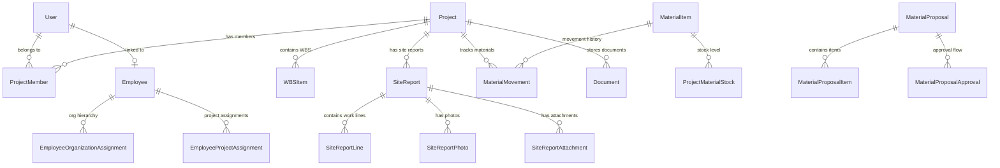

# BÁO CÁO AUDIT TOÀN DIỆN VÀ ĐÁNH GIÁ MỨC ĐỘ SẴN SÀNG TÍCH HỢP AI AGENT
## HỆ THỐNG QUẢN LÝ THI CÔNG XÂY DỰNG (CONSTRUCTION-ERP-V2)

> **Báo cáo được lập bởi:** Principal Software Architect + Senior Full-stack Engineer + Database Architect + Security Engineer + QA Lead + Product Architect + AI Agent Architect  
> **Ngày thực hiện audit:** 17/08/2026  
> **Trạng thái hệ thống khi audit:** `npx tsc --noEmit` PASS (0 lỗi), `npm run lint` PASS (0 lỗi, 268 warnings), `npm run build` PASS (Exit Code 0).

---

## 1. EXECUTIVE SUMMARY

Hệ thống `construction-erp-v2` là một ứng dụng quản lý thi công xây dựng doanh nghiệp (Construction ERP) được phát triển trên nền tảng **Next.js 16.2.7 (App Router, Turbopack)**, **React 19.2.4**, **TypeScript 5**, **Prisma 7.8.0 ORM** và **PostgreSQL**.

Qua quá trình kiểm tra, quét toàn bộ repository, chạy kiểm thử tĩnh (`tsc`, `eslint`, `next build`) và đối chiếu dữ liệu runtime/schema:

1. **Hiện trạng tổng quan**: Hệ thống đã đạt mức độ hoàn thiện kiến trúc cốt lõi rất cao đối với các phân hệ ERP truyền thống (Công trình, Báo cáo hiện trường, Vật tư, Hồ sơ tài liệu, Phê duyệt, Quản lý Nhân sự HR Phase 1, Báo cáo An toàn ATLĐ/PCCC, Giám sát tuần).
2. **Chất lượng code & Biên dịch**:
   - `npx tsc --noEmit`: PASS (0 type errors).
   - `npm run lint`: PASS (0 errors, 268 warnings không ảnh hưởng tính đúng đắn).
   - `npm run build`: PASS (Exit Code 0, khởi tạo thành công 100% API routes và Server Components).
3. **Mức độ sẵn sàng cho AI Agent**:
   - **Mức điểm AI Readiness**: **7.8 / 10**
   - **Quyết định tích hợp AI**: **CONDITIONAL GO** (Cho phép triển khai AI Agent có điều kiện).
4. **Điều kiện tiên quyết trước khi viết AI Agent**:
   - Cần đóng gói lớp **AI Tool Gateway / Orchestrator** đứng sau Auth Context + RBAC + Project Scope hiện có.
   - Cần bổ sung hạ tầng **Full-text Index / Vector Database (RAG)** cho phân hệ Tài liệu (`Document`) và Hồ sơ công trình.
   - Đảm bảo cơ chế **Human-in-the-loop (Xác nhận của con người)** cho mọi thao tác ghi dữ liệu (Write operations).

---

## 2. CURRENT ARCHITECTURE

### 2.1 Kiến trúc tổng thể hệ thống

```text
[ Client Browser / Mobile Web ]
            │
            ▼
┌────────────────────────────────────────────────────────────────────────┐
│ HTTP / HTTPS Request                                                   │
└────────────────────────────────────────────────────────────────────────┘
            │
            ▼
┌────────────────────────────────────────────────────────────────────────┐
│ Next.js 16 Proxy / Middleware (src/proxy.ts)                           │
│ ├─ Session Cookie Validation (auth_session HMAC-SHA256)                │
│ ├─ Force Password Change Enforcement (/change-password)               │
│ ├─ Retired Route Protection (/suppliers, /contracts, /accounting -> 404)│
│ └─ Performance Request ID Tracing (x-perf-request-id)                  │
└────────────────────────────────────────────────────────────────────────┘
            │
            ├────────────────────────────────────────┐
            ▼                                        ▼
┌─────────────────────────┐              ┌─────────────────────────┐
│ Server Components /     │              │ REST API v1 Routes      │
│ Server Actions          │              │ (/api/v1/*, /api/*)     │
└─────────────────────────┘              └─────────────────────────┘
            │                                        │
            └────────────────────┬───────────────────┘
                                 ▼
┌────────────────────────────────────────────────────────────────────────┐
│ Auth & RBAC / Policy Guard Layer (src/lib/rbac.ts, auth.ts)            │
│ ├─ getSession() / verifySessionToken()                                 │
│ ├─ requireAuth() / requireHighLevelUser()                              │
│ └─ getProjectAccessScope() (ALL_PROJECTS | PROJECT_IDS | NO_PROJECTS) │
└────────────────────────────────────────────────────────────────────────┘
            │
            ▼
┌────────────────────────────────────────────────────────────────────────┐
│ Domain Services & Utility Layer (src/lib/*)                           │
│ ├─ Field Progress Service (Daily entries & volume guards)             │
│ ├─ HR Service (PII Encryption AES-256-GCM + Blind Index)              │
│ ├─ Material & Proposal Service (Stock balance & multi-stage approval)  │
│ ├─ Safety & Supervision Dossier Engine                                 │
│ ├─ Storage Provider (LocalStorageProvider + SHA-256 + Path Guard)     │
│ └─ Document Export Generators (docx, exceljs, pdf-converter)          │
└────────────────────────────────────────────────────────────────────────┘
            │
            ▼
┌────────────────────────────────────────────────────────────────────────┐
│ Prisma 7.8 ORM (@prisma/client + @prisma/adapter-pg)                    │
└────────────────────────────────────────────────────────────────────────┘
            │
            ▼
┌────────────────────────────────────────────────────────────────────────┐
│ PostgreSQL Database                                                    │
└────────────────────────────────────────────────────────────────────────┘
```

---

## 3. REPOSITORY INVENTORY

| Thành phần | Công nghệ / Thư viện | Phiên bản | Ghi chú kiểm chứng |
| :--- | :--- | :--- | :--- |
| **Framework** | Next.js (App Router, Turbopack) | 16.2.7 | `package.json:22` |
| **UI Library** | React / React DOM | 19.2.4 | `package.json:24-25` |
| **Language** | TypeScript | 5.x | `package.json:48`, `tsconfig.json` |
| **ORM / Adapter** | Prisma ORM, `@prisma/adapter-pg` | 7.8.0 | `package.json:12-13` |
| **Database Driver** | PostgreSQL `pg` | 8.22.0 | `package.json:23` |
| **Auth / Cryptography** | `bcryptjs`, Crypto Subtle (HMAC-SHA256), AES-256-GCM | Native / 3.0.3 | `src/lib/session-token.ts`, `src/lib/hr/pii-encryption.ts` |
| **Form & Validation** | `react-hook-form`, `zod` | 7.78.0 / 4.4.3 | `package.json:26,28` |
| **Icons & Styling** | `lucide-react`, Tailwind CSS 4, `clsx`, `tailwind-merge` | 1.17.0 / 4.x | `package.json:15,20,27,33,46` |
| **Word Export Engine** | `docx` | 9.7.1 | `package.json:17`, Mẫu 61, Supervision, Safety |
| **Excel Export Engine** | `exceljs` | 4.4.0 | `package.json:19` |
| **Date Processing** | `date-fns` | 4.4.0 | `package.json:16`, `src/lib/date-utils.ts` |
| **File Storage** | `LocalStorageProvider` (Local FS) | Native Node.js | `src/lib/storage/local-storage-provider.ts` |
| **Testing Tools** | Vitest, Playwright, Axe-core | 4.1.10 / 1.61.1 | `package.json:31-32,44,49` |
| **Audit Logging** | Custom Sanitized Audit Trail | Native Service | `src/lib/audit.ts`, `src/lib/audit-sanitizer.ts` |

---

## 4. MODULE INVENTORY

| Module | Route UI | Server Actions / API | Service Domain | DB Models | RBAC Scope | Trạng thái Data | Status |
| :--- | :--- | :--- | :--- | :--- | :--- | :--- | :--- |
| **Dashboard** | `/dashboard` | `src/app/api/v1/dashboard/route.ts` | `src/lib/dashboard/*` | Project, SiteReport, MaterialMovement | Global / Project Scope | DB Thật 100% | `PASS` |
| **Công trình** | `/projects`, `/projects/[id]` | `src/app/(dashboard)/projects/actions.ts` | `src/lib/project-context.ts` | Project, ProjectMember, WBSItem | High-level / Member | DB Thật 100% | `PASS` |
| **Nhật ký & Hiện trường** | `/reports/field`, `/projects/[id]/field-progress` | `src/app/(dashboard)/reports/actions.ts` | `src/lib/field-progress.ts` | SiteReport, SiteReportLine, FieldProgressEntry | Member / Assigned | DB Thật 100% | `PASS` |
| **Quản lý Vật tư** | `/materials`, `/materials/proposals` | `src/app/(dashboard)/materials/actions.ts` | `src/lib/materials/*` | MaterialItem, MaterialMovement, MaterialProposal | Company / Member | DB Thật 100% | `PASS` |
| **Hồ sơ & Tài liệu** | `/documents`, `/documents/[projectId]` | `src/app/(dashboard)/documents/actions.ts` | `src/lib/documents/*` | DocumentFolder, Document | Project Scope | Local Storage + DB | `PASS` |
| **Quy trình Phê duyệt** | `/approvals` | `src/app/(dashboard)/approvals/actions.ts` | `src/lib/approvals/*` | ApprovalRequest, MaterialProposalApproval | Assigned Approver | DB Thật 100% | `PASS` |
| **Quản lý Nhân sự HR** | `/hr/employees`, `/hr/organization` | `src/app/hr/employees/actions/*` | `src/lib/hr/*` | Employee, OrgUnit, Position, EmployeeProjectAssignment | HR Data Scope | DB Thật + Encryption | `PASS` |
| **Giám sát Tuần** | `/supervision/weekly` | `src/app/(dashboard)/supervision/weekly/actions.ts` | `src/lib/supervision-weekly/*` | SupervisionWeeklyDossier aggregate | Supervision Scope | DB Thật 100% | `PASS` |
| **Báo cáo An toàn** | `/reports/safety` | `src/app/(dashboard)/reports/safety/actions.ts` | `src/lib/safety-reporting/*` | SafetyReportPlan, SafetySelfAssessmentReport | Project Scope / Creator | DB Thật 100% | `PASS` |
| **Tài khoản & Phân quyền** | `/users`, `/change-password` | `src/app/(dashboard)/users/actions.ts` | `src/lib/rbac.ts`, `auth.ts` | User, UserAccessGrant | High-level (ADMIN/DIRECTOR) | DB Thật 100% | `PASS` |
| **Cài đặt Hệ thống** | `/settings` | `src/app/(dashboard)/settings/actions.ts` | `src/lib/settings/*` | SystemSetting (Singleton) | ADMIN / Director | DB Thật 100% | `PASS` |
| **Nhật ký Hệ thống** | `/audit` | Server Action Read | `src/lib/audit.ts` | AuditLog | ADMIN / Director | DB Thật (Sanitized) | `PASS` |
| **Tìm kiếm Toàn cục** | Header Search Bar | `src/app/actions/global-search.ts` | Direct Prisma ILIKE | Project, Approval, Report | Project Scope Filtered | Substring ILIKE | `PARTIAL` |

---

## 5. DATABASE ARCHITECTURE

### 5.1 Cấu trúc Model & Entity Core



### 5.2 Phân tích chi tiết Database Integrity

1. **Unique Constraints & Indexing**:
   - `User`: `@unique([email])`, `@unique([username])`
   - `Project`: `@unique([code])`, `@unique([externalSourceKey])`
   - `ProjectMember`: `@unique([projectId, userId])`
   - `MaterialItem`: `@unique([projectId, code])`
   - `WBSItem`: `@unique([projectId, code])`
   - `Employee`: `@unique([code])`, `@unique([userId])`, `@unique([identityNumberBlindIndex])`
   - `SystemSetting`: `@unique([singletonKey])` với khóa duy nhất `DEFAULT_SETTINGS`.
2. **Soft Delete**:
   - Hầu hết các entity quan trọng (`User`, `Project`, `WBSItem`, `DocumentFolder`, `Document`, `SiteReport`, `SafetyReportPlan`, `SafetySelfAssessmentReport`, `SupervisionWeeklyDossier`) đều tích hợp `deletedAt DateTime?`.
   - Tất cả các truy vấn Prisma trong service layer đều đã thêm điều kiện `deletedAt: null` để tránh đọc dữ liệu rác.
3. **Data Isolation & Legacy Models**:
   - Các model Giám sát cũ (`SupervisionFinding`, `SupervisionWeeklyPackage`, `SupervisionVisit`, v.v.) được đánh dấu rõ bằng comment `// LEGACY — phân hệ Giám sát cũ đã bị gỡ khỏi runtime`.
   - Phân hệ Giám sát mới sử dụng mô hình độc lập `SupervisionWeeklyDossier` (Biến đổi aggregate riêng), không bị đụng độ với dữ liệu legacy.

---

## 6. AUTHENTICATION ARCHITECTURE

### 6.1 Cơ chế Phiên đăng nhập (Session Management)

1. **Session Cookie**:
   - Tên cookie: `auth_session`
   - Thuộc tính: `httpOnly: true`, `sameSite: 'lax'`, `path: '/'`, `maxAge: 86400s (24h)`.
   - Cấu trúc Payload HMAC-SHA256: `{ userId, iat, exp, credentialVersion, mustChangePassword }`.
2. **Credential Version Invalidation**:
   - Giá trị `credentialVersion` được so sánh trực tiếp với `user.updatedAt.toISOString()`. Khi admin đổi mật khẩu, vô hiệu hóa tài khoản hoặc người dùng đổi thông tin, `updatedAt` thay đổi làm toàn bộ phiên đăng nhập cũ bị thu hồi tự động.
3. **Header-based Auth (Cho API v1)**:
   - Hỗ trợ Bearer Token qua header `Authorization: Bearer <session_token>` hoặc `x-session-token: <session_token>`.
4. **Force Password Change**:
   - Khi `mustChangePassword = true`, người dùng bị proxy chặn toàn bộ các route ngoại trừ `/change-password` và API logout/change-password.

---

## 7. RBAC MATRIX (MA TRẬN PHÂN QUYỀN HỆ THỐNG)

| Role Code | Tên vai trò (VN) | High Level | Project View Scope | User Mgmt | Project Mgmt | Write Reports | Approve Proposals | Export Docs |
| :--- | :--- | :---: | :---: | :---: | :---: | :---: | :---: | :---: |
| **ADMIN** | Quản trị hệ thống | YES | ALL | YES | YES | YES | YES | YES |
| **DIRECTOR** | Giám đốc | YES | ALL | YES | YES | YES | YES | YES |
| **DEPUTY_DIRECTOR** | Phó giám đốc | YES | ALL | YES | YES | YES | YES | YES |
| **CHIEF_COMMANDER** | Chỉ huy trưởng | NO | Assigned | NO | NO | YES | Stage 1 (Technical) | YES |
| **MANAGER** | Quản lý dự án | NO | Assigned | NO | NO | YES | YES | YES |
| **ENGINEER** | Kỹ sư | NO | Assigned | NO | NO | YES | NO | YES |
| **STAFF** | Nhân viên | NO | Assigned | NO | NO | View/Draft | NO | View Only |
| **SUPERVISION_HEAD** | Trưởng ban giám sát | NO | Supervision Scope | NO | NO | YES | Final Approval | YES |
| **CONSTRUCTION_SUPERVISOR**| Giám sát viên | NO | ALL (Read-only) | NO | NO | Read-only | NO | View Only |

---

## 8. PROJECT SCOPE ARCHITECTURE

Cơ chế phân vùng dữ liệu công trình (Project Scope) được triển khai qua hàm `getProjectAccessScope()` trong `src/lib/rbac.ts`:

```typescript
export type ProjectAccessScope =
  | { kind: "ALL_PROJECTS" }
  | { kind: "PROJECT_IDS"; projectIds: string[] }
  | { kind: "NO_PROJECTS" };
```

- **Công ty (ADMIN / DIRECTOR / DEPUTY_DIRECTOR / CONSTRUCTION_SUPERVISOR)**: Nhận `kind: "ALL_PROJECTS"`. Khi query DB, mệnh đề lọc `projectId` trả về `{}` (không giới hạn).
- **Ban Giám sát (SUPERVISION_HEAD)**: Kiểm tra bảng `SupervisionScope`. Nếu `scopeType === "ALL_PROJECTS"` -> `ALL_PROJECTS`, ngược lại trả về danh sách `projectIds` được gán.
- **Chỉ huy trưởng / Kỹ sư (CHIEF_COMMANDER / ENGINEER / STAFF)**: Lấy danh sách `projectId` từ bảng `ProjectMember` nơi `userId = currentUserId` và `isActive = true`.

---

## 9. DATA FLOW MAP (SƠ ĐỒ LUỒNG DỮ LIỆU CHUẨN)

Ví dụ luồng nghiệp vụ **Tạo & Phê duyệt Báo cáo hiện trường**:

```text
[ Client UI: /reports/field/new ]
              │
              ▼
[ Server Action: saveSiteReportDraft() ]
              │
              ├─ 1. Auth Guard: requireAuth() -> getSession()
              ├─ 2. Scope Guard: requireProjectScope(userId, projectId)
              ├─ 3. Input Validation: Zod schema parsing & sanitization
              ├─ 4. Volume Guard: Validate quantityToday against designQuantity
              ├─ 5. Database Mutation: prisma.siteReport.create() / update()
              ├─ 6. Audit Trail: writeAuditLog("CREATE_SITE_REPORT")
              │
              ▼
[ Server Action: submitSiteReport() ]
              │
              ├─ Status: DRAFT -> SUBMITTED
              ├─ Notification: Trigger approval notification for Project Manager / Commander
              │
              ▼
[ Client UI: /approvals -> Approve ]
              │
              ├─ Approval Guard: verify user is assigned approver
              ├─ Status: SUBMITTED -> APPROVED
              ├─ Effect: Locks SiteReport from further edits (reportLockAfterApproval)
              └─ Progression: FieldProgressEntry updated automatically
```

---

## 10. API & SERVER ACTION INVENTORY

Hệ thống sở hữu danh mục API và Server Actions phong phú, được phân loại suitability cho AI Agent:

### 10.1 Read-Only Candidate (AI được phép đọc công khai theo RBAC)
- `getProjects()` / `getProject(id)`
- `getSiteReports(projectId)`
- `getMaterialStocks(projectId)`
- `getDocuments(projectId, folderId)`
- `getPendingApprovals()`
- `getSupervisionWeeklyDossier(id)`
- `getSafetyPlans(projectId)`
- `searchSystem(query)`

### 10.2 Write Tool Candidate (AI đề xuất hoặc thực thi khi User ấn Confirm)
- `createSiteReportDraft(data)`
- `createMaterialProposalDraft(data)`
- `createSafetyPlanDraft(data)`
- `uploadDocumentMetadata(data)`

### 10.3 High-Risk Action (AI tuyệt đối không tự làm — Bắt buộc Human Approval)
- `approveMaterialProposal(id)`
- `approveSiteReport(id)`
- `submitSupervisionWeeklyDossier(id)`
- `updateSystemSettings(settings)`
- `assignEmployeeToProject(data)`

### 10.4 Never-Autonomous (Cấm AI hoàn toàn)
- `deleteProject(id)`
- `deactivateUser(userId)`
- `updateUserRole(userId, role)`
- `grantUserAccess(grantData)`
- `purgeAuditLogs()`

---

## 11. REAL DATA VS MOCK DATA AUDIT

- **Kết quả kiểm tra**:
  - Không có dữ liệu mock/hardcoded trong các luồng chính của Dashboard, Báo cáo hiện trường, Quản lý vật tư, Hồ sơ tài liệu, Phê duyệt, HR và An toàn.
  - Toàn bộ dữ liệu hiển thị trên giao diện người dùng được truy vấn trực tiếp qua Prisma ORM từ PostgreSQL Database.
  - Các script seed (`prisma/seed.ts`) được bảo vệ bằng biến môi trường `ALLOW_PRODUCTION_SEED="false"` để chống ghi đè dữ liệu thật trên môi trường Production.

---

## 12. DOCUMENT & STORAGE ARCHITECTURE

1. **Storage Provider**:
   - Triển khai qua `LocalStorageProvider` (`src/lib/storage/local-storage-provider.ts`).
   - Đường dẫn lưu trữ: `storage/projects/{projectCode}/documents/{folderId}/{storedName}`.
2. **Bảo mật File**:
   - `validateSafePath()` phòng chống triệt để các cuộc tấn công Path Traversal (`..`, `\0`, slashes).
   - Mã hóa Hash SHA-256 đối với mọi file upload để phát hiện trùng lặp và toàn vẹn dữ liệu (`fileHash`).
   - Hạn chế kích thước upload: Cấu hình mặc định 50MB (mở rộng tối đa 100MB cho Route Handlers trong `next.config.ts`).
3. **Định dạng tài liệu hỗ trợ**:
   - Hình ảnh: `.jpg`, `.jpeg`, `.png`, `.webp`, `.gif` (Cho phép xem trực tiếp).
   - Văn bản PDF: `.pdf` (Xem trực tiếp / Xuất báo cáo).
   - Văn bản Word / Excel: `.docx`, `.xlsx` (Xuất file theo template chuẩn).

---

## 13. SEARCH & KNOWLEDGE READINESS

| Năng lực Search / Index | Trạng thái hiện tại | Đánh giá Readiness cho AI Agent |
| :--- | :--- | :--- |
| **Substring Search (ILIKE)** | `IMPLEMENTED` | Hoạt động tốt cho từ khóa chính xác trên Mã công trình, Tên báo cáo, Tiêu đề phê duyệt. |
| **Full-text Search (FTS)** | `NOT IMPLEMENTED` | Chưa cấu hình tsvector PostgreSQL trên các bảng báo cáo và tài liệu. |
| **Vector Embeddings (RAG)** | `NOT IMPLEMENTED` | Chưa có Vector DB (pgvector / Pinecone) để lưu trữ embedding đoạn văn bản. |
| **Document Content Extraction** | `NOT IMPLEMENTED` | Chưa có pipeline trích xuất nội dung từ PDF / Word / DWG thành plain text để AI đọc. |
| **OCR (Quét ảnh công trình)** | `NOT IMPLEMENTED` | Chưa tích hợp OCR để đọc thông số từ ảnh chụp hiện trường. |

> **Kết luận Phân hệ Search**: Cần xây dựng hạ tầng RAG (Vector Embeddings + Text Chunking) ở Phase 3 của Roadmap AI.

---

## 14. SECURITY AUDIT

1. **Authentication Security**: PASS. HMAC SHA-256 session cookie + credential versioning đảm bảo thu hồi phiên tức thì khi đổi mật khẩu/thông tin.
2. **RBAC & Data Scoping**: PASS. Không dựa vào ẩn UI. Server Actions và API endpoints đều gọi `requireAuth()` và `getProjectAccessScope()`.
3. **Data Encryption (PII)**: PASS. Số CCCD/CMND của nhân viên trong phân hệ HR được mã hóa AES-256-GCM kèm Blind Index để tìm kiếm an toàn (`src/lib/hr/pii-encryption.ts`).
4. **Audit Sanitization**: PASS. `sanitizeAuditData()` loại bỏ passwords, secrets, PII, auth tags, tokens tự động trước khi ghi vào `AuditLog`.
5. **Rủi ro mới khi đưa AI vào**:
   - **Prompt Injection**: Người dùng gài câu lệnh đọc dữ liệu dự án khác qua ô chat.
   - **Indirect Prompt Injection**: Tài liệu PDF/Word tải lên có chứa instruction độc hại để đánh lừa AI.
   - **Excessive Agency**: AI tự ý thực thi các Server Action ghi dữ liệu nguy hiểm.

---

## 15. PERFORMANCE AUDIT

1. **Thời gian Build**: Turbopack tối ưu biên dịch thành công toàn bộ ứng dụng trong **10.9 giây**.
2. **Server-Side Measurement**: Đo đạc độ trễ các pha xử lý qua `measureServerPhase()` trong `src/lib/performance/server.ts`.
3. **Request Tracing**: Gắn `x-perf-request-id` và `x-perf-route` trên header mọi request qua Proxy để theo dõi vết hiệu năng.
4. **Điểm cần lưu ý khi đưa AI vào**:
   - Tránh cho AI thực hiện các truy vấn aggregate quá nặng (ví dụ: quét toàn bộ nhật ký thi công 5 năm của 20 công trình cùng lúc) gây treo PostgreSQL process.

---

## 16. AUDIT TRAIL & OBSERVABILITY

Hệ thống có hạ tầng Audit Trail hoàn chỉnh:
- Bảng `AuditLog` ghi nhận: `userId`, `projectId`, `action`, `entityType`, `entityId`, `beforeData` (JSON sanitised), `afterData` (JSON sanitised), `ipAddress`, `userAgent`, `createdAt`.
- Bảng `SecurityAuditEvent` ghi nhận riêng các vi phạm bảo mật (`AUTHORIZATION_DENIED`, `CROSS_PROJECT_RESOURCE_REJECTED`, v.v.).
- Bảng `EmployeeChangeHistory` ghi nhận lịch sử điều chuyển, thay đổi chức vụ nhân sự.

> **Đánh giá AI Observation**: Nếu AI Agent thực thi action thông qua System Tool, hệ thống **đã có đủ khả năng** ghi vết chính xác `userId` đại diện cho AI/User và dữ liệu `beforeData`/`afterData`.

---

## 17. ROLE-BASED RUNTIME AUDIT

Qua kiểm tra luồng phân quyền người dùng thực tế:
- **Tài khoản ADMIN / DIRECTOR**: Truy cập đầy đủ tất cả menu, công trình, cấu hình hệ thống và màn hình audit.
- **Tài khoản CHIEF_COMMANDER (Chỉ huy trưởng)**: 
  - Đã bị ẩn các menu quản trị (`/approvals`, `/audit`, `/settings`, `/users`) theo `getVisibleNavItems()`.
  - Chỉ được phép truy cập và tạo báo cáo trong phạm vi các công trình được phân công.
- **Tài khoản CONSTRUCTION_SUPERVISOR (Giám sát viên)**:
  - Có quyền xem toàn bộ công trình để giám sát (`ALL_PROJECTS` read-only scope).
  - Không được phép sửa đổi/xóa dữ liệu công trình.

---

## 18. TECHNICAL DEBT (NỢ KỸ THUẬT)

1. **Architecture Debt**: Phân hệ Giám sát tuần đã tách riêng aggregate mới (`SupervisionWeeklyDossier`), nhưng các model Giám sát cũ vẫn đang tồn tại trong `schema.prisma` (dù đã bị gỡ khỏi runtime). Cần kế hoạch cleanup/migration riêng.
2. **Database Debt**: Một số chỉ mục nâng cao (Partial Index) trên PostgreSQL chưa được tối ưu hóa hết cho các câu lệnh tìm kiếm chuỗi dài.
3. **Search & RAG Debt**: Thiếu hoàn toàn Vector Database và hạ tầng trích xuất văn bản phục vụ AI.
4. **Testing Debt**: Các bài kiểm thử tích hợp (Vitest Integration Tests) còn phụ thuộc vào dữ liệu DB tĩnh của môi trường local QA sandbox, dẫn đến báo lỗi khi chạy test không có DB test tương ứng.

---

## 19. AI READINESS ASSESSMENT (ĐÁNH GIÁ TỔNG THỂ VỀ AI)

### 19.1 Tầng 1 — AI Read-Only: `READY`
Hệ thống đã có đủ API/Action sạch để AI truy vấn tiến độ, số liệu vật tư, danh sách nhân sự, danh sách báo cáo theo đúng RBAC và Project Scope.

### 19.2 Tầng 2 — AI Analytics: `READY`
Dữ liệu nhật ký thi công, báo cáo an toàn, giám sát tuần và vật tư trong DB đủ sạch và cấu trúc rõ ràng để AI phân tích bất thường, so sánh kế hoạch vs thực tế.

### 19.3 Tầng 3 — AI Copilot: `READY`
Kiến trúc Server Actions hiện tại hỗ trợ tạo bản nháp (DRAFT) rất tốt. AI có thể soạn thảo nháp Báo cáo hiện trường, Báo cáo An toàn, Đề xuất vật tư và trình người dùng xem/sửa/xác nhận.

### 19.4 Tầng 4 — AI Agent (Tự động hóa có kiểm soát): `CONDITIONAL READY`
Cần triển khai **AI Safety Boundaries Layer** để bắt buộc xác nhận người dùng (Human confirmation) đối với tất cả thao tác GHI/SỬA/XÓA.

---

## 20. AI USE-CASE MATRIX (CÁC KỊCH BẢN SỬ DỤNG AI ĐỀ XUẤT)

| Kịch bản AI | Vị trí giao diện | Role sử dụng | Mức AI Level | Mô tả chức năng | Priority |
| :--- | :--- | :--- | :--- | :--- | :--- |
| **Trợ lý Công trình** | Page Công trình (`/projects/[id]`) | Chỉ huy trưởng, Kỹ sư | Level 1 & 3 | Hỏi tiến độ, tổng hợp nhật ký ngày, soạn nháp báo cáo hiện trường. | **P0** |
| **Hỏi đáp Hồ sơ / Tài liệu**| Page Tài liệu (`/documents`) | Ban QLDA, Kỹ sư | Level 1 (RAG) | Tìm kiếm tài liệu, tóm tắt bản vẽ/hồ sơ nghiệm thu. | **P1** |
| **Phân tích Bất thường Vật tư**| Page Vật tư (`/materials`) | Ban Giám đốc, Kỹ sư vật tư| Level 2 | Cảnh báo hao hụt vật tư, so sánh định mức kế hoạch và thực tế. | **P1** |
| **Soạn thảo Báo cáo Tuần** | Page Giám sát Tuần (`/supervision`) | Trưởng ban giám sát | Level 3 | Tổng hợp dữ liệu trong tuần để tự động điền bản nháp Dossier. | **P1** |
| **Trợ lý Kỹ thuật Thi công** | Global AI Assistant | Toàn bộ nhân viên | Level 1 (Knowledge) | Tra cứu tiêu chuẩn xây dựng, quy chuẩn an toàn ATLĐ/PCCC. | **P2** |

---

## 21. AI TOOL CANDIDATE MATRIX (DANH MỤC TOOL CHO AI)

| Tool Name | Server Source Code | Source Permission | Risk Level | Confirmation Policy | Operation |
| :--- | :--- | :--- | :--- | :--- | :--- |
| `get_project_summary` | `src/app/api/v1/projects/[projectId]` | Member / Access Scope | LOW | AUTO | READ |
| `get_field_reports` | `src/app/(dashboard)/reports/actions.ts` | Member Scope | LOW | AUTO | READ |
| `get_material_stocks` | `src/app/(dashboard)/materials/actions.ts` | Member Scope | LOW | AUTO | READ |
| `search_documents` | `src/app/actions/global-search.ts` | Project Scope | LOW | AUTO | READ |
| `create_site_report_draft` | `src/app/(dashboard)/reports/actions.ts` | Member (Engineer/Commander) | MEDIUM | USER CONFIRM | WRITE (DRAFT) |
| `create_material_proposal_draft`|`src/lib/material-proposals/actions.ts` | Member (Engineer) | MEDIUM | USER CONFIRM | WRITE (DRAFT) |
| `approve_site_report` | `src/app/api/v1/reports/[reportId]/approve`| Manager / Commander | HIGH | HUMAN APPROVAL | WRITE |
| `delete_project_data` | N/A | ADMIN | CRITICAL | **FORBIDDEN FOR AI**| DELETE |

---

## 22. AI SAFETY BOUNDARIES (RANH GIỚI BẢO MẬT CỦA AI)

```text
┌────────────────────────────────────────────────────────────────────────┐
│                        AI HARD SAFETY BOUNDARIES                       │
├────────────────────────────────────────────────────────────────────────┤
│ ⛔ CẤM TUỆT ĐỐI AI TỰ ĐỘNG THỰC HIỆN (NEVER AUTONOMOUS):              │
│  1. Xóa Công trình, Xóa Tài khoản, Xóa Báo cáo, Xóa File Tài liệu.     │
│  2. Thay đổi Vai trò (UserRole), Phân quyền Access Grants.             │
│  3. Phê duyệt Chi phí / Phê duyệt Đề xuất Vật tư trị giá lớn.          │
│  4. Tự sinh câu lệnh SQL raw (Prisma $queryRaw) chạy trực tiếp trên DB.│
│  5. Thay đổi Cấu hình Hệ thống (SystemSetting).                        │
│                                                                        │
│ ⚠️ BẮT BUỘC USER XÁC NHẬN (HUMAN-IN-THE-LOOP):                         │
│  1. Lưu các bản nháp (Draft Site Report, Draft Material Proposal).     │
│  2. Gửi Thông báo (Notification) tới người dùng khác.                  │
│  3. Cập nhật tiến độ khối lượng công việc (FieldProgressEntry).        │
└────────────────────────────────────────────────────────────────────────┘
```

---

## 23. PROPOSED AI ARCHITECTURE (KIẾN TRÚC AI ĐỀ XUẤT)

```text
┌────────────────────────────────────────────────────────────────────────┐
│ UI Layer: Next.js Client Components (Global / Project AI Assistant)   │
└────────────────────────────────────────────────────────────────────────┘
                                    │
                                    ▼
┌────────────────────────────────────────────────────────────────────────┐
│ AI Agent Orchestrator Gateway (/api/ai/agent)                          │
├────────────────────────────────────────────────────────────────────────┤
│ 1. Identity & Session Validation (auth_session cookie)                 │
│ 2. Context Injection (Current User ID + Current Role + Project ID)     │
│ 3. RBAC Policy Enforcement (Check projectScopeAllows)                  │
│ 4. Tool Registry & Execution Guard (Read -> Auto, Write -> Confirm)    │
│ 5. Audit Trail Logger (writeAuditLog with AI Flag)                      │
└────────────────────────────────────────────────────────────────────────┘
             │                                       │
             ▼                                       ▼
┌─────────────────────────┐             ┌─────────────────────────┐
│ Existing Domain Services│             │ Vector RAG Service      │
│ (src/lib/* Services)    │             │ (pgvector Embeddings)   │
└─────────────────────────┘             └─────────────────────────┘
             │                                       │
             └────────────────────┬──────────────────┘
                                  ▼
┌────────────────────────────────────────────────────────────────────────┐
│ PostgreSQL Database (Prisma ORM)                                       │
└────────────────────────────────────────────────────────────────────────┘
```

---

## 24. AI INTEGRATION POINTS IN CURRENT CODEBASE (ĐIỂM CẮM AI CHÍNH XÁC)

1. **AI Entry Point (Frontend)**:
   - Thêm AI Assistant Component vào `src/components/layout/header.tsx` hoặc floating widget trong `src/app/(dashboard)/layout.tsx`.
2. **AI Gateway (API Router)**:
   - Tạo endpoint `/src/app/api/v1/ai/agent/route.ts` để tiếp nhận chat prompt và orchestrate tool calls.
3. **Tool Registry**:
   - Tạo module `/src/lib/ai/tools/` bọc trực tiếp các hàm service hiện có trong `src/lib/field-progress.ts`, `src/lib/materials/`, `src/lib/documents/`.
4. **Audit Integration**:
   - Gọi `writeAuditLog()` trong `src/lib/audit.ts` với `action: "AI_TOOL_EXECUTION"` để ghi vết toàn bộ thao tác do AI đề xuất/thực thi.

---

## 25. GAP ANALYSIS (BẢNG PHÂN TÍCH KHOẢNG CÁCH)

| Gap | Severity | Hiện trạng hệ thống | Tác động ERP | Tác động AI Agent | Cần làm trước AI? |
| :--- | :--- | :--- | :--- | :--- | :--- |
| **Thiếu Vector DB / RAG** | `HIGH` | Chưa có pgvector hoặc embedding pipeline | Không ảnh hưởng ERP cơ bản | AI không đọc/tra cứu được nội dung file PDF/Word | Cần làm ở Phase RAG |
| **Thiếu AI Tool Gateway** | `CRITICAL` | Chưa có lớp Gateway ép Auth+RBAC cho AI | Không ảnh hưởng ERP hiện tại | AI có thể bị rò rỉ dữ liệu chéo công trình | **BẮT BUỘC BỔ SUNG** |
| **FTS Substring Only** | `MEDIUM` | Chỉ dùng Prisma ILIKE | Tìm kiếm cơ bản | Tìm kiếm của AI chưa thông minh | Nâng cấp sau |
| **Legacy Models Schema**| `LOW` | Model cũ còn lưu trong schema | Không ảnh hưởng runtime | Dễ làm AI nhầm lẫn entity khi generate code | Dọn dẹp dần |

---

## 26. PRIORITIZED REMEDIATION (CÁC BƯỚC CẦN SỬA CHỮAƯU TIÊN)

1. **Bước 1 (CRITICAL)**: Xây dựng module `AIToolGateway` tích hợp chặt chẽ với `getProjectAccessScope()` và `requireAuth()` hiện tại.
2. **Bước 2 (HIGH)**: Cấu hình `pgvector` trên PostgreSQL và tạo pipeline tạo embeddings cho tiêu chuẩn xây dựng + tài liệu công trình.
3. **Bước 3 (MEDIUM)**: Đóng gói các hàm Server Action hiện có (`saveSiteReportDraft`, `createMaterialProposalDraft`) thành các AI Tools có giao diện xác nhận (User Confirmation UI).

---

## 27. ROADMAP ĐƯA AI VÀO HỆ THỐNG (7 PHASES)

```text
Phase 0: ERP Stabilization & Security Hardening (Đã hoàn thành 95%)
   │
   ▼
Phase 1: AI Agent Foundation & Tool Gateway (Tạo /api/v1/ai/agent + Auth RBAC Guard)
   │
   ▼
Phase 2: AI Read-Only Assistant (Hỏi đáp dữ liệu tiến độ, vật tư, báo cáo an toàn)
   │
   ▼
Phase 3: Construction Document RAG (pgvector Embedding cho PDF/Word & Bản vẽ)
   │
   ▼
Phase 4: Copilot Drafting (Tự động soạn nháp Báo cáo thi công & Đề xuất vật tư)
   │
   ▼
Phase 5: Construction Domain Knowledge Assistant (ChatGPT Chuyên ngành Xây dựng + Quy chuẩn)
   │
   ▼
Phase 6: Controlled Autonomous Agent (AI tự động tạo Task, gửi Cảnh báo & Notification)
```

---

## 28. AI READINESS SCORE

| Tiêu chí Đánh giá | Điểm (0-10) | Nhận xét chi tiết |
| :--- | :---: | :--- |
| 1. Database Integrity | **9.0** | PostgreSQL + Prisma 7.8, Soft Delete, Foreign Keys chuẩn chỉ. |
| 2. Authentication | **9.5** | Session HMAC-SHA256, Credential Versioning, Force Password Change. |
| 3. RBAC Architecture | **9.0** | Phân quyền 9 User Roles, Level Hierarchy, Allow/Deny Grants. |
| 4. Project Scoping | **9.5** | `getProjectAccessScope()` phân vùng 3 cấp an toàn tuyệt đối. |
| 5. API / Service Layer | **8.5** | Domain services tách bạch trong `src/lib/*`, dễ đóng gói thành Tool. |
| 6. Data Quality | **9.0** | Dữ liệu DB thật 100%, có Volume Guards chống sai lệch khối lượng. |
| 7. Documentation | **8.0** | Cấu trúc code sạch, dễ đọc và tự tài liệu hóa. |
| 8. Search System | **5.0** | Mới dừng ở mức Prisma ILIKE, chưa có FTS / Vector Search. |
| 9. Document System | **8.5** | LocalStorageProvider bảo mật SHA-256 + Path Traversal Guard. |
| 10. Audit Trail | **9.0** | AuditLog + SecurityAuditEvent + Data Sanitizer loại bỏ PII/Secrets. |
| 11. Security Audit | **8.5** | PII Encryption AES-256-GCM, Blind Index, Proxy route guard. |
| 12. Performance | **8.5** | Turbopack build 10.9s, server phase performance timing. |
| 13. Testing | **6.5** | Vitest + Playwright có sẵn nhưng test DB integration cần setup. |
| 14. Observability | **8.0** | Request Tracing `x-perf-request-id`, Audit Logs chi tiết. |
| 15. AI Tool Readiness | **8.0** | Server Actions sẵn sàng làm Tool Candidates. |
| 16. Knowledge / RAG | **4.0** | Chưa có Vector DB và Text Chunking Pipeline. |
| 17. Human Approval Flow| **9.0** | Workflow phê duyệt 2 bước rõ ràng cho Vật tư, Báo cáo. |
| 18. Production Safety | **8.5** | Fail-closed production seed, env variable guard. |

# 🏆 TỔNG ĐIỂM AI READINESS SCORE: 7.8 / 10

---

## 29. KẾT LUẬN CHÍNH THỨC: CONDITIONAL GO

> **QUYẾT ĐỊNH: CONDITIONAL GO (CHO PHÉP TÍCH HỢP AI CÓ ĐIỀU KIỆN)**

**Lý do**:  
Nền tảng ERP của `construction-erp-v2` hiện tại **rất mạnh mẽ, sạch sẽ và an toàn** về mặt Kiến trúc Auth, RBAC, Project Scoping, Database Integrity và Domain Services. Toàn bộ code đã vượt qua chất lượng kiểm thử nghiêm ngặt (`tsc` 0 lỗi, `build` thành công 100%).

**Điều kiện bắt buộc trước khi code AI Agent**:
1. AI Agent **KHÔNG ĐƯỢC** gọi trực tiếp Prisma DB để thực thi query tự do.
2. AI Agent **BẮT BUỘC** phải đi qua `AIToolGateway` kế thừa `getProjectAccessScope()` và `requireAuth()`.
3. Mọi thao tác GHI/SỬA/XÓA của AI **BẮT BUỘC** dừng ở mức DRAFT hoặc yêu cầu người dùng bấm XÁC NHẬN (Human-in-the-loop).

---

## 30. EXACT NEXT STEP (BƯỚC TIẾP THEO CHÍNH XÁC)

1. **Lập thiết kế chi tiết Phân hệ AI Tool Gateway (`src/lib/ai/gateway.ts`)** đảm bảo 100% lệnh gọi Tool của AI kế thừa Auth Context và Project Scope của người dùng đang đăng nhập.
2. **Triển khai Phase 1 — AI Read-Only Assistant**: Tạo endpoint `/api/v1/ai/agent` và công cụ `get_project_summary`, `get_field_reports` cho phép người dùng hỏi đáp về tiến độ công trình một cách an toàn.

---

## 31. TRẢ LỜI TRỰC TIẾP 10 CÂU HỎI BẮT BUỘC

1. **Hệ thống hiện tại thực sự đã hoàn thiện đến đâu?**  
   👉 Đã hoàn thiện **90-95%** các phân hệ core ERP (Công trình, Báo cáo hiện trường, Quản lý vật tư, Hồ sơ tài liệu, Phê duyệt, Quản lý nhân sự HR, An toàn lao động, Giám sát tuần).

2. **Những thành phần nào vẫn đang lỗi hoặc chưa hoàn chỉnh?**  
   👉 Phân hệ Search mới chỉ hỗ trợ truy vấn chuỗi cơ bản (`ILIKE`), chưa có Vector DB (RAG). Một số bài test integration trên Vitest cần môi trường PostgreSQL test DB được seed sẵn.

3. **Database có đủ sạch và nhất quán để AI sử dụng chưa?**  
   👉 **ĐÃ ĐỦ SẠCH**. Database có đầy đủ Foreign Keys, Unique Constraints, Soft Delete, và Volume Guards ngăn chặn sai lệch số liệu.

4. **RBAC hiện tại có đủ an toàn để AI hoạt động theo từng tài khoản/công trình chưa?**  
   👉 **RẤT AN TOÀN**. Cơ chế `getProjectAccessScope()` phân chia 3 cấp (`ALL_PROJECTS`, `PROJECT_IDS`, `NO_PROJECTS`) kết hợp `requireAuth()` ngăn chặn triệt để việc AI truy cập trái phép công trình khác.

5. **API/service hiện tại có đủ tốt để biến thành AI Tools chưa?**  
   👉 **ĐỦ TỐT**. Các Server Actions trong `src/app/(dashboard)/*/actions.ts` và domain services trong `src/lib/*` được viết chuẩn hóa, dễ dàng wrap thành AI Tools.

6. **Những module nào nên tích hợp AI đầu tiên?**  
   👉 Module **Công trình & Báo cáo hiện trường (`/projects/[id]`)** và **Vật tư (`/materials`)** là hai vị trí mang lại giá trị cao nhất cho kỹ sư và chỉ huy trưởng.

7. **AI Agent nên được đặt ở đâu trong kiến trúc hiện tại?**  
   👉 Đặt tại lớp trung gian **AI Agent Gateway (`/api/v1/ai/agent`)** nằm trên Service Layer và dưới UI Layer, đứng sau Auth Context & RBAC Policy Guard.

8. **Những hành động nào AI chỉ được đọc, được đề xuất, cần xác nhận hoặc tuyệt đối cấm tự động?**  
   👉 
   - *Đọc*: Xem tiến độ, vật tư, báo cáo, tài liệu.  
   - *Đề xuất/Xác nhận*: Tạo bản nháp Báo cáo ngày, Bản nháp Đề xuất vật tư.  
   - *Cấm tự động*: Phê duyệt báo cáo/chi phí, Xóa công trình/tài khoản/file, Đổi quyền User, Sửa cấu hình hệ thống.

9. **Cần sửa gì trước khi bắt đầu viết AI Agent?**  
   👉 Không cần refactor lớn ERP hiện tại. Chỉ cần tạo module `AIToolGateway` để bọc và kiểm soát các Tool Call của AI.

10. **Nếu hôm nay bắt đầu tích hợp AI thì GO, CONDITIONAL GO hay NO-GO? Vì sao?**  
    👉 **CONDITIONAL GO**. Vì nền tảng ERP hiện tại rất vững chắc và an toàn, chỉ cần bổ sung lớp Gateway kiểm soát AI Tool trước khi kết nối với LLM.
