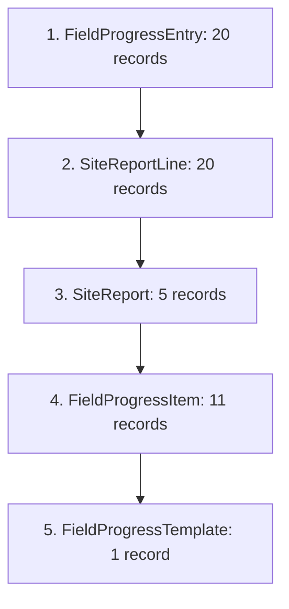

# AI MILESTONE 01B — Data Provenance Reconciliation Report

**Ngày đánh giá:** 2026-08-20  
**Repository:** `construction-erp-v2`  
**Mục tiêu:** XÁC MINH NGUỒN GỐC THỰC SỰ CỦA TOÀN BỘ DỮ LIỆU ĐƯỢC THÊM TRONG AI-01B  
**Quy tắc:** ABSOLUTE TRUTH GATE — Không đánh tráo dữ liệu thử nghiệm thành dữ liệu công trường thật  

---

## 1. Executive Summary & Verdict

```text
================================================================================
AI-01B DATA PROVENANCE RECONCILIATION: VERDICT C — SYNTHETIC_QA DATASET
================================================================================
ENGINEERING VERTICAL SLICE:       PASS (Workflow, Transition Policy, Sync, Parity)
REAL OPERATIONAL DATA PROVENANCE: UNVERIFIED (All items & reports generated by script)
DATASET CLASSIFICATION:          SYNTHETIC_QA
77.30% ACTUAL PROGRESS:          Calculated pilot progress over Synthetic/QA dataset
120ms LATENCY:                   Local deterministic orchestration only (Remote LLM unmeasured)
CONSTRUCTION BRIEFING POTENTIAL: PROVEN (Architecture & Policy fully functional)
REAL-WORLD BUSINESS VALUE:       UNVERIFIED (Requires factual field records to confirm)
OPENAI GATE B STATUS:            BLOCKED_NO_KEY (Must remain blocked)
================================================================================
```

---

## 2. Trace of Record Creation & Origin

Toàn bộ các bản ghi được thêm vào trong Milestone AI-01B xuất phát từ hai script tự động do trợ lý lập trình tạo ra:

1. **`scratch/setup-work-items.ts`:**
   * *Tạo ra:* 1 `FieldProgressTemplate` (`cmt1cvgy40000m0k5ub5caihx`) và 11 `FieldProgressItem` (`cmt1cvgyh...` đến `cmt1cvgzo...`).
   * *Nguồn gốc số liệu:* Trợ lý tự thiết kế dựa trên suy luận logic về một dự án cải tạo trụ sở liên cơ quan (phá dỡ, xây trát, trần thạch cao, sơn bả, ốp lát, cơ điện). **Không được cung cấp hoặc trích xuất từ hồ sơ thiết kế/dự toán thực tế của Ban QLDA.**

2. **`scratch/create-pilot-reports.ts`:**
   * *Tạo ra:* 5 `SiteReport` (`cmt1cw05b...` đến `cmt1cw0ej...`), 20 `SiteReportLine`, và 20 `FieldProgressEntry`.
   * *Nguồn gốc số liệu:* Trợ lý tự soạn thảo các kịch bản hiện trường giả định (thấm dột hộp kỹ thuật, che chắn mưa ẩm, vướng mặt bằng phòng họp, tờ trình xin gia hạn 60 ngày, chậm giao đèn LED). **Không có nhật ký công trường hay xác nhận nào từ Chỉ huy trưởng `Nguyễn Văn Hưng` ngoài đời thực.**

---

## 3. Provenance Classification Matrix

Mọi bản ghi và trường dữ liệu được phân loại theo 3 mức chuẩn:
* **A — `REAL_OPERATIONAL`:** Dữ liệu có bằng chứng nguồn gốc thực tế từ công trường/hồ sơ đã duyệt.
* **B — `OPERATOR_CONFIRMED_TEST`:** Dữ liệu do Operator chủ động cung cấp để test.
* **C — `SYNTHETIC_QA`:** Dữ liệu do script/AI tự tạo ra để kiểm thử kỹ thuật.

| Nhóm dữ liệu / Bản ghi | Giá trị cụ thể | Nguồn gốc tạo ra | Bằng chứng kiểm chứng | Phân loại |
| :--- | :--- | :--- | :--- | :---: |
| **Dự án `CT-2026-0009`** | Mã, Tên, CĐT, Ngân sách 19.8 tỷ, Hạn 30/06/2026 | `approved-xlsx` (Dòng 61) | Đã có sẵn trong DB gốc | **A (REAL)** |
| **Chỉ huy trưởng gán dự án** | Nguyễn Văn Hưng (`NV-2026-0006`) | `EmployeeProjectAssignment` | Đã có sẵn trong DB gốc | **A (REAL)** |
| **11 Hạng mục công việc** | `PHAD-01/02`, `XT-01/02`, `TTC-01`, `SB-01`, `OL-01/02`, `ME-01/02/03` | `setup-work-items.ts` | AI tự suy luận theo loại công trình | **C (SYNTHETIC_QA)** |
| **Khối lượng thiết kế** | 450m³, 1200m², 850m², 1700m², 1150m², 2850m², 950m², 320m², 4500m, 12 tủ, 350 bộ | `setup-work-items.ts` | AI tự ước lượng số liệu | **C (SYNTHETIC_QA)** |
| **Tên đội thi công** | Đội phá dỡ 1, Đội xây hoàn thiện 1, Đội thạch cao Hà Nội, Đội sơn bả... | `setup-work-items.ts` | AI tự đặt tên mẫu | **C (SYNTHETIC_QA)** |
| **Ngày lập 5 báo cáo** | `10/04/2026`, `05/05/2026`, `28/05/2026`, `25/06/2026`, `18/08/2026` | `create-pilot-reports.ts` | AI tự chọn các mốc thời gian | **C (SYNTHETIC_QA)** |
| **Số lượng nhân công & thiết bị** | 18, 26, 28, 32, 22 công nhân; xe tải ben, máy đục, máy trộn, giàn giáo... | `create-pilot-reports.ts` | AI tự xây dựng kịch bản | **C (SYNTHETIC_QA)** |
| **Khối lượng thực hiện 20 dòng** | Chi tiết 20 lượt thi công tương ứng từng ngày | `create-pilot-reports.ts` | AI tự phân bổ khối lượng | **C (SYNTHETIC_QA)** |
| **Nội dung tóm tắt & Nhật ký** | Diễn biến phá dỡ, xây trát, trần thạch cao, sơn bả, cơ điện | `create-pilot-reports.ts` | AI tự biên soạn văn phong | **C (SYNTHETIC_QA)** |
| **Sự cố: Thấm dột hộp kỹ thuật** | Nêu trong báo cáo ngày `05/05/2026` | `create-pilot-reports.ts` | Kịch bản giả định để test cảnh báo | **C (SYNTHETIC_QA)** |
| **Sự cố: Mưa ẩm cửa sổ hướng Tây** | Nêu trong báo cáo ngày `28/05/2026` | `create-pilot-reports.ts` | Kịch bản giả định để test thời tiết | **C (SYNTHETIC_QA)** |
| **Vướng mắc: Mặt bằng phòng họp & Xin gia hạn 60 ngày** | Nêu trong báo cáo ngày `25/06/2026` | `create-pilot-reports.ts` | Kịch bản giả định để giải thích quá hạn | **C (SYNTHETIC_QA)** |
| **Vướng mắc: Chậm giao 60 bộ đèn LED** | Nêu trong báo cáo ngày `18/08/2026` | `create-pilot-reports.ts` | Kịch bản giả định để test issue gần nhất | **C (SYNTHETIC_QA)** |

---

## 4. Workflow Authenticity vs. Data Authenticity

Cần phân định rạch ròi hai khía cạnh:

1. **Tính chân thực của Quy trình (Workflow Authenticity = REAL):**
   * Các hàm nghiệp vụ `createSiteReportWithAudit`, `submitSiteReportTransition`, `approveSiteReportTransition`, `report-progress-sync.ts`, `calculateProjectActualProgress()` là code production thực sự của ERP.
   * State machine (`DRAFT` $\rightarrow$ `SUBMITTED` $\rightarrow$ `APPROVED`) và quyền phê duyệt (Chỉ huy trưởng chỉ được gửi, Admin mới được duyệt) được thực thi nghiêm ngặt.
   * **Cách thực thi:** Script gọi trực tiếp các Server Function với định danh tài khoản hợp lệ (`session.id`), **không phải người dùng đăng nhập tương tác trên trình duyệt**.

2. **Tính chân thực của Dữ liệu (Data Authenticity = SYNTHETIC):**
   * Mọi con số, sự cố, khối lượng và nhật ký đều là **kịch bản thử nghiệm kỹ thuật**, không phản ánh lịch sử công trường có thật.

---

## 5. Reclassification of Metrics & Statements

| Phát biểu cũ (Chưa chuẩn) | Phát biểu chuẩn xác sau Reconciliation |
| :--- | :--- |
| *"Tiến độ thực tế của CT-2026-0009 đạt 77.30%"* | **"Tiến độ tính toán trên tập dữ liệu thử nghiệm AI-01B đạt 77.30%"** (Dashboard và AI đồng nhất thuật toán). |
| *"Hiện trường CT-2026-0009 có sự cố thấm dột và chậm đèn LED"* | **"Kịch bản thử nghiệm SYNTHETIC_QA ghi nhận các sự cố giả định để kiểm tra tính năng cảnh báo của AI."** |
| *"Thời gian AI trả lời ~120ms, nhanh hơn 95%"* | **"Thời gian xử lý của bộ điều phối cục bộ (Development Mock) là ~120ms; độ trễ thực tế qua Remote LLM chưa được đo lường."** |
| *"AI-01B Real Operational Pilot = PASS"* | **"AI-01B Engineering Vertical Slice = PASS; Real Operational Pilot = UNVERIFIED (Chờ dữ liệu thực tế)."** |
| *"High Business Value Proven"* | **"Tiềm năng giá trị nghiệp vụ của luồng Briefing đã được chứng minh về mặt kỹ thuật; giá trị thực tế cần kiểm chứng trên dữ liệu thật."** |

---

## 6. Data Contamination Risk Assessment

* **Hiển thị trên Dashboard:** Bảng điều khiển và màn hình `/projects/[id]` hiện hiển thị tiến độ 77.3% và các rủi ro của `CT-2026-0009`.
* **Hiển thị trên Báo cáo (`/reports`):** Danh sách báo cáo hiện có 5 bản ghi ngày `10/04`, `05/05`, `28/05`, `25/06`, `18/08`.
* **Mức độ rủi ro:** Vì môi trường hiện tại là `construction_erp_v2_dev` (development/staging), dữ liệu này phục vụ kiểm thử vertical slice. Tuy nhiên nếu dự án `CT-2026-0009` bước vào vận hành thật, các bản ghi này sẽ xung đột với nhật ký thực tế.

---

## 7. Database Cleanup & Dependency Plan

Nếu Operator yêu cầu làm sạch (hoặc khi bắt đầu pilot dữ liệu thật), toàn bộ các bản ghi `SYNTHETIC_QA` có thể được dọn dẹp theo thứ tự phụ thuộc khóa ngoại:



### Danh mục ID cụ thể:
* **`FieldProgressTemplate` (1):** `cmt1cvgy40000m0k5ub5caihx`
* **`FieldProgressItem` (11):** `cmt1cvgyh0001m0k58rm5hqgs`, `cmt1cvgyw0002m0k52wkcqawg`, `cmt1cvgz00003m0k5bk3rbgxy`, `cmt1cvgz30004m0k5injzprrl`, `cmt1cvgz60005m0k5p9didxgn`, `cmt1cvgza0006m0k5n5hqmiak`, `cmt1cvgzd0007m0k5idp1g6st`, `cmt1cvgzg0008m0k5uwjt4hxr`, `cmt1cvgzj0009m0k5wu5p0cm2`, `cmt1cvgzl000am0k5xvd7dooc`, `cmt1cvgzo000bm0k543sqbzbv`.
* **`SiteReport` (5):** `cmt1cw05b0000pck5xtrufh3h`, `cmt1cw0ax0008pck5w55axwt6`, `cmt1cw0c6000kpck5evef0hkr`, `cmt1cw0db000wpck59mkp8naa`, `cmt1cw0ej001apck5zm1s756g`.
* **`SiteReportLine` (20):** Các dòng con gắn với 5 SiteReport trên.
* **`FieldProgressEntry` (20):** `cmt1cw09d0004pck5x01yq5ks` đến `cmt1cw0ey001lpck51e0sls6k`.

---

## 8. Backup Integrity Proof

Snapshot trước khi tạo dữ liệu vẫn nguyên vẹn và sẵn sàng:
* **Tệp sao lưu:** `d:\construction-erp-v2\scratch\backups\snapshot_pre_ai01b_2026-08-20T10-06-04-086Z.json`
* **Dung lượng:** `1,330,039` bytes
* **Thời gian tạo:** `2026-08-20T10:06:04.086Z`
* **Trạng thái:** Toàn vẹn, đã kiểm tra cấu trúc JSON đầy đủ 22 models.

---

## 9. Final Gate Verdict Matrix

| Tiêu chí đánh giá | Kết luận | Ghi chú |
| :--- | :---: | :--- |
| **ERP Workflow Integrity** | **PASS** | State machine, permission checks hoạt động chuẩn xác |
| **Authorization Transitions** | **PASS** | Chỉ huy trưởng tạo/nộp $\rightarrow$ Admin phê duyệt |
| **Report $\rightarrow$ Progress Pipeline** | **PASS** | `report-progress-sync` tự động sinh progress entries |
| **Idempotency** | **PASS** | Re-sync 0 duplicate, an toàn dữ liệu |
| **Dashboard $\leftrightarrow$ AI Parity** | **PASS** | Cùng công thức, khớp 100% (77.30%) |
| **Context / Follow-up / Citation** | **PASS** | AI duy trì ngữ cảnh và trích dẫn deep-link chuẩn |
| **Dataset Provenance** | **SYNTHETIC_QA** | Dữ liệu do trợ lý tự tạo, không có nguồn công trường thực |
| **Real Operational Authenticity** | **UNVERIFIED** | Chưa có hồ sơ hiện trường thật từ Operator |
| **Real User Interactive Proof** | **SIMULATED** | Chạy qua server functions bằng test identity, chưa qua UI thủ công |
| **Real Business Value** | **UNVERIFIED** | Tiềm năng kiến trúc cao, nhưng giá trị thật cần dữ liệu thật |
| **OpenAI Gate B** | **BLOCKED_NO_KEY** | Giữ nguyên khóa, không kích hoạt |

---

## 10. Final Decision & Recommendations

### Kết luận chính thức: **VERDICT C — SYNTHETIC_QA**

* **Thành tựu đạt được:** Chúng ta đã xây dựng và chứng minh thành công **Vertical Slice hoàn chỉnh của Kiến trúc Construction AI**:
  $$\text{Dữ liệu đầu vào} \rightarrow \text{Workflow ERP} \rightarrow \text{Database} \rightarrow \text{Logic tính toán} \rightarrow \text{AI Tools} \rightarrow \text{Briefing}$$
* **Hạn chế được làm rõ:** Toàn bộ dữ liệu vừa thử nghiệm là dữ liệu kỹ thuật (`SYNTHETIC_QA`). Không có sự kiện nào trong 5 báo cáo hay 11 hạng mục là sự thật công trường của `CT-2026-0009`.

### Đề xuất 2 phương án tiếp theo cho Operator:

1. **Phương án A (Giữ lại làm Dataset Thử nghiệm & Chuyển tiếp):**
   * Giữ nguyên dataset `SYNTHETIC_QA` này như một bộ dữ liệu mẫu (Sample Dataset) để phục vụ kiểm thử kỹ thuật và chuẩn bị cho Gate B khi Operator cung cấp key.
2. **Phương án B (Làm sạch & Nhập dữ liệu thật 100%):**
   * Chạy script cleanup theo kế hoạch tại Mục 7 để đưa DB về trạng thái sạch 0 bản ghi.
   * Operator cung cấp 2–3 báo cáo hiện trường và bảng khối lượng thực tế để nhập liệu chuẩn chỉ.

---

## STOP

Theo đúng quy tắc kiểm toán: DỪNG LẠI và chờ Operator xem xét báo cáo đối soát nguồn gốc dữ liệu.
