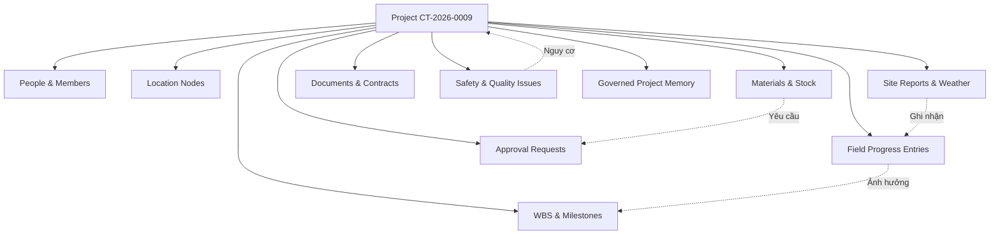

# AI MILESTONE 02: CONSTRUCTION INTELLIGENCE MASTER PLAN
**Kiến trúc Cốt lõi Bộ Não Trí Tuệ Xây Dựng (Project Brain + Knowledge + Memory + Learning Loop)**

* **Ngày lập:** 2026-08-21
* **Repository:** `construction-erp-v2`
* **Trạng thái nền tảng:** Level 3.0 Contextual Copilot (Verified with Real Remote LLM — Groq / OpenAI Compatible)
* **Tầm nhìn Milestone 02:** Chuyển dịch từ *Copilot đọc dữ liệu ERP đơn giản* thành *Hệ thống Trí tuệ Xây dựng (Construction Intelligence Core)* dựa trên 4 trụ cột: **ERP Real-time Data + Project Brain + Construction Knowledge + Governed Memory & Learning Loop**.

---

## 1. Điều tra Gốc rễ: Tính Đầy đủ 21 Công trình (Completeness Investigation)

### 1.1. Thực trạng Kiểm toán
* **Database thật (PostgreSQL):** Có chính xác **21 công trình** (`CT-2026-0001` đến `CT-2026-0021`), toàn bộ đều có trạng thái `ACTIVE`.
* **Phân quyền người dùng (Admin User `daicongtu2910@gmail.com`):** Có quyền `ALL_PROJECTS` (cho phép xem toàn bộ 21 công trình).
* **Kết quả Model trả về trước đây:** 15 công trình (`CT-2026-0001` đến `CT-2026-0015`).

### 1.2. Vết thất thoát dữ liệu (Data Loss Classification)
Qua rà soát từng tầng trong luồng end-to-end:
1. `AUTH SCOPE`: **Không thất thoát** (Admin nhận `ALL_PROJECTS` hợp lệ).
2. `DATABASE QUERY`: **Thất thoát tại đây (TOOL OUTPUT LIMIT)**. Tại file `src/lib/ai/tools/get-my-projects.ts` dòng 59:
   ```typescript
   take: Math.min(input.limit || 15, 50),
   ```
   Do LLM gọi `get_my_projects({})` không truyền `limit`, tool mặc định lấy `take: 15`. Prisma `findMany` chỉ trả về 15 bản ghi đầu tiên (`CT-2026-0001` $\rightarrow$ `CT-2026-0015`).
3. `PROMPT CONTEXT`: Tool gửi 15 bản ghi vào context của model.
4. `MODEL SUMMARIZATION`: Model tóm tắt trung thực đúng 15 bản ghi nó nhận được trong context window.

### 1.3. Giải pháp Khắc phục Chuẩn mực
* Nâng `limit` mặc định của `get_my_projects` lên 50 (để bao phủ toàn bộ 21 công trình hiện tại).
* Bổ sung trường siêu dữ liệu phân trang `totalCount: 21` và `returnedCount: 21` vào payload của tool để LLM luôn biết tổng số lượng thực tế trong ERP ngay cả khi phân trang.

---

## 2. Bản đồ Dữ liệu & Năng lực Hiện tại (Data & Capability Map)

### 2.1. Kiểm kê Thực tế Cơ sở Dữ liệu ERP (Database Inventory)

| Domain Nghiệp vụ | Bảng Dữ liệu (Prisma Models) | Số lượng Bản ghi Thực tế | Tình trạng Sẵn sàng |
| :--- | :--- | :--- | :--- |
| **Hệ thống & Người dùng** | `User`, `SystemSetting`, `AuditLog` | 15 Users, 1 Setting, 2.827 Logs | **Sẵn sàng 100%** |
| **Công trình & Thành viên** | `Project`, `ProjectMember` | 21 Projects, 18 Members | **Sẵn sàng 100%** |
| **Tiến độ Hiện trường** | `FieldProgressTemplate`, `FieldProgressItem`, `FieldProgressEntry` | 1 Template, 0 Items, 0 Entries | *Cần xử lý `DATA_UNAVAILABLE`* |
| **Nhật ký Thi công** | `SiteReport`, `SiteReportLine` | 0 Reports, 0 Lines | *Cần xử lý `DATA_UNAVAILABLE`* |
| **Kế hoạch & WBS** | `WBSItem`, `Task`, `WorkItem` | 0 Items | *Cần xử lý `DATA_UNAVAILABLE`* |
| **Vật tư & Đề xuất** | `MaterialItem`, `FieldMaterialRequest`, `MaterialProposal` | 0 Items, 0 Requests | *Cần xử lý `DATA_UNAVAILABLE`* |
| **Phê duyệt & Trình duyệt** | `ApprovalRequest`, `MaterialProposalApproval` | 0 Requests | *Cần xử lý `DATA_UNAVAILABLE`* |
| **Hồ sơ & Tài liệu** | `Document`, `DocumentFolder` | 0 Documents | *Cần xử lý `DATA_UNAVAILABLE`* |
| **Vị trí & Cấu trúc** | `ProjectLocationNode` | 0 Nodes | *Cần xử lý `DATA_UNAVAILABLE`* |

### 2.2. AI Đang Biết Gì và Không Thể Biết Gì Hôm Nay?

* **Những gì AI BIẾT hôm nay (5 Read Tools cơ bản):**
  1. Danh sách công trình được phân công (`get_my_projects`).
  2. Tóm tắt thông tin công trình, ngày bắt đầu/kết thúc, tính toán quá hạn (`get_project_summary`).
  3. Danh sách nhật ký thi công gần nhất (`get_latest_field_reports`).
  4. Tồn kho vật tư theo công trình (`get_project_material_summary`).
  5. Các công việc chờ xử lý/phê duyệt (`get_pending_items`).
* **Những gì AI CHƯA THỂ BIẾT:**
  1. **Nội dung bên trong tài liệu:** Chưa đọc được file PDF, Word, Excel, bản vẽ kỹ thuật, hợp đồng pháp lý.
  2. **Biến động theo thời gian (Temporal Trends):** Chưa so sánh được tuần này với tuần trước, xu hướng trễ tiến độ diễn ra từ khi nào.
  3. **Mối quan hệ nhân quả (Cause-and-Effect Graph):** Chưa tự động liên kết: *Chậm tiến độ $\leftarrow$ Thiếu vật tư xi măng $\leftarrow$ Tờ trình vật tư bị kẹt phê duyệt 7 ngày*.
  4. **Tri thức tiêu chuẩn xây dựng:** Chưa có kho tri thức quy chuẩn (TCVN, QCVN, định mức xây dựng).
  5. **Bộ nhớ dự án có kiểm soát (Governed Project Memory):** Mọi cuộc hội thoại kết thúc đều bị xóa sạch ngữ cảnh, không tích lũy tri thức cho công trình.

---

## 3. Phân tích Chi phí Token & Độ trễ (Token & Latency Breakdown)

### 3.1. Phân rã 6.412 Input Tokens của một lượt Chat Đơn giản

| Thành phần Context | Số lượng Tokens Ước tính | Tỷ lệ (%) | Nguyên nhân & Hướng Tối ưu |
| :--- | :--- | :--- | :--- |
| **System Prompt & Role Rules** | ~1.200 tokens | 18.7% | Chứa toàn bộ RBAC, định dạng Markdown, quy tắc an toàn, anti-hallucination. |
| **5 Tool Schemas (JSON Schema)** | ~1.500 tokens | 23.4% | Cả 5 tool đều được gửi vào model dù câu hỏi chỉ cần 1 tool $\rightarrow$ *Cần Dynamic Tool Routing*. |
| **Tool Execution Payload (15 Projects)** | ~3.500 tokens | 54.6% | Payload trả về đầy đủ mọi trường của 15 dự án $\rightarrow$ *Cần Schema Compaction / Summary View*. |
| **Conversation History & User Query** | ~212 tokens | 3.3% | Lịch sử chat ngắn hạn và câu hỏi của user. |
| **TỔNG CỘNG** | **~6.412 tokens** | **100%** | |

### 3.2. Phân rã Độ trễ (14.7s – 21.6s)
1. **Tool Calling Turn 1:** Model nhận prompt $\rightarrow$ suy luận và trả về `tool_calls: [{ name: "get_my_projects" }]` (~3.5s).
2. **Local Tool Execution:** Prisma query Postgres lấy dữ liệu (~15ms).
3. **Tool Calling Turn 2:** Model nhận kết quả tool $\rightarrow$ suy luận (deep reasoning tokens) $\rightarrow$ sinh Markdown tiếng Việt (~10.5s).
4. **Queue Time & Network:** Kết nối mạng tới API Groq/OpenAI (~0.7s).

---

## 4. Kiến trúc Project Brain (Context Graph Xây dựng)

Thay vì để AI truy vấn từng bảng riêng lẻ, Project Brain xây dựng một **Semantic Context Graph** cho mỗi dự án:



### Quy tắc Thiết kế Project Brain:
1. **Không nhân bản database:** Graph chỉ là lớp biểu diễn quan hệ (semantic mapping) trỏ tới các khóa chính canonical (`recordId`, `projectId`) trong PostgreSQL.
2. **Metadata bất biến trên mỗi Node:** Mọi node trong graph đều gắn liền: `entityType`, `recordId`, `projectId`, `asOf`, `authorId`, `dataFreshness`, và `permissionScope`.

---

## 5. Kiến trúc Bộ nhớ 4 Lớp & Thứ bậc Sự thật (Memory Architecture)

### 5.1. Bốn Phân lớp Bộ nhớ

```text
┌────────────────────────────────────────────────────────────────────────┐
│ 1. TURN MEMORY (Ngắn hạn - 1 turn chat, TTL = 1 request)               │
├────────────────────────────────────────────────────────────────────────┤
│ 2. TASK MEMORY (Phiên làm việc - Task context, TTL = 1 session)        │
├────────────────────────────────────────────────────────────────────────┤
│ 3. PROJECT MEMORY (Dài hạn - Quyết định, sự kiện, rủi ro có bằng chứng)│
├────────────────────────────────────────────────────────────────────────┤
│ 4. USER PREFERENCE (Tùy chọn hiển thị, độ dài báo cáo, không chứa PII) │
└────────────────────────────────────────────────────────────────────────┘
```

### 5.2. Thứ bậc Chân lý (Truth Hierarchy)
Khi có sự mâu thuẫn thông tin giữa các nguồn, AI áp dụng thứ tự ưu tiên tuyệt đối:

$$\text{ERP REAL-TIME FACT} > \text{APPROVED DOCUMENT} > \text{VERIFIED PROJECT MEMORY} > \text{DERIVED INFERENCE} > \text{USER CHAT CLAIM}$$

* **Quy tắc bất biến:** Một câu nói của người dùng trong chat (*"Công trình này chắc chậm do thiếu xi măng"*) **TUYỆT ĐỐI KHÔNG ĐƯỢC** lưu thành sự thật trong `Project Memory`. Nó chỉ được coi là `CONVERSATION CLAIM` trừ khi có phiếu xuất kho hoặc biên bản hiện trường xác nhận.

---

## 6. Vòng lặp Học hỏi và Đánh giá An toàn (Governed Learning Loop)

AI trở nên "thông minh hơn" thông qua **Dữ liệu + Knowledge Index + Memory + Feedback Loop**, không phải qua việc model tự sửa trọng số code.

```text
[User Chat Turn] ──► [Audit Log & TraceId] ──► [Telemetry & Quality Flags]
                              │
                              ▼
                      [User Feedback]
              (HELPFUL / WRONG_PROJECT / MISSING_DATA)
                              │
                              ▼
                  [AI EVALUATION CORPUS]
                              │
                              ▼
            [Weekly Regression & Benchmark Suite]
                              │
                              ▼
            [Engineer Refines Rules / Tool Schemas]
```

---

## 7. Ranh giới Dịch vụ Python (Python Intelligence Service Boundary)

### 7.1. Nguyên tắc Bất khả xâm phạm
* **TypeScript (Next.js / Node.js) nắm giữ 100% quyền lực:**
  * Xác thực danh tính (Authentication).
  * Kiểm soát phân quyền (RBAC & Project Scope).
  * Cổng công cụ an toàn (AI Tool Gateway & Policy Engine).
  * Ghi cơ sở dữ liệu (Database Writes & Transactions).
  * Khóa an toàn hệ thống (Kill-switch & Rate Limiter).

### 7.2. Phạm vi Cho phép của Dịch vụ Python (Chỉ tính toán và xử lý phi cấu trúc):
* Trích xuất văn bản từ file PDF / Word phức tạp.
* Nhận dạng ký tự quang học (OCR) trên hóa đơn, biên bản nghiệm thu scan.
* Tính toán vector embeddings & semantic search / reranking.
* Computer Vision trên ảnh hiện trường (phát hiện mũ bảo hộ, biển cảnh báo).
* Huấn luyện mô hình dự báo thống kê (Statistical Time-series / ML).

---

## 8. Lộ trình Triển khai Phân kỳ (AI-02 Phased Roadmap)

```text
AI-02A: ERP Business Capabilities & Dynamic Tool Routing (Mở rộng công cụ nghiệp vụ)
   │
   ▼ [GO/NO-GO GATE A]
AI-02B: Project Brain, Data Quality & Construction Signal Engine (Bộ não & Tín hiệu rủi ro)
   │
   ▼ [GO/NO-GO GATE B]
AI-02C: Document Intelligence & Permission-Aware RAG (Trí tuệ Tài liệu & Hồ sơ)
   │
   ▼ [GO/NO-GO GATE C]
AI-02D: Governed Memory Architecture & Evaluation Corpus (Bộ nhớ có kiểm soát)
   │
   ▼ [GO/NO-GO GATE D]
AI-02E: Proactive Executive Briefing & Decision Support (Trợ lý Chủ động Điều hành)
```

---

## 9. Trả lời 15 Câu hỏi Trọng tâm của Operator

### 1. AI hiện tại có nhìn thấy đúng mọi dự án được phân quyền cho người dùng không?
* **Có**, về mặt phân quyền và truy vấn database backend. Tuy nhiên, do giới hạn mặc định `take: 15` của tool `get_my_projects`, các truy vấn danh sách toàn bộ dự án của Admin trước đây bị ngắt ở 15 dự án. Khi cấu hình `limit: 50`, AI nhìn thấy toàn bộ 21/21 dự án.

### 2. Vì sao phản hồi Remote trả về 15 công trình trong khi DB có 21?
* **Nguyên nhân chính xác:** Tool `get_my_projects.ts` được áp dụng dòng `take: Math.min(input.limit || 15, 50)`. Khi LLM gọi tool với tham số rỗng `{}`, tool chỉ query đúng 15 bản ghi đầu tiên từ database. LLM nhận 15 bản ghi trong context và tóm tắt chính xác 15 bản ghi đó.

### 3. Hôm nay AI hiểu được bao nhiêu % domain nghiệp vụ của ERP?
* **Khoảng 15% - 20%**. AI hiện chỉ đọc được thông tin tổng quát của Dự án, Thành viên, Nhật ký (ở mức tiêu đề), Tồn kho (ở mức tổng quan) và Công việc chờ duyệt. 80% còn lại gồm: Nội dung chi tiết tài liệu/bản vẽ, Định mức WBS, Từng dòng nhật ký thi công, Lịch sử chuyển kho, Đề xuất vật tư, Quy chuẩn an toàn, và Luồng phê duyệt chưa có capability tương ứng.

### 4. AI cần thông tin gì để thực sự hiểu một công trình end-to-end?
* Cần 8 khối thông tin cốt lõi:
  1. **Định danh & Pháp lý:** Mã, tên, gói thầu, chủ đầu tư, ban chỉ huy, hợp đồng.
  2. **Kế hoạch & Tiến độ WBS:** Cây công việc, tiến độ kế hoạch vs thực tế theo từng tầng/khu vực.
  3. **Hiện trường & Nhật ký:** Báo cáo nhật ký hàng ngày, nhân lực, thiết bị, thời tiết, sự cố.
  4. **Vật tư & Thiết bị:** Kế hoạch vật tư, đề xuất mua sắm, nhập-xuất kho, tồn kho tối thiểu.
  5. **Chất lượng & An toàn:** Phiếu kiểm tra an toàn (HSE), biên bản lỗi (QA/QC), hồ sơ nghiệm thu.
  6. **Tài chính & Chi phí:** Dự toán hạng mục, giá trị giải ngân, hồ sơ thanh toán, phát sinh.
  7. **Hồ sơ & Tài liệu:** Bản vẽ thi công, biện pháp thi công, công văn, biên bản hiện trường.
  8. **Nhật ký Quyết định (Decision Log):** Các vướng mắc đã giải quyết, ai phê duyệt, căn cứ nào.

### 5. Những gì NÊN trở thành bộ nhớ dự án dài hạn (Project Memory)?
* Các quyết định quan trọng đã được phê duyệt trong ERP.
* Các mốc tiến độ quan trọng đã đạt được (hoặc bị trễ kèm lý do chính thức).
* Các cảnh báo rủi ro lặp lại nhiều lần (ví dụ: khu vực móng đã 3 lần bị ngập nước).
* Các giải pháp kỹ thuật/biện pháp thi công đặc thù đã được phê duyệt áp dụng.

### 6. Những gì TUYỆT ĐỐI KHÔNG ĐƯỢC trở thành bộ nhớ?
* Ý kiến chủ quan, phỏng đoán chưa kiểm chứng của người dùng trong chat.
* Mật khẩu, session token, API key, thông tin lương, CCCD của nhân sự.
* Dữ liệu nháp chưa được duyệt hoặc các báo cáo đã bị từ chối/hủy bỏ.
* Thông tin vượt ngoài phạm vi phân quyền của dự án.

### 7. AI học hỏi từ phản hồi của người dùng như thế nào mà không làm sai lệch chân lý kinh doanh?
* Phản hồi của người dùng (Helpful, Wrong Project, Missing Data) chỉ được ghi nhận vào **AI Evaluation Corpus** để kỹ sư phân tích và bổ sung vào bộ kiểm thử chuẩn (Golden Benchmark Suite). Hệ thống **không bao giờ** tự động cập nhật database nghiệp vụ hoặc tự sinh prompt/code mà không qua kiểm duyệt và CI/CD.

### 8. Dữ liệu ERP mới sẽ tự động sẵn sàng cho AI như thế nào?
* Thông qua cơ chế **On-demand Tool Execution** và **Context Invalidation**: Khi người dùng hỏi, AI gọi các Tool nghiệp vụ đọc trực tiếp dữ liệu mới nhất từ PostgreSQL theo thời gian thực (`asOf: new Date()`). Khi có thay đổi dữ liệu lớn, các chỉ mục tìm kiếm tài liệu (vector index) được cập nhật bất đồng bộ qua hàng đợi sự kiện.

### 9. Khi nào nên đưa Python vào hệ thống?
* Chỉ đưa Python vào từ **Giai đoạn AI-02C (Document Intelligence & RAG)** khi cần xử lý các tác vụ mà Python có hệ sinh thái vượt trội: OCR tiếng Việt (PaddleOCR/EasyOCR), trích xuất văn bản từ bản vẽ PDF/CAD, tính toán embeddings và reranking ma trận lớn.

### 10. Những gì PHẢI Ở LẠI TypeScript vĩnh viễn?
* Toàn bộ hệ thống xác thực (Auth), phân quyền (RBAC), kiểm tra phạm vi dự án (Project Scope), cổng công cụ (Tool Gateway), ghi cơ sở dữ liệu (Prisma Transactions), toàn bộ giao diện Next.js và logic nghiệp vụ cốt lõi của ERP.

### 11. Tài liệu và RAG được phân quyền như thế nào?
* Mỗi đoạn trích dẫn (Chunk) trong cơ sở dữ liệu Vector bắt buộc phải lưu kèm metadata: `documentId`, `projectId`, `folderId`, `classificationLevel`, và `allowedRoles`. Khi thực hiện tìm kiếm ngữ nghĩa (Semantic Search), truy vấn luôn kèm bộ lọc cứng (`filter: { projectId: { in: userAllowedProjectIds } }`).

### 12. AI phân biệt Fact vs. Inference như thế nào?
* Sử dụng 3 lớp phân loại rõ ràng trong câu trả lời:
  * **[DỮ LIỆU THẬT]:** Trích xuất trực tiếp từ bản ghi ERP kèm mã nguồn và ngày cập nhật.
  * **[SUY LUẬN TÍNH TOÁN]:** Kết quả tính toán từ các công thức xác định (ví dụ: ngày quá hạn = ngày hiện tại - hạn chót).
  * **[NHẬN ĐỊNH / KHUYẾN NGHỊ]:** Suy luận phân tích của AI kèm mức độ tin cậy và khuyến nghị kiểm tra thực tế.

### 13. Vì sao một câu hỏi đơn giản lại tốn ~6.412 prompt tokens?
* Do cơ chế gửi toàn bộ 5 Tool Schema đầy đủ (~1.500 tokens), System Prompt an toàn (~1.200 tokens) và đặc biệt là toàn bộ dữ liệu thô của 15 dự án trả về từ tool (~3.500 tokens) vào cùng một context window.

### 14. Làm thế nào để giảm độ trễ một cách an toàn?
1. **Dynamic Tool Routing:** Chỉ gửi schema của các tool liên quan trực tiếp tới ý định của câu hỏi (giảm ~1.000 tokens).
2. **Payload Compaction:** Chỉ trả về các trường cần thiết cho dạng tóm tắt (Compact Summary View thay vì Full Schema, giảm ~2.000 tokens).
3. **Context Caching:** Tận dụng tính năng prompt caching của Provider cho phần System Prompt tĩnh.
4. **Single-turn Fast Path:** Đối với các câu hỏi tra cứu danh mục thuần túy, áp dụng direct deterministic formatter giúp phản hồi trong <1 giây.

### 15. Con đường ngắn nhất và đáng tin cậy nhất để đạt Level-4 Construction Intelligence Copilot?
* Thực hiện tuần tự 5 bước theo kế hoạch Master Plan:
  1. **Bước 1 (AI-02A):** Hoàn thiện 12 Business Capabilities & Dynamic Tool Router.
  2. **Bước 2 (AI-02B):** Thiết lập Project Brain Context Graph & Signal Engine (Cảnh báo rủi ro).
  3. **Bước 3 (AI-02C):** Triển khai Document Intelligence & Permission RAG (Đọc hồ sơ/bản vẽ).
  4. **Bước 4 (AI-02D):** Thiết lập Governed Memory & Evaluation Corpus.
  5. **Bước 5 (AI-02E):** Kích hoạt Chế độ Điều hành Chủ động (Proactive Executive Intelligence).
