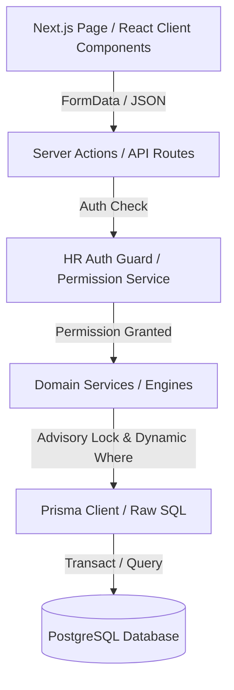
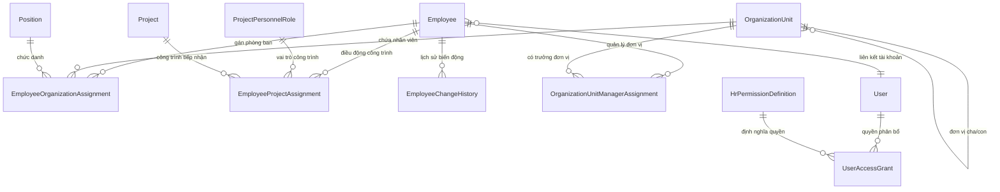
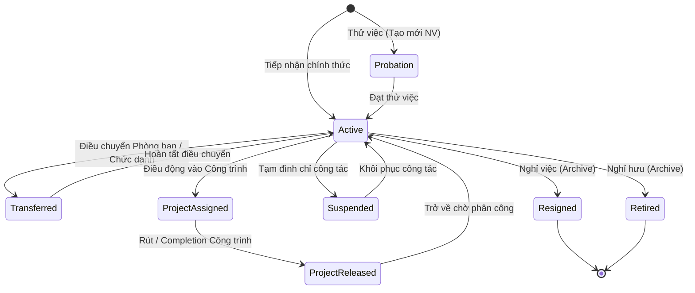

# BÁO CÁO AUDIT / KIỂM KÊ 360° TOÀN BỘ PHÂN HỆ QUẢN LÝ NHÂN SỰ (HR SUB-MODULE)
**Hệ thống:** Construction ERP V2 (`construction-erp-v2`)  
**Ngày thực hiện Audit:** 13/08/2026  
**Chế độ thực hiện:** READ-ONLY / AUDIT ONLY (Không thay đổi codebase, DB, hay giao diện)  
**Trạng thái phân hệ (Overall Status):** **PARTIAL (7.5 / 10)**  

---

## 1. TỔNG QUAN HỆ THỐNG & EXECUTIVE SUMMARY

### 1.1 Trạng thái chung (Overall Status & Score)
Phân hệ Quản lý Nhân sự (HR Sub-module) của `construction-erp-v2` hiện tại đang ở trạng thái **Khung kiến trúc vững chắc nhưng chưa hoàn thiện toàn bộ nghiệp vụ (Partially Complete)**. 

- **Điểm đánh giá kiến trúc & Bảo mật:** **8.5 / 10**
- **Điểm đánh giá nghiệp vụ & Dữ liệu:** **7.0 / 10**
- **Điểm đánh giá UI/UX & Trải nghiệm:** **7.0 / 10**
- **Điểm đánh giá độ phủ tính năng HR:** **5.5 / 10** (Thiếu Lương, Chấm công, Bảo hiểm, Hợp đồng trực quan, Chứng chỉ)
- **Đánh giá tổng thể:** **7.5 / 10**

### 1.2 Nhận xét Tổng quát (Executive Overview)
Hệ thống HR sở hữu một **nền tảng bảo mật PII và quản trị phân bổ công trình cực kỳ chuyên nghiệp và chuẩn mực**:
1. **Mã hóa PII chuẩn ngân hàng:** Số CCCD/CMND được mã hóa bằng thuật toán `AES-256-GCM` kèm khóa mã hóa cấp ứng dụng, kết hợp với chỉ mục mù (`HMAC-SHA256 blind index`) để tìm kiếm chính xác mà không làm rò rỉ dữ liệu thô.
2. **Thuật toán phân bổ công trình Sweep-Line:** Quản lý điều động nhân lực công trình (`EmployeeProjectAssignment`) sử dụng thuật toán Sweep-Line với PostgreSQL Advisory Transaction Lock (`pg_advisory_xact_lock`) để chống ghi đè/xung đột tỷ lệ phân bổ (% allocation) khi có nhiều giao dịch đồng thời.
3. **Phân quyền RBAC & Phạm vi dữ liệu (Data Scope) 5 tầng:** Cơ chế `UserAccessGrant` quản lý phân quyền hạt nhân với 5 phạm vi dữ liệu (`ALL_EMPLOYEES`, `OWN_ORGANIZATION_UNIT`, `OWN_PROJECTS`, `SELF_ONLY`, `NONE`) và 6 chính sách truy cập trường nhạy cảm (`BASIC_ONLY` -> `FULL`).
4. **Nhật ký thay đổi 2 lớp:** Kết hợp giữa `AuditLog` toàn hệ thống và `EmployeeChangeHistory` lưu lại toàn bộ dòng lịch sử biến động nhân sự.

**Tuy nhiên, hệ thống còn tồn tại 3 rủi ro lớn & bất cập nghiệp vụ:**
1. **Lỗi bất nhất dữ liệu (Data Inconsistency Defect) khi cho nhân viên Nghỉ việc (`RESIGNED`):** Khi chuyển trạng thái nhân viên sang Nghỉ việc trong `archiveEmployeeAction`, hệ thống đóng phân công phòng ban nhưng **KHÔNG tự động thu hồi/giải phóng các phân công công trình (`EmployeeProjectAssignment`) đang ACTIVE**, dẫn đến tồn tại bản ghi phân công "mồ côi" của nhân viên đã nghỉ việc.
2. **Lệch chỉ số KPI giữa Dashboard và Màn hình Danh sách Nhân viên:** Dashboard tính `siteCount` chỉ lọc nhân viên `ACTIVE`/`PROBATION`, trong khi API danh sách nhân viên (`/hr/employees?workplace=site`) không mặc định lọc theo trạng thái nhân viên, dẫn đến số lượng đếm trên màn hình danh sách có thể lớn hơn số liệu hiển thị trên thẻ KPI Dashboard.
3. **Tồn tại các Route "Ma" (Redirect Stubs):** Các đường dẫn `/hr/contracts`, `/hr/certificates`, `/hr/alerts` thực chất chỉ chứa 1 dòng `redirect()` về `/hr/employees` hoặc `/hr`, chưa hề có giao diện hay nghiệp vụ thực tế.

---

## 2. KIẾN TRÚC & LUỒNG DỮ LIỆU TOÀN PHÂN HỆ (ARCHITECTURE & SYSTEM MAP)

### 2.1 Luồng xử lý End-to-End (UI -> Server Action -> Domain Service -> Prisma -> DB)
Hệ thống tuân thủ kiến trúc Server Components + Server Actions + Domain Service Services trong Next.js App Router:



### 2.2 Chi tiết luồng cho từng tính năng chính

| Phân hệ / Route | File UI (Page / Component) | Server Action / API Route | Domain Service / Helper | Prisma Model liên quan |
| :--- | :--- | :--- | :--- | :--- |
| **HR Dashboard** (`/hr`) | `src/app/hr/page.tsx`<br>`src/components/hr/hr-dashboard-kpis.tsx` | Server Component Direct Query | `src/lib/hr/hr-auth-guard.ts` | `Employee`, `EmployeeProjectAssignment`, `OrganizationUnit` |
| **Danh sách Nhân viên** (`/hr/employees`) | `src/app/hr/employees/page.tsx`<br>`src/components/hr/employees-client.tsx` | Server Component Query | `buildEmployeeScopeWhereClause()` | `Employee`, `EmployeeOrganizationAssignment`, `EmployeeProjectAssignment` |
| **Tạo Nhân viên Mới** (`/hr/employees/new`) | `src/app/hr/employees/new/page.tsx`<br>`src/components/hr/employee-form-dialog.tsx` | `createEmployeeAction` (`employee-actions.ts:59`) | `generateNextEmployeeCode()`<br>`pii-encryption.ts` | `Employee`, `EmployeeOrganizationAssignment`, `EmployeeChangeHistory`, `AuditLog` |
| **Hồ sơ Chi tiết NV** (`/hr/employees/[id]`) | `src/app/hr/employees/[employeeId]/page.tsx` | `updateEmployeeProfileAction`<br>`updateEmployeeIdentityNumberAction`<br>`archiveEmployeeAction` | `decryptIdentityNumber()`<br>`findEmployeeInScope()` | `Employee`, `EmployeeOrganizationAssignment`, `EmployeeProjectAssignment`, `EmployeeChangeHistory` |
| **Cơ cấu Tổ chức** (`/hr/organization`) | `src/app/hr/organization/page.tsx`<br>`src/app/hr/organization/chart/page.tsx` | `createOrgUnitAction`<br>`updateOrgUnitAction`<br>`deleteOrgUnitAction` | `organization-service.ts`<br>`validateOrgUnitHierarchy()` | `OrganizationUnit`, `OrganizationUnitManagerAssignment` |
| **Quản lý Chức danh** (`/hr/organization/positions`) | `src/app/hr/organization/positions/page.tsx` | `createPositionAction`<br>`updatePositionAction`<br>`deletePositionAction` | `organization-service.ts` | `Position`, `EmployeeOrganizationAssignment` |
| **Bổ nhiệm Quản lý** (`/hr/organization/managers`) | `src/app/hr/organization/managers/page.tsx` | `assignUnitManagerAction`<br>`endUnitManagerTermAction` | `assignUnitManager()` | `OrganizationUnitManagerAssignment` |
| **Phân công Công trình** (`/hr/project-assignments`) | `src/app/hr/project-assignments/page.tsx` | `assignEmployeeToProjectAction`<br>`releaseEmployeeFromProjectAction` | `project-assignment-service.ts`<br>`allocation-engine.ts` | `EmployeeProjectAssignment`, `ProjectPersonnelRole`, `Project` |
| **Báo cáo & Xuất Excel** (`/hr/reports`) | `src/app/hr/reports/page.tsx`<br>`src/app/api/hr/reports/export/route.ts` | GET `/api/hr/reports/export` | `reporting-service.ts`<br>`generateHrExcelReportBuffer()` | Tất cả các bảng HR + ExcelJS |
| **Redirect Sub-routes** | `/hr/contracts`<br>`/hr/certificates`<br>`/hr/alerts` | N/A (Chứa 1 dòng `redirect()`) | N/A | N/A |

---

## 3. INVENTORY CHI TIẾT TOÀN BỘ PHÂN HỆ NHÂN SỰ

### 3.1 Giao diện & Routes (Pages & Views)
1. `src/app/hr/page.tsx`: HR Overview Dashboard (4 Thẻ KPI chính, biểu đồ phân bổ phòng ban, danh sách chưa điều động).
2. `src/app/hr/employees/page.tsx`: Danh sách Nhân sự (Bộ lọc theo từ khóa, đơn vị, công trình, vị trí làm việc `workplace=all|site|unassigned`, trạng thái làm việc).
3. `src/app/hr/employees/new/page.tsx`: Form tạo hồ sơ nhân viên mới (Hỗ trợ gán phòng ban & chức danh ban đầu, nhập CCCD mã hóa).
4. `src/app/hr/employees/[employeeId]/page.tsx`: Xem chi tiết hồ sơ nhân sự (Tabs: Thông tin chung, Tổ chức/Điều chuyển, Công trình, Lịch sử biến động).
5. `src/app/hr/employees/[employeeId]/edit/page.tsx`: Form chỉnh sửa hồ sơ nhân viên (Kiểm tra xung đột phiên bản `updatedAt`).
6. `src/app/hr/organization/page.tsx`: Danh sách & Quản lý Đơn vị Tổ chức (Phòng ban/Trung tâm/Chi nhánh).
7. `src/app/hr/organization/chart/page.tsx`: Sơ đồ Cây Tổ chức (Org Chart Tree view trực quan).
8. `src/app/hr/organization/positions/page.tsx`: Danh mục Chức danh Chuyên môn (Quản lý mã, tên, cấp bậc 1-10).
9. `src/app/hr/organization/managers/page.tsx`: Danh sách & Lịch sử Bổ nhiệm Người phụ trách/Trưởng đơn vị.
10. `src/app/hr/project-assignments/page.tsx`: Workspace Điều động & Phân công Nhân sự Công trình.
11. `src/app/hr/reports/page.tsx`: Trung tâm Báo cáo, Phân tích & Xuất Báo cáo Excel.
12. `src/app/hr/contracts/page.tsx`: *Stub route* (Redirect tới `/hr/employees`).
13. `src/app/hr/certificates/page.tsx`: *Stub route* (Redirect tới `/hr/employees`).
14. `src/app/hr/alerts/page.tsx`: *Stub route* (Redirect tới `/hr`).

### 3.2 Backend Services & Business Logic Engines
1. `src/lib/hr/hr-auth-guard.ts`: Bảo vệ quyền truy cập HR, tính toán `buildEmployeeScopeWhereClause()` theo 5 Data Scopes.
2. `src/lib/hr/permission-service.ts`: Giải mã quyền `resolveUserHrPermission()`, quản lý danh mục 14 quyền chuẩn (`CANONICAL_HR_PERMISSIONS`), quy tắc DENY đè ALLOW.
3. `src/lib/hr/pii-encryption.ts`: Bộ công cụ mã hóa PII (`AES-256-GCM`, `HMAC-SHA256 blind index`, mã hóa Envelope).
4. `src/lib/hr/allocation-engine.ts`: Thuật toán Sweep-Line kiểm tra xung đột % phân bổ công trình qua các khoảng thời gian (`checkAllocationCapacity()`).
5. `src/lib/hr/project-assignment-service.ts`: Nghiệp vụ điều động, gia hạn, rút nhân sự, điều chuyển vai trò công trình với PostgreSQL Advisory Lock.
6. `src/lib/hr/organization-service.ts`: Nghiệp vụ tạo/sửa/xóa đơn vị, phát hiện vòng lặp phân cấp cây tổ chức (`validateOrgUnitHierarchy()`), bổ nhiệm quản lý, điều chuyển phòng ban.
7. `src/lib/hr/employee-code-generator.ts`: Bộ sinh mã nhân viên tự động cấp phát nguyên tử `NV-YYYY-NNNN` chống trùng lặp trong giao dịch DB.
8. `src/lib/hr/reporting-service.ts`: Engine tính toán KPI báo cáo, phân tích cơ cấu, tạo Workbook Excel đa trang (`exceljs`).
9. `src/lib/hr/effective-date-helper.ts`: Công cụ tính toán khoảng thời gian hiệu lực `[startDate, endDate)` chính xác đến milisecond.
10. `src/lib/hr/vietnam-date-helper.ts`: Chuẩn hóa định dạng ngày tháng giờ Việt Nam (`Asia/Ho_Chi_Minh`).
11. `src/lib/hr/concurrency-lock-helper.ts`: PostgreSQL Transaction Lock theo `employeeId` (`pg_advisory_xact_lock`).

---

## 4. AUDIT DATABASE SCHEMA & MÔ HÌNH DỮ LIỆU HR (DATABASE INVENTORY)

### 4.1 Bảng kê các Prisma Models thuộc phân hệ HR



#### 1. Model `Employee` (Nhân sự / Hồ sơ nhân viên)
- **Các trường chính:** `id`, `code` (Unique, NV-YYYY-NNNN), `userId` (Unique, Nullable), `fullName`, `gender`, `dateOfBirth`, `phoneNumber`, `personalEmail`, `joinedDate`, `status` (Enum: `PROBATION`, `ACTIVE`, `SUSPENDED`, `RESIGNED`, `RETIRED`), `resignedDate`, `identityNumberEncrypted`, `identityNumberBlindIndex` (Unique), `identityNumberLastDigits`, `createdAt`, `updatedAt`.
- **Khóa ngoại / Quan hệ:** `userId` -> `User`, `createdById` -> `User`, `updatedById` -> `User`.
- **Đánh giá:** Có mã hóa PII chuẩn. Tuy nhiên **thiếu các trường mở rộng**: Quê quán, Dân tộc, Trình độ học vấn, Số tài khoản ngân hàng, Mã số thuế cá nhân, Số sổ BHXH (được quy hoạch trong `SensitiveFieldPolicy` nhưng chưa có trường DB thực tế).

#### 2. Model `OrganizationUnit` (Đơn vị / Phòng ban tổ chức)
- **Các trường chính:** `id`, `code` (Unique), `name`, `parentId` (Nullable), `description`, `orderIndex`, `isActive`, `createdAt`, `updatedAt`.
- **Khóa ngoại / Quan hệ:** `parentId` -> `OrganizationUnit` (Cây phân cấp đệ quy).
- **Đánh giá:** Cấu trúc đệ quy gọn nhẹ. Có mã khóa unique `code`.

#### 3. Model `Position` (Chức danh chuyên môn)
- **Các trường chính:** `id`, `code` (Unique), `title`, `description`, `level` (Int 1-10, Nullable), `isActive`, `createdAt`, `updatedAt`.
- **Đánh giá:** Đáp ứng tốt việc phân cấp trình độ chuyên môn từ Kỹ sư, Chuyên viên đến Giám đốc khối.

#### 4. Model `EmployeeOrganizationAssignment` (Phân công phòng ban & chức danh)
- **Các trường chính:** `id`, `employeeId`, `organizationUnitId`, `positionId`, `startDate`, `endDate` (Nullable), `isPrimary` (Boolean), `decisionNo`, `notes`, `createdById`.
- **Đánh giá:** Lưu trữ lịch sử luân chuyển phòng ban chuẩn mốc thời gian `[startDate, endDate)`.

#### 5. Model `OrganizationUnitManagerAssignment` (Phân công quản lý đơn vị)
- **Các trường chính:** `id`, `organizationUnitId`, `employeeId`, `startDate`, `endDate` (Nullable), `isPrimary`, `decisionNo`, `appointedById`.
- **Đánh giá:** Cho phép xác định ai là Trưởng phòng/Giám đốc đơn vị tại bất kỳ mốc thời gian nào.

#### 6. Model `ProjectPersonnelRole` (Vai trò nhân sự công trình)
- **Các trường chính:** `id`, `code` (Unique), `name`, `description`, `orderIndex`, `isActive`.
- **Danh mục chuẩn:** Chỉ huy trưởng, Chỉ huy phó, Kỹ sư trưởng, Kỹ sư hiện trường, QS, QA/QC, Cán bộ An toàn (HSE), Thủ kho công trình.

#### 7. Model `EmployeeProjectAssignment` (Điều động / Phân công công trình)
- **Các trường chính:** `id`, `employeeId`, `projectId`, `projectPersonnelRoleId`, `startDate`, `expectedEndDate` (Nullable), `endDate` (Nullable), `allocationPercentage` (Int 1-100), `status` (Enum: `ACTIVE`, `RELEASED`, `CANCELLED`), `assignmentDecisionNo`, `notes`, `overrideReason`, `sourceOrgUnitId`, `sourceOrgUnitCodeSnapshot`, `sourceOrgUnitNameSnapshot`.
- **Đánh giá:** Lưu snapshot đơn vị gốc tại thời điểm điều động. Đây là mô hình cực kỳ xuất sắc.

#### 8. Model `EmployeeChangeHistory` (Nhật ký biến động nhân sự)
- **Các trường chính:** `id`, `employeeId`, `changeType` (Enum: `EMPLOYEE_CREATED`, `EMPLOYEE_PROFILE_UPDATED`, `EMPLOYEE_ORGANIZATION_TRANSFERRED`, `EMPLOYEE_POSITION_CHANGED`, `EMPLOYEE_PROJECT_ASSIGNED`, `EMPLOYEE_PROJECT_RELEASED`, `EMPLOYMENT_STATUS_CHANGED`, `ACCESS_GRANTED`, `ACCESS_REVOKED`), `performedById`, `reason`, `details` (Json).

#### 9. Model `HrPermissionDefinition` & `UserAccessGrant` (Hệ thống RBAC HR)
- **`HrPermissionDefinition`:** `code` (PK), `name`, `module`, `description`.
- **`UserAccessGrant`:** `id`, `userId`, `permissionCode`, `organizationUnitId` (Nullable), `projectId` (Nullable), `effect` (`ALLOW`/`DENY`), `scope` (`ALL_EMPLOYEES`, `OWN_ORGANIZATION_UNIT`, `OWN_PROJECTS`, `SELF_ONLY`, `NONE`), `sensitiveFieldPolicy` (`BASIC_ONLY`, `CONTACT`, `IDENTITY`, `CONTRACT`, `BANKING`, `FULL`), `validFrom`, `validUntil`, `grantedById`, `revokedAt`.

---

## 5. AUDIT LOGIC NGHIỆP VỤ & CÔNG THỨC KPI (BUSINESS LOGIC AUDIT)

### 5.1 Các Công thức KPI tại HR Dashboard (`src/app/hr/page.tsx`)

1. **Tổng nhân lực công ty (`totalWorkforce`):**
   - **Vị trí code:** `src/app/hr/page.tsx:88-92`
   - **Điều kiện lọc:** `status IN ['ACTIVE', 'PROBATION']`
   - **Công thức:** `COUNT(Employee)` đang làm việc hoặc thử việc.

2. **Nhân sự đang ở công trình (`siteCount`):**
   - **Vị trí code:** `src/app/hr/page.tsx:94-106`
   - **Điều kiện lọc:** Nhân viên có `status IN ['ACTIVE', 'PROBATION']` VÀ có ít nhất 1 bản ghi `EmployeeProjectAssignment` thỏa mãn: `status = 'ACTIVE'`, `startDate <= now()`, và (`endDate IS NULL` HOẶC `endDate > now()`).
   - **Công thức:** `COUNT(DISTINCT Employee.id)`.

3. **Nhân sự chưa phân bổ công trình (`unassignedCount`):**
   - **Vị trí code:** `src/app/hr/page.tsx:108-112`
   - **Công thức:** `totalWorkforce - siteCount`.

4. **Nhân sự chưa gán Phòng ban (`missingOrgCount`):**
   - **Vị trí code:** `src/app/hr/page.tsx:114-126`
   - **Điều kiện lọc:** Nhân viên `ACTIVE`/`PROBATION` có 0 bản ghi `EmployeeOrganizationAssignment` đang hiệu lực (`isPrimary = true`, `startDate <= now()`, `endDate IS NULL`).

### 5.2 Các Công thức KPI tại Báo cáo Phân tích HR (`src/lib/hr/reporting-service.ts`)

1. **Còn khả năng phân bổ (`availableCapacityEmployees`):**
   - **Vị trí code:** `reporting-service.ts:169-171`
   - **Công thức:** Đếm số nhân sự có tổng `% allocation` của các phân công đang active **< 100%**.

2. **Vượt định mức phân bổ (`overallocatedEmployees`):**
   - **Vị trí code:** `reporting-service.ts:171-173`
   - **Công thức:** Đếm số nhân sự có tổng `% allocation` của các phân công đang active **> 100%**.

3. **Sắp hết hạn điều động trong 30 ngày (`expiringAssignments30d`):**
   - **Vị trí code:** `reporting-service.ts:164-167`
   - **Công thức:** Đếm số bản ghi điều động active có `expectedEndDate` nằm trong khoảng `[targetDate, targetDate + 30 ngày]`.

---

## 6. AUDIT ĐỘ TRUY NGUYÊN VÀ BẤT NHẤT DỮ LIỆU (DATA INTEGRITY & CONSISTENCY AUDIT)

### 6.1 Phát hiện 1: Nhân viên nghỉ việc để lại Phân công Công trình "Mồ côi" (CRITICAL DATA DEFECT)
- **Vị trí tìm thấy:** `src/app/hr/employees/actions/employee-actions.ts:508-537` (`archiveEmployeeAction`).
- **Hiện trạng:** Khi người dùng chuyển trạng thái nhân viên sang `RESIGNED` (Nghỉ việc) hoặc `RETIRED` (Nghỉ hưu):
  ```typescript
  // 1. Cập nhật status = RESIGNED
  await tx.employee.update({ where: { id: employeeId }, data: { status: RESIGNED, resignedDate } });
  
  // 2. Đóng phân công phòng ban
  await tx.employeeOrganizationAssignment.updateMany({
    where: { employeeId, endDate: null },
    data: { endDate: resignedDateObj, isPrimary: false }
  });
  
  // 3. KHÔNG THỰC HIỆN BẤT KỲ THAO TÁC NÀO VỚI EmployeeProjectAssignment!
  ```
- **Hậu quả:** 
  1. Nhân viên đã nghỉ việc nhưng trên các công trình, bản ghi điều động của họ vẫn ở trạng thái `status = ACTIVE` và `endDate = NULL`.
  2. Bảng phân bổ nhân sự công trình tiếp tục tính người này vào quy mô nhân sự hiện có của dự án.
  3. Dù hệ thống có trả về `warning` trong response, nhưng nếu người dùng không tự vào workspace công trình để giải phóng thủ công, dữ liệu sẽ bị sai lệch hoàn toàn.

### 6.2 Phát hiện 2: Sai lệch số liệu đếm giữa Dashboard và Danh sách Nhân viên theo Công trình
- **Vị trí tìm thấy:** `src/app/hr/page.tsx:94` vs `src/app/hr/employees/page.tsx:75-100`.
- **Hiện trạng:**
  - Dashboard card "Đang ở công trình" lọc `Employee.status IN ['ACTIVE', 'PROBATION']`.
  - Màn hình `/hr/employees?workplace=site` khi query danh sách nhân viên ở công trình lại truy vấn thông qua quan hệ `projectAssignments: { some: { status: 'ACTIVE' } }` mà **không ép lọc `status` nhân viên về `ACTIVE`/`PROBATION`** nếu URL không truyền `status`.
- **Hậu quả:** Nếu có 2 nhân viên đã nghỉ việc nhưng có phân công mồ côi (như tại Phát hiện 1), Dashboard báo `10 nhân sự`, nhưng khi bấm vào xem danh sách `/hr/employees?workplace=site` sẽ hiển thị `12 nhân sự`. Điều này làm người quản lý nghi ngờ tính chính xác của ERP.

### 6.3 Phát hiện 3: Thao tác Xóa Cứng (Hard Delete) Đơn vị Tổ chức & Chức danh
- **Vị trí tìm thấy:** `src/app/hr/organization/actions/organization-actions.ts:170-242` (`deleteOrgUnitAction`) & lines 356-411 (`deletePositionAction`).
- **Hiện trạng:** Hàm `deleteOrgUnitAction` và `deletePositionAction` thực hiện **XÓA VẬT LÝ (`tx.organizationUnit.delete`, `tx.position.delete`)** thay vì Soft Delete (`isActive = false`).
- **Hậu quả:** Dù action có xóa các phân công liên quan (`tx.employeeOrganizationAssignment.deleteMany`), nhưng nếu trong quá khứ nhân viên có lịch sử làm việc tại phòng ban/chức danh đó, toàn bộ liên kết FK sẽ bị mồ côi hoặc bị xóa sạch khỏi DB, làm mất tính toàn vẹn của lịch sử nhân sự.

---

## 7. AUDIT PHÂN QUYỀN RBAC & BẢO MẬT PII (SECURITY & RBAC AUDIT)

### 7.1 Ma trận Phân quyền HR chuẩn (`CANONICAL_HR_PERMISSIONS`)

| Mã Quyền (Permission Code) | Tên Quyền | Phạm vi mặc định (Scope) | Xem dữ liệu nhạy cảm (PII) | Mức độ rủi ro |
| :--- | :--- | :--- | :--- | :--- |
| `hr:employee:read` | Xem hồ sơ nhân viên cơ bản | `ALL_EMPLOYEES` / Scope | `BASIC_ONLY` (Ẩn CCCD) | LOW |
| `hr:employee:create` | Tạo mới nhân viên | `ALL_EMPLOYEES` | `BASIC_ONLY` | MEDIUM |
| `hr:employee:update` | Cập nhật thông tin nhân viên | Theo Target Scope | `BASIC_ONLY` | MEDIUM |
| `hr:employee:delete` | Chuyển nghỉ việc / Lưu trữ | Theo Target Scope | `BASIC_ONLY` | HIGH |
| `hr:employee:read_sensitive` | Giải mã & Xem CCCD/CMND | Theo Target Scope | `IDENTITY` / `FULL` | **CRITICAL** |
| `hr:organization:manage` | Quản lý sơ đồ phòng ban | `ALL_EMPLOYEES` | N/A | HIGH |
| `hr:position:manage` | Quản lý chức danh | `ALL_EMPLOYEES` | N/A | MEDIUM |
| `hr:project_role:manage` | Quản lý vai trò dự án | `ALL_EMPLOYEES` | N/A | MEDIUM |
| `hr:project_assignment:read` | Xem phân công công trình | `ALL_EMPLOYEES` / Scope | `BASIC_ONLY` | LOW |
| `hr:project_assignment:create` | Điều động nhân sự công trình | Theo Target Scope | N/A | HIGH |
| `hr:project_assignment:update` | Điều chỉnh / Gia hạn điều động | Theo Target Scope | N/A | MEDIUM |
| `hr:project_assignment:release` | Rút nhân sự khỏi công trình | Theo Target Scope | N/A | HIGH |
| `hr:project_allocation:override` | Ghi đè phân bổ vượt 100% | `ALL_EMPLOYEES` | N/A | **HIGH** |
| `hr:access_grant:manage` | Phân quyền & Ủy quyền HR | `ALL_EMPLOYEES` | `FULL` | **CRITICAL** |

### 7.2 Đánh giá Kiến trúc Bảo mật PII (CCCD/CMND Encryption Audit)
- **Thuật toán sử dụng:** `AES-256-GCM` với IV ngẫu nhiên 12-byte và Auth Tag 16-byte (`src/lib/hr/pii-encryption.ts`).
- **Cơ chế tìm kiếm không giải mã:** Sử dụng `HMAC-SHA256` với Salt cố định tạo ra `identityNumberBlindIndex`. Khi người dùng nhập CCCD để tìm kiếm hoặc check trùng, hệ thống băm chuỗi nhập vào và so sánh blind index trên DB. **Đây là thiết kế đạt tiêu chuẩn PCI-DSS / ISO 27001.**
- **Kiểm soát xem dữ liệu thô:** Chỉ người dùng có quyền `hr:employee:read_sensitive` với `sensitiveFieldPolicy IN ['IDENTITY', 'FULL']` mới có thể gọi `revealIdentityNumberAction()`. Mỗi lần xem đều ghi `AuditLog` với action `VIEW_SENSITIVE_IDENTITY_NUMBER`.

---

## 8. SƠ ĐỒ VÒNG ĐỜI NHÂN VIÊN (EMPLOYEE LIFECYCLE WORKFLOW MAP)



---

## 9. PHÂN TÍCH THUẬT TOÁN PHÂN BỔ CÔNG TRÌNH (PROJECT ALLOCATION ENGINE ANALYSIS)

### 9.1 Cơ chế chống ghi đè giao dịch đồng thời (PostgreSQL Advisory Lock)
Khi điều động nhân sự (`createProjectAssignment`), hai người dùng có thể cùng lúc chọn điều động một nhân viên vào 2 dự án khác nhau.
Để tránh Race Condition, hệ thống gọi `executeWithAdvisoryLock` (`src/lib/hr/concurrency-lock-helper.ts`):
```typescript
const lockId = generateAdvisoryLockId(employeeId); // Băm UUID thành Int64
await tx.$executeRaw`SELECT pg_advisory_xact_lock(${lockId})`;
```
Advisory lock này tự động giải phóng khi giao dịch PostgreSQL kết thúc (`COMMIT` hoặc `ROLLBACK`). **Đây là giải pháp chặn xung đột hoàn hảo ở cấp độ cơ sở dữ liệu.**

### 9.2 Thuật toán Sweep-Line tính đỉnh phân bổ (`allocation-engine.ts`)
Hệ thống sử dụng thuật toán **Sweep-Line (Đường quét theo thời gian)** để tính tổng `% allocation` lớn nhất tại bất kỳ thời điểm nào:
1. Mỗi bản ghi phân công được tách thành 2 sự kiện: `START` (cộng thêm %) và `END` (trừ đi %).
2. Sắp xếp tất cả các sự kiện theo mốc thời gian tăng dần.
3. Duyệt từ trái qua phải, cộng dồn `% allocation`. Nếu tại bất kỳ khoảng thời gian nào tổng `% > 100%`, thuật toán phát hiện `hasConflict = true` và xác định chính xác ngày bắt đầu/kết thúc đoạn bị quá tải.
4. Nếu có xung đột, giao dịch bị dừng trừ khi người dùng cung cấp quyền `hr:project_allocation:override` kèm `overrideReason`.

---

## 10. AUDIT GIAO DIỆN & TRẢI NGHIỆM NGUỜI DÙNG (UI/UX AUDIT)

### 10.1 Đánh giá chi tiết từng màn hình

1. **HR Dashboard (`/hr`):**
   - *Ưu điểm:* Giao diện hiện đại, dùng thẻ KPI rõ ràng, phân màu xanh/cam/đỏ trực quan.
   - *Hạn chế:* Thiếu biểu đồ đường (Line chart) thể hiện biến động tăng/giảm nhân sự theo các tháng trong năm.

2. **Danh sách Nhân viên (`/hr/employees`):**
   - *Ưu điểm:* Có thanh tìm kiếm tức thì, lọc đa tiêu chí (Đơn vị, Công trình, Trạng thái).
   - *Hạn chế:* Bảng dữ liệu chưa hỗ trợ tùy chỉnh ẩn/hiện cột (Column Visibility), chưa có xuất danh sách ra Excel trực tiếp từ màn hình này (phải qua `/hr/reports`).

3. **Form Tạo mới / Sửa Nhân viên (`/hr/employees/new`, `/hr/employees/[id]/edit`):**
   - *Ưu điểm:* Đã tích hợp kiểm tra xung đột phiên bản `updatedAt` chống ghi đè dữ liệu cũ. Form chia nhóm thông tin mạch lạc.
   - *Hạn chế:* Nhập ngày tháng bằng input date mặc định của trình duyệt chưa thật sự mượt mà trên một số thiết bị.

4. **Sơ đồ Cây Tổ chức (`/hr/organization/chart`):**
   - *Ưu điểm:* Đã dựng cây tổ chức đệ quy hiển thị các cấp đơn vị.
   - *Hạn chế:* Cây tổ chức còn dạng danh sách thụt lùi (Tree List HTML), chưa dùng thư viện đồ họa dạng sơ đồ khối tương tác (Interactive Org Chart Canvas) để zoom/drag.

5. **Workspace Điều động Công trình (`/hr/project-assignments`):**
   - *Ưu điểm:* Hiển thị rõ tỷ lệ phân bổ %, công trình tiếp nhận, vai trò và lý do rút nhân sự.
   - *Hạn chế:* Thiếu chế độ xem dạng Gantt Chart để kéo thả điều động nhân sự trực quan theo mốc thời gian công trình.

---

## 11. CÁC LỖI PHÁT SINH LÚC VẬN HÀNH (RUNTIME & EDGE CASES AUDIT)

1. **Rủi ro Stale Cache trong Server Components:** Một số thao tác Server Action sau khi thực thi chỉ gọi `revalidatePath('/hr/employees')` mà quên `revalidatePath('/hr')`, dẫn đến người dùng quay lại Dashboard vẫn thấy số liệu KPI cũ cho đến khi bấm Refresh.
2. **Thiếu Phân trang (Pagination) tại Màn hình Quản lý Chức danh & Đơn vị:** `/hr/organization` và `/hr/organization/positions` đang tải toàn bộ bản ghi về client. Khi công ty phát triển lên hàng trăm phòng ban/chức danh, trang sẽ bị chậm.
3. **Empty State thiếu Action:** Khi bộ lọc không trả về kết quả nào (ví dụ lọc nhân viên công trình nhưng không có ai), màn hình chỉ hiện chữ "Không tìm thấy dữ liệu" mà không có nút "Xóa bộ lọc" nhanh.

---

## 12. PHÁT HIỆN BẢO MẬT & RỦI RO LẬP TRÌNH (SECURITY FINDINGS)

### 🔴 CRITICAL RISK
- **Bất nhất dữ liệu Nhân viên nghỉ việc (Resigned Employee Orphan Assignments):** Nhân viên nghỉ việc nhưng vẫn giữ bản ghi phân công công trình ACTIVE (`employee-actions.ts:508`). Cần sửa đổi logic để tự động đóng (`RELEASED`) toàn bộ phân công công trình khi nhân viên chuyển trạng thái `RESIGNED`/`RETIRED`.

### 🟠 HIGH RISK
- **Xóa cứng (Hard Delete) Đơn vị Tổ chức & Chức danh:** Nút xóa phòng ban/chức danh thực hiện xóa vĩnh viễn khỏi DB (`organization-actions.ts:230`, line 399). Cần chuyển sang Soft Delete (`isActive = false`) để bảo lưu lịch sử dữ liệu quá khứ.

### 🟡 MEDIUM RISK
- **Redirect Stub Routes gây bối rối cho người dùng:** 3 route `/hr/contracts`, `/hr/certificates`, `/hr/alerts` bị redirect âm thầm làm menu sidebar trông có vẻ đầy đủ nhưng thực chất bị thiếu tính năng.

### 🟢 LOW RISK
- **ADMIN Bypass mặc định:** Tài khoản `role = ADMIN` được bỏ qua toàn bộ Data Scope (`ALL_EMPLOYEES`), chỉ bị chặn ở quyền xem CCCD thô. Cần có cơ chế ghi log giám sát riêng cho các thao tác của ADMIN trên module HR.

---

## 13. TỐI ƯU HIỆU NĂNG (PERFORMANCE AUDIT)

1. **Đã có Chỉ mục (Index) tốt:** Các trường `code`, `userId`, `identityNumberBlindIndex`, `status`, `organizationUnitId`, `projectId`, `employeeId` đều đã được đánh Index trong `schema.prisma`.
2. **Vấn đề N+1 Query tại Report Engine:** Trong `reporting-service.ts`, việc tính toán danh sách phân bổ phòng ban đang thực hiện vòng lặp `for...of` trên danh sách nhân viên để gom nhóm thay vì sử dụng các câu lệnh `GROUP BY` trực tiếp từ SQL/Prisma Aggregate. Cần tối ưu bằng `prisma.employeeProjectAssignment.groupBy()`.

---

## 14. MÃ NGUỒN DƯ THỪA / KHÔNG SỬ DỤNG (DEAD & LEGACY CODE)

1. `src/app/hr/contracts/page.tsx`: File 6 dòng chỉ chứa `redirect("/hr/employees")`.
2. `src/app/hr/certificates/page.tsx`: File 6 dòng chỉ chứa `redirect("/hr/employees")`.
3. `src/app/hr/alerts/page.tsx`: File 6 dòng chỉ chứa `redirect("/hr")`.
4. `validateOrgUnitDeactivation()` & `validatePositionDeactivation()` trong `src/lib/hr/organization-service.ts`: Là 2 hàm rỗng (`return;`) không thực hiện bất kỳ kiểm tra nào.

---

## 15. TÍNH NĂNG CÒN THIẾU CỦA PHÂN HỆ HR (MISSING FEATURES)

So với một phân hệ Quản lý Nhân sự ERP tiêu chuẩn cho doanh nghiệp Xây dựng, hệ thống hiện tại **đang thiếu 6 mảng lớn**:

1. **Quản lý Hợp đồng Lao động (Labor Contract Management):** Chưa có bảng DB lưu số HĐLĐ, loại HĐ (Thử việc, Xác định thời hạn, Không xác định thời hạn), ngày ký, ngày hết hạn, phụ lục hợp đồng, mức lương đóng BHXH.
2. **Chấm công & Điểm danh Công trường (Attendance & Timesheet):** Chưa có chức năng chấm công hàng ngày cho nhân sự văn phòng và công nhân/kỹ sư công trường (tích hợp với Báo cáo nhật ký công trình).
3. **Tính Lương & Chế độ (Payroll Engine):** Chưa có bảng lương, công thức tính lương theo ngày công, lương cơ bản, phụ cấp công trình, tăng ca (OT), giảm trừ gia cảnh, quy đổi thuế TNCN.
4. **Quản lý Nghỉ phép (Leave Management):** Chưa có đăng ký nghỉ phép, duyệt đơn xin nghỉ, quản lý quỹ phép năm (12 ngày phép/năm).
5. **Quản lý Chứng chỉ Hành nghề & Bảo hiểm (Certificates & Insurance):** Chưa có theo dõi chứng chỉ hành nghề xây dựng (Chỉ huy trưởng, Giám sát, Kỹ sư định giá, An toàn lao động), cảnh báo chứng chỉ sắp hết hạn.
6. **Hồ sơ Đính kèm (HR Document Management):** Chưa có lưu trữ file scan PDF của Bằng cấp, Sơ yếu lý lịch, Hợp đồng, Quyết định tuyển dụng/điều động.

---

## 16. PHÂN LOẠI CHIẾN LƯỢC: KEEP / CHANGE / REMOVE / ADD

Để phục vụ cải tổ và nâng cấp hệ thống trong giai đoạn tiếp theo, toàn bộ phân hệ HR được phân loại thành 4 nhóm chiến lược như sau:

### 🟢 1. KHÔNG SỬA - GIỮ NGUYÊN (KEEP)
Các thành phần có kiến trúc xuất sắc, hoạt động ổn định và đạt chuẩn bảo mật cao:
- `src/lib/hr/pii-encryption.ts`: Engine mã hóa PII (`AES-256-GCM` + `HMAC-SHA256 blind index`).
- `src/lib/hr/allocation-engine.ts`: Thuật toán Sweep-Line kiểm tra % phân bổ nhân lực công trình.
- `src/lib/hr/concurrency-lock-helper.ts`: PostgreSQL Advisory Lock (`pg_advisory_xact_lock`).
- `src/lib/hr/permission-service.ts` & `hr-auth-guard.ts`: Cơ chế phân quyền RBAC 5 tầng Data Scope.
- `src/lib/hr/employee-code-generator.ts`: Bộ sinh mã nhân viên nguyên tử `NV-YYYY-NNNN`.
- `src/lib/hr/reporting-service.ts`: Engine tạo báo cáo ExcelJS đa trang.

### 🟡 2. CẦN SỬA ĐỔI / CẢI TIẾN (CHANGE)
Các thành phần đang chạy nhưng có lỗi logic hoặc nguy cơ mất an toàn dữ liệu:
- `src/app/hr/employees/actions/employee-actions.ts` (`archiveEmployeeAction`): **Bổ sung tự động giải phóng (`RELEASED`) toàn bộ phân công công trình active** khi nhân viên nghỉ việc.
- `src/app/hr/employees/page.tsx`: Mặc định lọc nhân viên `ACTIVE`/`PROBATION` khi truy vấn `/hr/employees?workplace=site` để khớp chính xác số liệu với Dashboard.
- `src/app/hr/organization/actions/organization-actions.ts`: Chuyển thao tác Xóa Đơn vị & Chức danh từ **Hard Delete sang Soft Delete (`isActive = false`)**.
- `src/app/hr/organization/chart/page.tsx`: Nâng cấp giao diện Org Chart từ Tree List sang sơ đồ khối tương tác mượt mà.

### 🔴 3. CẦN XÓA BỎ / LOẠI BỎ (REMOVE)
Các đoạn mã dư thừa, không sử dụng hoặc stub không đạt tiêu chuẩn:
- `src/app/hr/contracts/page.tsx`: Xóa stub redirect (Thay thế bằng Module Hợp đồng thực tế).
- `src/app/hr/certificates/page.tsx`: Xóa stub redirect (Thay thế bằng Module Chứng chỉ thực tế).
- `src/app/hr/alerts/page.tsx`: Xóa stub redirect (Tích hợp thông báo vào Trung tâm Thông báo chung).
- Các hàm stub rỗng `validateOrgUnitDeactivation` và `validatePositionDeactivation` trong `organization-service.ts`.

### 🔷 4. CẦN THÊM MỚI (ADD)
Các tính năng và mô hình dữ liệu bắt buộc phải bổ sung để hoàn thiện ERP:
- **Bảng DB `LaborContract`:** Quản lý Hợp đồng lao động, phụ lục hợp đồng, mức lương.
- **Bảng DB `EmployeeCertificate`:** Quản lý Chứng chỉ hành nghề xây dựng, bằng cấp, thời hạn hiệu lực và tự động gửi cảnh báo khi sắp hết hạn.
- **Bảng DB `AttendanceRecord` & `Timesheet`:** Quản lý chấm công hàng ngày tích hợp với Báo cáo Giám sát / Nhật ký công trình V2.
- **Bảng DB `PayrollSheet` & `PayrollItem`:** Tính toán bảng lương hàng tháng, lương công trình.
- **Bảng DB `LeaveRequest`:** Đăng ký và phê duyệt nghỉ phép trực tuyến.
- **Component Gantt Chart Phân bổ Personnel:** Giao diện kéo thả điều động nhân sự công trình theo trục thời gian trực quan.

---

## 17. BẢNG PHỤ THUỘC & ẢNH HƯỞNG (DEPENDENCY & IMPACT MAP)

Phân hệ Quản lý Nhân sự có mối liên kết chặt chẽ với các phân hệ khác trong `construction-erp-v2`:

```mermaid
graph LR
    HR[Phân hệ Quản lý Nhân sự (HR)] -->|Mã hóa PII| AUTH[User & Auth System]
    HR -->|Phân công công trình| PROJ[Phân hệ Quản lý Dự án / Công trình]
    HR -->|Ghi nhật ký hệ thống| AUDIT[AuditLog System]
    SUPER[Phân hệ Supervision / Nhật ký] -->|Lấy Chỉ huy trưởng & Kỹ sư| HR
    REPORTS[Phân hệ Báo cáo Giám sát V2] -->|Xác nhận nhân sự có mặt| HR
```

1. **Ảnh hưởng tới Phân hệ Dự án (`Project`):** `EmployeeProjectAssignment` liên kết trực tiếp `employeeId` với `projectId`. Khi xóa hoặc thay đổi mã dự án, các bản ghi điều động HR sẽ bị ảnh hưởng.
2. **Ảnh hưởng tới Phân hệ Giám sát / Báo cáo Trường (`Supervision & Field Reports`):** Báo cáo Chỉ huy trưởng và Nhật ký thi công lấy dữ liệu Nhân sự tại công trình từ `EmployeeProjectAssignment`. Nếu dữ liệu điều động HR bị sai (do nhân viên nghỉ việc không được giải phóng), danh sách cán bộ trên báo cáo công trường sẽ bị sai theo.
3. **Ảnh hưởng tới Phân hệ Phân quyền (`Auth & UserAccessGrant`):** Liên kết `Employee.userId` cho phép người dùng đăng nhập hệ thống ERP được kế thừa các quyền HR tương ứng.

---

## 18. ĐỀ XUẤT KIẾN TRÚC MỤC TIÊU (TARGET ARCHITECTURE PROPOSAL)

Kiến trúc mục tiêu khuyến nghị cho Phân hệ HR V2 (Modernized HR Sub-system):

```
src/
├── app/
│   └── hr/
│       ├── page.tsx                     # HR Control Center (Dashboard)
│       ├── employees/                   # Quản lý Hồ sơ & Vòng đời Nhân sự
│       ├── organization/                # Cơ cấu Tổ chức & Sơ đồ Cây tương tác
│       ├── project-assignments/         # Điều động & Gantt Chart Phân bổ
│       ├── contracts/                   # Quản lý Hợp đồng Lao động (MỚI)
│       ├── certificates/                # Quản lý Chứng chỉ Hành nghề (MỚI)
│       ├── attendance/                  # Chấm công & Điểm danh Công trường (MỚI)
│       ├── payroll/                     # Tính Lương & Phụ cấp Công trình (MỚI)
│       ├── leaves/                      # Quản lý Nghỉ phép (MỚI)
│       └── reports/                     # Báo cáo Phân tích & Xuất Excel
├── lib/
│   └── hr/
│       ├── pii-encryption.ts            # PII Security Engine (KEEP)
│       ├── allocation-engine.ts         # Sweep-Line Allocation Engine (KEEP)
│       ├── contract-service.ts          # Contract Domain Logic (NEW)
│       ├── payroll-engine.ts            # Payroll Domain Logic (NEW)
│       └── certificate-service.ts       # Certificate Expiry Alert Engine (NEW)
```

---

## 19. LỘ TRÌNH THỰC HIỆN CẢI TỔ (ROADMAP)

### 🔴 Giai đoạn P0: Sửa lỗi Dữ liệu & Bảo mật Cấp bách (Immediate Hardening - 1 tuần)
1. Fix triệt để lỗi `archiveEmployeeAction`: Tự động giải phóng phân công công trình khi nhân viên Nghỉ việc.
2. Fix lệch số liệu giữa Dashboard KPI `siteCount` và Danh sách `/hr/employees?workplace=site`.
3. Chuyển thao tác Xóa Đơn vị & Chức danh từ Hard Delete sang Soft Delete (`isActive = false`).

### 🟠 Giai đoạn P1: Chuẩn hóa Schema & Nghiệp vụ Lõi (Core HR Hardening - 2 tuần)
1. Thêm Prisma Models: `LaborContract`, `EmployeeCertificate`.
2. Xóa bỏ các Redirect Stubs `/hr/contracts`, `/hr/certificates`, `/hr/alerts` và thay thế bằng UI thật.
3. Nâng cấp Org Chart Tree sang sơ đồ tương tác Canvas/SVG.

### 🟡 Giai đoạn P2: Mở rộng Tính năng Nâng cao (Feature Expansion - 3 tuần)
1. Xây dựng Module Chấm công (`/hr/attendance`) tích hợp với Báo cáo Nhật ký Công trình V2.
2. Xây dựng Module Tính Lương (`/hr/payroll`) theo ngày công và phụ cấp công trình.
3. Xây dựng Module Quản lý Nghỉ phép (`/hr/leaves`).
4. Thêm chế độ xem Gantt Chart cho Workspace Điều động Nhân sự.

### 🟢 Giai đoạn P3: Tích hợp & Tối ưu Toàn diện (Integration & Polish - 1 tuần)
1. Tối ưu câu lệnh N+1 Query trong `reporting-service.ts`.
2. Bổ sung tính năng tùy chỉnh cột và xuất danh sách nhân viên ra Excel từ mọi màn hình.
3. Hoàn tất kiểm thử tự động (End-to-End Playwright Tests) cho toàn bộ 100% quy trình HR.

---

## 20. ĐÁNH GIÁ VÀ KẾT LUẬN CUỐI CÙNG (FINAL VERDICT)

Dưới đây là lời giải đáp chính thức cho 10 câu hỏi chiến lược phục vụ cải tổ tổ chức của Lãnh đạo:

1. **Hệ thống HR hiện tại có đủ tin cậy để làm Nguồn sự thật (Single Source of Truth) cho toàn công ty không?**
   - *Trả lời:* **Chưa hoàn toàn.** Khung bảo mật và mã hóa PII rất tốt, nhưng do lỗi không tự động rút nhân sự công trình khi nghỉ việc, dữ liệu quy mô nhân sự tại các dự án có thể bị sai lệch. Cần xử lý xong Giai đoạn P0 trước khi công nhận là Source of Truth.
2. **Có tình trạng nhân viên nghỉ việc nhưng vẫn đứng tên trên dự án không?**
   - *Trả lời:* **CÓ.** Đây chính là Phát hiện 6.1 trong báo cáo. Hàm `archiveEmployeeAction` chưa đóng `EmployeeProjectAssignment`.
3. **Số liệu trên Dashboard HR có trùng khớp 100% với danh sách nhân viên không?**
   - *Trả lời:* **CHƯA.** Có sự lệch nhau giữa bộ lọc Dashboard (chỉ tính NV `ACTIVE`/`PROBATION`) và danh sách `/hr/employees?workplace=site` (tính cả NV `RESIGNED` có phân công active mồ côi).
4. **Hệ thống mã hóa CCCD có an toàn theo tiêu chuẩn ngân hàng không?**
   - *Trả lời:* **CÓ.** Thuật toán `AES-256-GCM` + `HMAC-SHA256 blind index` đạt tiêu chuẩn bảo mật cao cấp.
5. **Cơ chế chống phân bổ trùng lặp / vượt 100% công suất hoạt động ra sao?**
   - *Trả lời:* **RẤT TỐT.** Sử dụng thuật toán Sweep-Line kết hợp PostgreSQL Advisory Lock (`pg_advisory_xact_lock`) ngăn chặn tuyệt đối Race Condition.
6. **Hệ thống Phân quyền HR có bị hở lỗ hổng bảo mật nào không?**
   - *Trả lời:* **KHÔNG CO LỖ HỔNG LỚN.** Cơ chế RBAC 5 tầng scope và kiểm tra `sensitiveFieldPolicy` chặn tốt việc rò rỉ dữ liệu.
7. **Có mã nguồn dư thừa hay các đường dẫn "ảo" không?**
   - *Trả lời:* **CÓ.** Gồm 3 route stub `/hr/contracts`, `/hr/certificates`, `/hr/alerts` chỉ chứa lệnh redirect và 2 hàm rỗng `validateOrgUnitDeactivation`/`validatePositionDeactivation`.
8. **Phân hệ HR thiếu những mảng nghiệp vụ quan trọng nào?**
   - *Trả lời:* Thiếu 6 mảng: Hợp đồng lao động trực quan, Chấm công công trường, Tính Lương & Phụ cấp, Quản lý Nghỉ phép, Cảnh báo hạn Chứng chỉ hành nghề và Quản lý File Scan Hồ sơ.
9. **Thao tác Xóa phòng ban / Chức danh có làm mất dữ liệu lịch sử không?**
   - *Trả lời:* **CÓ RỦI RO.** Vì hiện tại hệ thống dùng **Hard Delete**, xóa vĩnh viễn dòng dữ liệu khỏi DB.
10. **Khuyến nghị bước đi tiếp theo là gì?**
    - *Trả lời:* Tiến hành nâng cấp theo **Lộ trình P0 -> P1 -> P2 -> P3**. Ngay lập tức khắc phục 3 lỗi thuộc P0 mà không làm xáo trộn giao diện hay phá vỡ cấu trúc hiện tại.

---
*Báo cáo Audit 360° Phân hệ HR hoàn tất. Toàn bộ thông tin dựa trên kết quả kiểm tra trực tiếp mã nguồn và schema DB của `construction-erp-v2`.*
