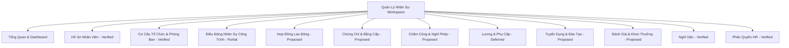
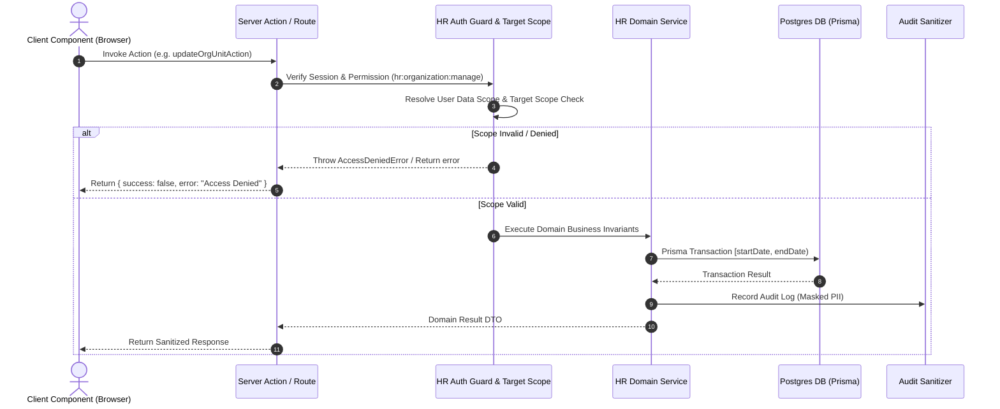
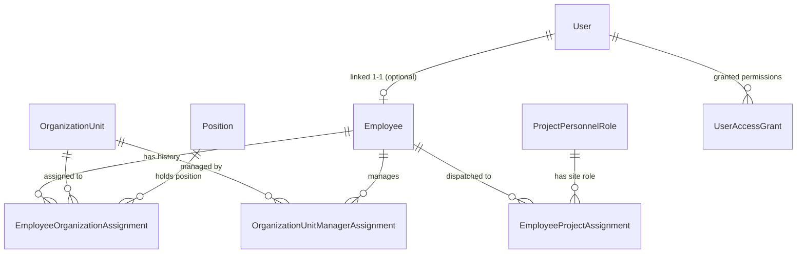

# HR Master Architecture — Kiến Trúc Tổng Thể Phân Hệ Quản Lý Nhân Sự

**Phiên bản:** 1.1.0  
**Tác giả:** Kiến Trúc Sư Phần Mềm ERP  
**Trạng thái Kiểm toán:** PARTIALLY VERIFIED  

---

## I. TỔNG QUAN KIẾN TRÚC VÀ NGUYÊN TẮC THIẾT KẾ

Phân hệ HR Construct-ERP được thiết kế theo mô hình **Domain-Driven Design (DDD)** kết hợp **Layered Architecture** bảo mật 3 lớp. Kiến trúc đảm bảo tính tách biệt giữa tài khoản xác thực hệ thống (`User`) và thông tin con người ngoài đời thực (`Employee`).

### Các Nguyên Tắc Kiến Trúc Cốt Lõi:
1. **Độc Lập User – Employee:** User quản lý quyền đăng nhập; Employee quản lý lịch sử lao động. Vô hiệu hóa User không làm mất Employee.
2. **Ủy Quyền 3 Lớp (3-Tier Authorization):**
   - **Layer 1:** System Role (`ADMIN`, `DIRECTOR`, `ENGINEER`, `STAFF`...)
   - **Layer 2:** Permission Code (`hr:employee:read`, `hr:organization:manage`...)
   - **Layer 3:** Data Scope (`ALL_EMPLOYEES`, `OWN_ORGANIZATION_UNIT`, `OWN_PROJECTS`, `SELF_ONLY`, `NONE`)
3. **Bảo Vệ Target Scope Ở Server Side:** Tất cả Server Actions của HR bắt buộc phải kiểm tra Target Scope trước khi mutation.
4. **Bảo Mật PII (Encryption & Masking):** CCCD/CMND mã hóa bằng AES-256-GCM + HMAC Blind Index. Không truyền Ciphertext hay Key xuống Client Component.
5. **Không Hard Delete Lịch Sử:** Mọi dữ liệu biến động đều dùng Soft Delete hoặc Effective-Date `[startDate, endDate)`.

---

## II. SƠ ĐỒ PHÂN HỆ VÀ WORKSPACE

---

## III. SƠ ĐỒ LUỒNG DỮ LIỆU BẢO MẬT & AUTHORIZATION

---

## IV. SƠ ĐỒ QUAN HỆ CỐT LÕI (USER – EMPLOYEE – ORG – PROJECT)

---

## V. CẤU TRÚC THƯ MỤC NGUỒN VÀ TÍCH HỢP HỆ THỐNG

- `src/app/hr/`: Chứa các route Next.js của HR workspace.
- `src/components/hr/`: Component UI chuẩn hóa light-theme.
- `src/lib/hr/`: Domain logic, services, auth guards, PII encryption, effective date helpers.
- `scripts/qa/`: Test scripts Playwright & E2E mutation validation trên isolated QA DB.
- `docs/hr/`: Bộ tài liệu master kiến trúc và báo cáo kiểm toán.
