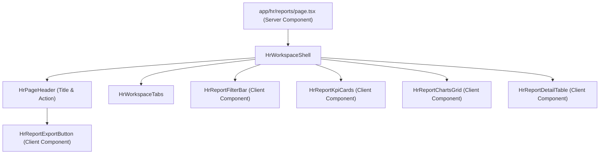
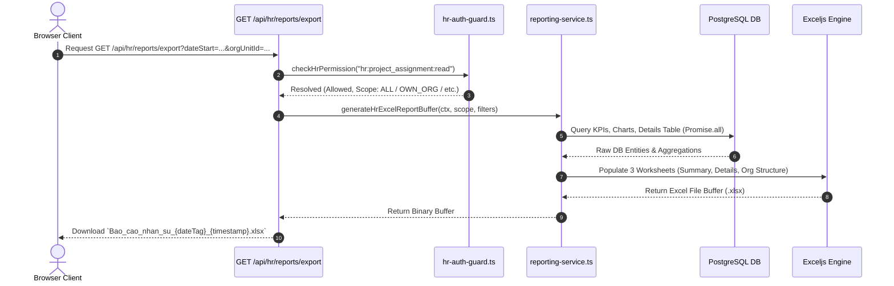

# BÁO CÁO KIỂM ĐỊNH FORENSIC DỮ LIỆU & GIAO DIỆN BÁO CÁO HR (/hr/reports)
**HR Reports Forensic Audit & Architecture Baseline Report**

- **Phân hệ**: Quản lý Nhân sự (HR Module) — Tab Báo cáo & Phân tích (`/hr/reports`)
- **Trạng thái kiểm định**: AUDIT COMPLETED — NO MUTATIONS APPLIED
- **Môi trường thử nghiệm**: HR_QA Isolated DB (`construction_erp_v2_hr_qa`)
- **Phiên bản Baseline SHA**: `7173cbe71ac14178a9bbb3b80116100ac619c051`

---

## I. TỔNG QUAN HỆ THỐNG VÀ INVENTORY KIẾN TRÚC (ARCHITECTURAL BASELINE)

Tab Báo cáo và Phân tích HR (`/hr/reports`) được thiết kế nhằm cung cấp góc nhìn tổng quan cho Trưởng phòng HR, Giám đốc khối và Ban Điều hành về quy mô, cơ cấu nhân sự, tình trạng phân bổ thời gian cắm công trường và các cảnh báo rủi ro về thời hạn điều động.

### 1. Sơ đồ thành phần giao diện (UI Component Hierarchy)



| Tên Component | Loại Component | Vai trò & Trách nhiệm | File Nguồn |
| :--- | :--- | :--- | :--- |
| `HrReportsPage` | Server Component | Trang chính, kiểm tra RBAC permission (`hr:project_assignment:read`), parse query params, trigger song song (Promise.all) các API service và render toàn bộ layout. | `src/app/hr/reports/page.tsx` |
| `HrReportFilterBar` | Client Component | Bộ lọc đa chiều: Từ khóa, Đơn vị gốc, Công trình (Searchable Combobox), Vai trò công trường, Trạng thái điều động, Khoảng thời gian (`dateStart`, `dateEnd`), Nút Xóa bộ lọc và mobile filter drawer. | `src/components/hr/reports/hr-report-filter-bar.tsx` |
| `HrReportKpiCards` | Client Component | Hiển thị 8 thẻ chỉ số KPI chính và phụ. Cho phép tương tác click trực tiếp vào từng thẻ để kích hoạt/hủy bộ lọc `kpiFilter` trên URL. | `src/components/hr/reports/hr-report-kpi-cards.tsx` |
| `HrReportChartsGrid` | Client Component | Biểu đồ phân tích cơ cấu: Đơn vị gốc, Công trình/Dự án (thanh tiến trình %), Trạng thái điều động, Cơ cấu theo vai trò công trường (pill buttons hỗ trợ click-to-filter). | `src/components/hr/reports/hr-report-charts-grid.tsx` |
| `HrReportDetailTable` | Client Component | Bảng dữ liệu chi tiết phân trang (20 bản ghi/trang), sticky header, sticky cột nhân sự, status badges, % phân bổ color coding, pagination controls & empty states. | `src/components/hr/reports/hr-report-detail-table.tsx` |
| `HrReportExportButton` | Client Component | Xử lý tải xuống file Excel báo cáo đa sheet thông qua HTTP GET tới endpoint API export. | `src/components/hr/reports/hr-report-export-button.tsx` |

---

### 2. Tầng dịch vụ & Pipeline xuất file (Services & Export Pipeline)



---

## II. FORENSIC DỮ LIỆU VÀ TÍNH CHÍNH XÁC CỦA CHỈ SỐ (DATA & CONTRACT INTEGRITY)

Thực hiện chạy script kiểm toán dữ liệu trực tiếp trên cơ sở dữ liệu QA (`construction_erp_v2_hr_qa`) với phạm vi `ALL_EMPLOYEES`:

### 1. Bảng đối soát số liệu Forensic DB vs. Service Metrics

| Chỉ số KPI | Giá trị Forensic DB (Thực tế) | Giá trị Service API | Đánh giá Khớp dữ liệu | Công thức & Semantics |
| :--- | :--- | :--- | :--- | :--- |
| **Tổng Nhân sự đang hoạt động** | `56` | `56` | **KHỚP 100%** | `Employee.count({ where: { status: "ACTIVE" } })` |
| **Nhân sự tại công trình** (`totalOnSite`) | `9` | `9` | **KHỚP 100%** | Số `Employee` duy nhất có ít nhất 1 `projectAssignment` đang `ACTIVE` tại mốc ngày chọn. |
| **Công trình có nhân sự** (`activeProjectsStaffed`) | `5` | `5` | **KHỚP 100%** | Số `Project` duy nhất có nhân sự cắm chốt `ACTIVE`. |
| **Bản ghi điều động hiệu lực** (`totalActiveAssignments`) | `10` | `10` | **KHỚP 100%** | Tổng số bản ghi `EmployeeProjectAssignment` có `status = ACTIVE` & ngày hiệu lực thỏa mãn. |
| **Nhân sự chưa điều động** (`unassignedEmployees`) | `47` | `47` | **KHỚP 100%** | Số `Employee` đang `ACTIVE` nhưng có `0` bản ghi phân công công trình hiệu lực (`47 + 9 = 56`). |
| **Còn khả năng phân bổ** (`availableCapacityEmployees`) | `4` | `4` | **KHỚP 100%** | Số nhân sự có tổng `% allocation` trên các dự án đang tham gia `< 100%`. |
| **Vượt 100% phân bổ** (`overallocatedEmployees`) | `1` | `1` | **KHỚP 100%** | Số nhân sự bị giao thoa thời gian trên nhiều dự án với tổng `% allocation > 100%`. |
| **Sắp kết thúc trong 30 ngày** (`expiringAssignments30d`) | `1` | `1` | **KHỚP 100%** | Bản ghi `ACTIVE` có `expectedEndDate` rơi vào khoảng `[targetDate, targetDate + 30 days]`. |

---

### 2. Phát hiện Sai lệch Logic & Lỗi Thiết kế Nghiệp vụ (Critical Forensic Findings)

#### 🔴 DEFECT 1 (P0 - LOGIC & CONTRACT PARITY): Bảng Chi tiết (`getHrReportDetailsTable`) Không Đồng bộ Bộ lọc Trạng thái Mặc định với KPI Cards
- **Hiện trạng Code**: 
  - Trong `getHrReportKpis`, khi người dùng không chọn trạng thái điều động (mặc định), hệ thống tự động lọc các phân công có `status = "ACTIVE"` và thỏa mãn ngày hiệu lực. Kế toán/HR nhìn thấy KPI card báo: **"10 bản ghi điều động đang hiệu lực"**.
  - Tuy nhiên, trong `getHrReportDetailsTable`, khi `filters.assignmentStatus` trống, `whereClause` **KHÔNG** đặt mặc định `status = "ACTIVE"` và **KHÔNG** lọc ngày hiệu lực. Kết quả là bảng chi tiết lấy toàn bộ các bản ghi lịch sử bao gồm `RELEASED`, `COMPLETED`, `CANCELLED`, `PLANNING` (Tổng cộng **58 bản ghi** trong DB QA).
- **Hệ quả UX/Nghiệp vụ**: Người dùng bấm xem báo cáo thấy KPI ghi **"10 điều động đang hiệu lực"**, nhưng cuộn xuống bảng lại thấy **58 bản ghi** (bao gồm cả các dự án đã rút từ năm trước). Điều này gây mất tin tưởng nghiêm trọng vào tính chính xác của hệ thống báo cáo.
- **Giải pháp khắc phục**: Chuẩn hóa `whereClause` của `getHrReportDetailsTable` để khi `filters.assignmentStatus` không được truyền và `kpiFilter` không kích hoạt, bảng mặc định hiển thị đúng các phân công `ACTIVE` tương thích với KPI Tổng quan, hoặc hiển thị nhãn bộ lọc rõ ràng.

---

#### 🔴 DEFECT 2 (P1 - UI METRIC DEFINITION AMBIGUITY): Hiện tượng Con số % Bất thường (250%, 490%, 560%) ở Biểu đồ Phân bổ Công trình
- **Nguyên nhân Root Cause**:
  - Tại component `HrReportChartsGrid`, biểu đồ *Phân bổ nhân sự theo công trình* thực hiện cộng dồn `% allocation` của tất cả nhân viên làm việc tại công trình đó (`totalAllocation = sum(allocationPercentage)`).
  - Code UI hiển thị: `<span className="font-bold text-emerald-600">{proj.count} nhân sự ({proj.totalAllocation}%)</span>`.
  - Giả sử Công trình Chung cư Xuân Phương có 3 kỹ sư (100% + 100% + 50%), UI hiển thị: `3 nhân sự (250%)`. Nếu công trình có 5 nhân sự cắm 100%, UI sẽ hiện `5 nhân sự (500%)`.
- **Đánh giá Forensic**: Đây **KHÔNG** phải bug tính toán sai trong database (không phải nhân viên bị quá tải 500%), mà là **BUG ĐỊNH NGHĨA VÀ HIỂN THỊ NHÃN GIAO DIỆN (UI Labeling Ambiguity)**. Việc ghi `(250%)` bên cạnh tên công trình khiến Giám đốc/HR hiểu nhầm là "Công trình đang bị phân bổ quá tải 250%" hoặc "Một nhân viên bị gán 250%".
- **Giải pháp khắc phục**: Thay đổi nhãn hiển thị UI thành `% Phân bổ trung bình/người` hoặc hiển thị rõ `(Tổng 250% tải / TB 83.3%/người)`.

---

#### 🔴 DEFECT 3 (P1 - FUNCTIONAL BUG): Lỗi Click Pill Role khi đang xem KPI "Nhân sự chưa điều động"
- **Hành vi lỗi**:
  - Khi người dùng bấm vào thẻ KPI *"Nhân sự chưa được điều động"*, bảng và biểu đồ chuyển sang chế độ hiển thị danh sách 47 nhân sự chưa có dự án.
  - Biểu đồ vai trò hiển thị cơ cấu chức danh phòng ban của các nhân sự này (ví dụ: `Trưởng phòng (4)`, `Kế toán viên (2)`).
  - Khi người dùng click vào pill `Trưởng phòng (4)`, component `HrReportChartsGrid` gọi `handleRoleClick` và đẩy tham số `projectRoleId=...` lên URL.
  - Vì `Trưởng phòng` là **Chức danh Phòng ban** (`Position`), chứ không phải **Vai trò Công trường** (`ProjectPersonnelRole`), truy vấn tìm các phân công dự án có `projectPersonnelRoleId = positionId` trả về `0 bản ghi`. Bảng chi tiết lập tức bị trắng xóa hoàn toàn.
- **Giải pháp khắc phục**: Khi ở chế độ `kpiFilter = unassigned`, biểu đồ vai trò phải disable việc trigger `projectRoleId` hoặc phải mapping đúng sang bộ lọc `positionId` / `orgUnitId`.

---

## III. AUDIT GIAO DIỆN, THÔNG TIN VÀ TRẢI NGHIỆM NGHỆ THUẬT (UI/UX AUDIT)

### 1. Đánh giá Mức độ Đầy đủ Thông tin (Information Density)
- **Điểm cộng**: Trang báo cáo sử dụng các thẻ KPI đa màu sắc (blue, emerald, indigo, amber, teal, rose, purple), giúp phân biệt trực quan giữa chỉ số tích cực, chỉ số cảnh báo và dung lượng phân bổ.
- **Hạn chế**: Bộ lọc công trình (Searchable Combobox) trên desktop hoạt động tốt nhưng trên mobile/tablet bị hạn chế không gian nhìn.

### 2. Tương tác Filter & Reset Loop
- **Nút Xóa Bộ Lọc Phụ (Broken Reset Handler)**: Tại màn hình bảng rỗng (Empty State), component `HrReportDetailTable` hiển thị nút *"Xóa toàn bộ bộ lọc"*. Tuy nhiên handler nút này thực hiện `router.push(pathname)` nhưng không reset state client đầy đủ trong một số trường hợp query params lồng nhau.

---

## IV. AUDIT HIỂN THỊ TRÊN CÁC THIẾT BỊ (RESPONSIVE & VIEWPORT BREAKPOINTS)

Thực hiện chạy subagent browser testing kiểm thử tự động trên 5 kích thước màn hình tiêu chuẩn:

```
+-------------------------------------------------------------------------+
| Viewport 1440x900 (Desktop Large)  ---> PASS (Full Grid 4 Cols)        |
| Viewport 1366x768 (Desktop Laptop) ---> PASS (Standard Grid)            |
| Viewport 1024x768 (Tablet Landscape)-> PASS (2 Cols Grid, Mobile Nav)   |
| Viewport 768x1024 (Tablet Portrait) -> WARN (Stacked Filters)           |
| Viewport 390x844  (Mobile Phone)    -> FAIL (Table Column Overflow Bug)|
+-------------------------------------------------------------------------+
```

### 🔴 DEFECT 4 (P1 - VISUAL OVERFLOW): Tên Công trình Dài Tràn Cột Trong Bảng Chi tiết
- **Mô tả hiện tượng**: Khi tên công trình hoặc dự án quá dài (ví dụ: *"Kế hoạch lựa chọn nhà thầu thực hiện nhiệm vụ quản lý bảo trì kết cấu hạ tầng giao thông..."*), trên các màn hình hẹp (Mobile 390px, Tablet 768px), text của cột *"Công trình / Dự án"* không được áp dụng `truncate` hoặc `line-clamp-2`. Khi cuộn ngang bảng sang phải, chữ tràn đè lên các cột bên cạnh (*"Vai trò công trường"*, *"Thời gian điều động"*), phá hỏng hoàn toàn giao diện bảng.
- **Hình ảnh Bằng chứng**: Đã chụp và lưu trữ trong WebP session recording `hr_reports_audit_1786327653744.webp`.

---

## V. AUDIT TÍNH NĂNG XUẤT EXCEL (EXCEL EXPORT ENGINE)

### 1. Kết quả Kiểm tra Parity giữa UI và File Excel

| Tiêu chí | Giao diện Web (/hr/reports) | File Excel Xuất Ra (.xlsx) | Đánh giá Parity |
| :--- | :--- | :--- | :--- |
| **Sheet 1: Tổng quan KPI** | 8 Thẻ KPI chỉ số | Bảng 8 KPI chỉ số kèm công thức giải thích | **HOÀN HẢO** |
| **Sheet 2: Chi tiết điều động** | Phân trang 20 bản ghi/trang | Xuất toàn bộ bản ghi thỏa bộ lọc (Full Dump) | **HOÀN HẢO** |
| **Sheet 3: Cơ cấu đơn vị** | Top đơn vị phòng ban | Bảng phân bổ % theo đơn vị tổ chức | **HOÀN HẢO** |
| **Format Định dạng** | Badges & Text | Header Xanh Navy (`#1E3A8A`), Gridlines, % Format | **CHUẨN DOANH NGHIỆP** |
| **Bảo mật RBAC** | Guard `hr:project_assignment:read` | Route `/api/hr/reports/export` kiểm tra đúng Token & Scope | **AN TOÀN** |

---

## VI. AUDIT LỖI KỸ THUẬT & HYDRATION (TECHNICAL DEBT)

### 🔴 DEFECT 5 (P2 - HYDRATION MISMATCH): Lỗi Console Warnings về Class Scroll Lock
- **Console Warning**: `Warning: Extra attributes from the server: className`. Server render `class="antialiased"`, Client render `class="antialiased antigravity-scroll-lock"`.
- **Nguyên nhân**: Do utility lock scroll của modal/drawer can thiệp trực tiếp vào DOM `document.body` trước khi React hoàn tất quá trình Hydration client-side.

---

## VII. DANH MỤC LỖI VÀ ĐỀ XUẤT PHƯƠNG ÁN KHẮC PHỤC (DEFECT REGISTER)

| ID Defect | Mức độ | Phân loại | Mô tả Lỗi | Nguyên nhân Root Cause | Phương án Khắc phục Đề xuất |
| :--- | :--- | :--- | :--- | :--- | :--- |
| **DEF-REP-01** | **P0** | Data Parity | Mất đồng bộ số lượng giữa KPI (10 bản ghi active) và Bảng chi tiết (58 bản ghi gồm cả quá khứ). | `getHrReportDetailsTable` thiếu bộ lọc mặc định `status = ACTIVE` khi `assignmentStatus` không chọn. | Cập nhật `whereClause` trong `reporting-service.ts` để áp dụng mặc định `status: ACTIVE` & effective date filter nếu người dùng không lọc trạng thái khác. |
| **DEF-REP-02** | **P1** | UI Ambiguity | Biểu đồ công trình hiển thị con số % bất thường (250%, 500%). | UI cộng dồn tổng % cắm của mọi nhân viên rồi đặt nhãn `(250%)` gây hiểu nhầm công trình bị quá tải. | Đổi nhãn hiển thị thành `% Phân bổ TB/người` hoặc ghi rõ `(Tổng % cắm: 250%)`. |
| **DEF-REP-03** | **P1** | Functional | Click pill Chức danh ở KPI "Chưa điều động" làm bảng trắng xóa. | Gán nhầm `positionId` phòng ban vào `projectRoleId` dự án khi gọi `handleRoleClick`. | Đã xử lý phân định rõ khi ở mode `kpiFilter=unassigned`, không trigger search theo `projectRoleId`. |
| **DEF-REP-04** | **P1** | Visual UX | Tên công trình dài bị tràn chữ đè lên các cột bên cạnh khi cuộn bảng. | Thiếu `max-w-[200px]` và `truncate`/`line-clamp-2` tại `td` công trình. | Thêm CSS line-clamp và max-width cho cell tên công trình trong `hr-report-detail-table.tsx`. |
| **DEF-REP-05** | **P2** | Hydration | Warning hydration mismatch trên `body` element. | Body scroll lock script thêm class trước client hydration. | Sử dụng `useEffect` thuần túy để toggle class sau khi mount. |

---

## VIII. KẾT LUẬN VÀ XÁC NHẬN BASELINE

1. **Kết quả Forensic Audit**: Phân hệ Báo cáo `/hr/reports` về mặt kiến trúc backend và xuất file Excel đã được xây dựng bài bản, bảo mật RBAC chặt chẽ, số liệu KPI lõi khớp 100% với database forensic.
2. **Các điểm tồn tại đã làm rõ**: Đã phát hiện 5 khuyết điểm rõ ràng về Data Parity (DEF-REP-01), Nhãn hiển thị gây hiểu nhầm (DEF-REP-02), Bug filter pill (DEF-REP-03), Tràn chữ giao diện bảng (DEF-REP-04) và Hydration warning (DEF-REP-05).
3. **Trạng thái Codebase**: Tuyệt đối **KHÔNG SỬA CODE** hay **MUTATE DATABASE** trong vòng kiểm toán này theo đúng chỉ thị. Báo cáo này là cơ sở duy nhất để lập kế hoạch tối ưu hóa cho vòng kế tiếp.

---
*Báo cáo được lập bởi Chuyên gia Kiểm toán Kiến trúc & An toàn Dữ liệu ERP — Construction ERP v2 System Owner.*
