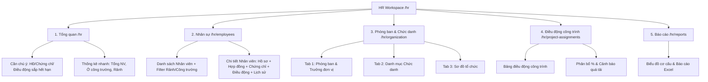
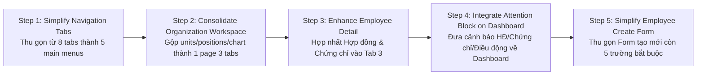

# HR SIMPLIFICATION REDESIGN AUDIT — TINH GỌN PHÂN HỆ QUẢN LÝ NHÂN SỰ
# DÀNH RIÊNG CHO CÔNG TY XÂY DỰNG

**Repository:** `D:\construction-erp-v2`  
**Target Architecture:** HR V1 — Simple Construction HR  
**Audit Date:** 2026-08-07  
**Design Principle:** 80% Nhu cầu thực tế với 20% độ phức tạp. Giám đốc nhìn là hiểu, Nhân sự dùng không mệt, Chỉ huy trưởng nắm chắc nhân sự công trường.

---

## 1. Executive Summary

Phân hệ Nhân sự hiện tại đã có phần Backend vô cùng vững chắc (RBAC, PII AES-256-GCM, Allocation Engine, Change History). Tuy nhiên, về mặt trải nghiệm người dùng (UX) và cấu trúc điều hướng (Navigation), hệ thống đang có xu hướng phình to theo mô hình HR ERP Enterprise với 8 menu cấp 1 (bao gồm 3 menu giao diện tạm "Sắp có"), gây phân tán thông tin và tạo cảm giác phức tạp không cần thiết cho một **Công ty Xây dựng**.

**Định hướng Tinh gọn (HR V1 — Simple Construction HR):**
1. **Thu gọn Menu chính**: Từ 8 tabs cấp 1 xuống **đúng 5 menu chính**:
   - `Tổng quan` (`/hr`)
   - `Nhân sự` (`/hr/employees`)
   - `Phòng ban & Chức danh` (`/hr/organization`)
   - `Điều động công trình` (`/hr/project-assignments`)
   - `Báo cáo` (`/hr/reports`)
2. **Triệt tiêu Menu đơn lẻ thừa**:
   - Loại bỏ menu `/hr/contracts` & `/hr/certificates` độc lập $\rightarrow$ **Gộp vào Tab "Hợp đồng & Giấy tờ" trong Hồ sơ nhân viên (Employee Detail)**.
   - Loại bỏ menu `/hr/alerts` độc lập $\rightarrow$ **Gộp vào Block "Cần chú ý" (Attention Required) tại Dashboard HR**.
3. **Hồ sơ nhân viên là Trung tâm**: Chi tiết nhân viên (`/hr/employees/[id]`) hợp nhất 4-5 tab mượt mà, giúp xem toàn bộ lịch sử công tác, công trình hiện tại, % phân bổ, hợp đồng, chứng chỉ an toàn chỉ trên một màn hình.
4. **Form tối giản**: Màn tạo nhân viên mới cắt giảm từ 15+ trường xuống **5 trường bắt buộc** (Họ tên, SĐT/Email, Phòng ban, Chức danh, Ngày vào làm). Các thông tin nâng cao bổ sung sau.
5. **Giữ nguyên Backend lõi**: Không phá vỡ hay xóa database logic (`UserAccessGrant`, `SensitiveFieldPolicy`, `allocation-engine.ts`, `EmployeeChangeHistory`). Giữ nguyên 90 tests passing, chỉ tinh gọn lớp hiển thị UI.

---

## 2. Keep / Merge / Remove / Defer Matrix

| Chức năng hiện tại | Quyết định | Chuyển thành | Lý do & Giá trị xây dựng |
|---|---|---|---|
| **Overview Dashboard** (`/hr`) | **KEEP & SIMPLIFY** | Dashboard Tinh gọn + Block "Cần chú ý" | Giúp Giám đốc/HR thấy ngay tổng quy mô, số người ở công trường, người rảnh và việc cần xử lý. |
| **Employee Directory** (`/hr/employees`) | **KEEP & SIMPLIFY** | Danh sách Nhân sự + Bộ lọc Nhanh | Giữ nguyên danh sách nhưng bổ sung bộ lọc nhanh: "Văn phòng / Công trường", "Chưa điều động (Rảnh)". |
| **Employee Detail** (`/hr/employees/[id]`) | **KEEP & ENHANCE** | Trung tâm Dữ liệu Nhân sự (4 Tabs) | Tích hợp toàn bộ Hợp đồng, Chứng chỉ, % Phân bổ công trình và Lịch sử vào một nơi duy nhất. |
| **Organization Units** (`/hr/organization/units`) | **MERGE** | Workspace "Phòng ban & Chức danh" (Tab 1) | Không tạo menu riêng; gộp chung vào 1 Workspace Quản lý Tổ chức. |
| **Positions Catalog** (`/hr/organization/positions`) | **MERGE** | Workspace "Phòng ban & Chức danh" (Tab 2) | Gộp thành Tab trong Workspace Tổ chức. |
| **Org Chart Visual** (`/hr/organization/chart`) | **MERGE** | Workspace "Phòng ban & Chức danh" (Tab 3) | Sơ đồ cây trực quan là 1 Tab xem nhanh. |
| **Unit Managers** (`/hr/organization/managers`) | **MERGE** | Inline Action tại Cây Phòng ban | Bổ nhiệm Trưởng/Phó phòng trực tiếp ngay tại ô Phòng ban, không cần màn riêng. |
| **Project Assignments** (`/hr/project-assignments`) | **KEEP (P0)** | Điều động Công trình | **Nghiệp vụ sống còn của Cty Xây dựng**. Giữ nguyên workflow nhưng đơn giản hóa ngôn từ UI. |
| **Allocation Engine** | **KEEP BACKEND / SIMPLIFY UI** | Badge % Phân bổ | Người dùng chỉ thấy "Đang phân bổ 80%" hoặc "Cảnh báo 120%". Ẩn các khái niệm thuật ngữ engine. |
| **Contracts** (`/hr/contracts`) | **MERGE & SIMPLIFY** | Employee Detail > Tab "Hợp đồng & Giấy tờ" | Không cần phân hệ riêng. Cảnh báo hết hạn đưa về Dashboard. |
| **Certifications** (`/hr/certificates`) | **MERGE & SIMPLIFY** | Employee Detail > Tab "Hợp đồng & Giấy tờ" | Quản lý chứng chỉ an toàn/hành nghề ngay trong hồ sơ nhân viên + Cảnh báo hết hạn tại Dashboard. |
| **Alerts Center** (`/hr/alerts`) | **REMOVE MENU / MERGE TO DASHBOARD** | Dashboard > Block "Cần chú ý" | Người dùng click vào dòng cảnh báo ở Dashboard để đi thẳng tới nhân viên/hợp đồng tương ứng. |
| **HR Reports & Excel** (`/hr/reports`) | **KEEP & SIMPLIFY** | Báo cáo & Trích xuất Excel | Giữ 4 KPI chính và 2 biểu đồ cơ cấu quan trọng nhất. Giữ nút xuất Excel `.xlsx`. |
| **PII Reveal & Encryption** | **KEEP BACKEND / SIMPLIFY UI** | Icon Con mắt Mở khóa CCCD | Giữ mã hóa AES-256-GCM và audit log. Ẩn khái niệm `SensitiveFieldPolicy` trên UI. |
| **Attendance & Timesheet** | **DEFER (P2)** | Nằm trong Phase 4.8 | Chưa làm ngay; ưu tiên quản lý con người và nguồn lực công trình trước. |
| **Leave Management** | **DEFER (P2)** | Nằm trong Phase 4.9 | Chưa làm ngay. |
| **Payroll & Benefits** | **DEFER (P3)** | Giai đoạn sau | Công ty xây dựng thường tính lương theo sản lượng/bảng công riêng, chưa cần tích hợp ERP phức tạp. |
| **Recruitment & Training** | **DEFER (P3)** | Giai đoạn sau | Chưa cần thiết cho quy mô hiện tại. |

---

## 3. Navigation Restructuring Plan

### Structure Hiện tại (8 Menu Items phình to & cuộn ngang):
```
/hr (Tổng quan)
/hr/employees (Hồ sơ nhân viên)
/hr/organization (Cơ cấu tổ chức)
/hr/project-assignments (Điều động công trình)
/hr/reports (Báo cáo và phân tích)
/hr/contracts (Hợp đồng - [Sắp có])
/hr/certificates (Chứng chỉ - [Sắp có])
/hr/alerts (Cảnh báo - [Sắp có])
```

### Structure Đề xuất (HR V1 — Đúng 5 Main Menus):



---

## 4. Employee Detail Redesign (The Single Source of Truth)

Thay vì phân tán thành nhiều trang khác nhau, **Hồ sơ nhân viên (`/hr/employees/[id]`)** được thiết kế làm trung tâm thông tin với **4 Tab tinh gọn**:

```
Chi tiết Nhân viên: Nguyễn Văn A (Mã: NV-2026-0012) - [ĐANG HOẠT ĐỘNG]
┌────────────────────────┬─────────────────────────┬─────────────────────────┬─────────────────────────┐
│ 1. Tổng quan & Công việc│ 2. Công trình & Điều động│ 3. Hợp đồng & Giấy tờ   │ 4. Lịch sử công tác     │
└────────────────────────┴─────────────────────────┴─────────────────────────┴─────────────────────────┘
```

### Chi tiết nội dung 4 Tabs:

1. **Tab 1: Tổng quan & Công việc**
   - Thông tin cá nhân: Họ tên, Ngày sinh, Giới tính, SĐT, Email, Số CCCD (Icon con mắt mở khóa bảo mật).
   - Công việc: Phòng ban chính, Chức danh, Quản lý trực tiếp, Ngày vào làm, Trạng thái (Thử việc / Đang làm / Nghỉ việc).
   - Tài khoản hệ thống: Trạng thái liên kết tài khoản đăng nhập.
2. **Tab 2: Công trình & Điều động**
   - Công trình hiện tại: Tên dự án, Vai trò công trường (Chỉ huy trưởng, Kỹ sư, HSE...), Tỷ lệ phân bổ %, Ngày bắt đầu, Ngày dự kiến kết thúc.
   - Nút hành động nhanh: `Điều động mới`, `Gia hạn`, `Rút khỏi công trình`.
   - Lịch sử công trình đã tham gia trước đây.
3. **Tab 3: Hợp đồng & Giấy tờ**
   - Hợp đồng lao động: Loại hợp đồng, Số HĐ, Ngày ký, Ngày hết hạn, Trạng thái (Còn hạn / Sắp hết hạn / Quá hạn).
   - Chứng chỉ nghề & An toàn: Chứng chỉ hành nghề xây dựng, Chứng chỉ an toàn lao động, Ngày cấp, Ngày hết hạn.
   - File đính kèm: Scan hợp đồng, scan chứng chỉ.
4. **Tab 4: Lịch sử công tác**
   - Nhật ký biến động (Change History): Ngày tạo hồ sơ, Chuyển phòng ban, Đổi chức danh, Các đợt điều động dự án, Người thực hiện thay đổi.

---

## 5. Form Simplification Strategy

### Form Tạo mới Nhân viên (`/hr/employees/new`):
- **Cắt giảm**: Loại bỏ các trường chưa thực sự cần thiết lúc tạo ban đầu (Số CCCD, Ngày sinh, Giới tính, Địa chỉ chi tiết, Số quyết định).
- **Chỉ giữ 5 trường bắt buộc (Quick Create)**:
  1. **Họ và tên** (`fullName`) *
  2. **Số điện thoại hoặc Email** (`phoneNumber` / `personalEmail`) *
  3. **Phòng ban chính** (`organizationUnitId`) *
  4. **Chức danh** (`positionId`) *
  5. **Ngày vào làm** (`joinedDate`) *
- *Mã nhân viên*: Tự động sinh `NV-YYYY-NNNN` (không cần nhập).
- Các thông tin chi tiết khác (CCCD, Hợp đồng, Chứng chỉ) có thể bổ sung sau khi mở Hồ sơ nhân viên.

---

## 6. 15 Core Questions & UX Click-Count Matrix

Một người quản lý công ty xây dựng cần trả lời 15 câu hỏi cốt lõi với **số thao tác tối thiểu (≤ 2 clicks)**:

| # | Câu hỏi quản lý cốt lõi | Thao tác trên HR V1 Tinh gọn | Số clicks |
|---|---|---|---|
| 1 | Công ty hiện có bao nhiêu nhân sự? | Nhìn ngay Card KPI ở Menu **Tổng quan** (`/hr`) | **0 click** (Ngay màn chính) |
| 2 | Nhân viên này là ai? | Gõ tên vào Thanh tìm kiếm ở Menu **Nhân sự** | **1 click** |
| 3 | Thuộc phòng ban nào, chức danh gì? | Xem cột "Phòng ban" & "Chức danh" tại Danh sách Nhân sự | **1 click** |
| 4 | Đang làm văn phòng hay công trường? | Xem Badge trạng thái "Văn phòng" hoặc "Công trường A" | **1 click** |
| 5 | Đang ở công trình nào, phân bổ bao nhiêu %? | Xem Badge "Dự án Landmark (80%)" tại Danh sách Nhân sự | **1 click** |
| 6 | Có đang tham gia nhiều công trình không? | Mở Hồ sơ NV $\rightarrow$ Tab **"Công trình & Điều động"** | **2 clicks** |
| 7 | **Ai hiện đang rảnh (chưa điều động)?** | Tại Menu **Nhân sự** $\rightarrow$ Click filter **"Chưa điều động (Rảnh)"** | **1 click** |
| 8 | **Ai đang quá tải (>100% phân bổ)?** | Click Card KPI **"Quá tải"** tại Dashboard Tổng quan | **1 click** |
| 9 | **Điều động nào sắp kết thúc (30 ngày)?** | Click dòng warning tại Block **"Cần chú ý"** ở Dashboard | **1 click** |
| 10 | Hợp đồng có sắp hết hạn không? | Click warning **"Hợp đồng sắp hết hạn"** ở Dashboard | **1 click** |
| 11 | Chứng chỉ an toàn/nghề có sắp hết hạn không? | Click warning **"Chứng chỉ sắp hết hạn"** ở Dashboard | **1 click** |
| 12 | Nhân viên đã chuyển phòng/công trình những đâu? | Hồ sơ NV $\rightarrow$ Tab **"Lịch sử công tác"** | **2 clicks** |
| 13 | Nhân viên còn đang làm hay đã nghỉ? | Xem Badge trạng thái "Đang làm việc" / "Đã nghỉ việc" | **1 click** |
| 14 | Mở khóa xem số CCCD nhân viên | Hồ sơ NV $\rightarrow$ Click icon **Con mắt** (Log audit tự động) | **2 clicks** |
| 15 | Trích xuất toàn bộ danh sách ra file Excel | Menu **Báo cáo** $\rightarrow$ Click nút **"Xuất Excel"** | **1 click** |

---

## 7. Organization Workspace Simplification

Thay vì chia nhỏ thành 4 menu riêng (`/units`, `/positions`, `/managers`, `/chart`), **Cơ cấu Tổ chức (`/hr/organization`)** được gộp thành **1 Workspace duy nhất với 3 Tab**:

```
Cơ cấu Tổ chức & Chức danh
┌───────────────────────────┬───────────────────────────┬───────────────────────────┐
│ Tab 1: Phòng ban & Quản lý │ Tab 2: Danh mục Chức danh │ Tab 3: Sơ đồ Cây Tổ chức │
└───────────────────────────┴───────────────────────────┴───────────────────────────┘
```

- **Inline Manager Appointment**: Không cần sang màn riêng để bổ nhiệm Trưởng phòng. Ngay tại dòng Phòng ban trong Tab 1, click nút `"Bổ nhiệm Trưởng phòng"` để mở Dialog chọn nhân viên.

---

## 8. Dashboard Simplification: Block "Cần Chú Ý" (Attention Required)

Thay vì tạo một Alert Center độc lập phức tạp, **Dashboard HR (`/hr`)** tích hợp Widget **"Cần chú ý" (Attention Required)** thu gom toàn bộ cảnh báo quan trọng:

```
┌────────────────────────────────────────────────────────────────────────────────────────┐
│ ⚠️ CẦN CHÚ Ý (ATTENTION REQUIRED)                                                      │
├────────────────────────────────────────────────────────────────────────────────────────┤
│ 📄 Hợp đồng lao động: 4 hợp đồng sắp hết hạn trong 30 ngày.        [Xem danh sách ->]  │
│ 🪪 Chứng chỉ an toàn: 3 chứng chỉ cán bộ công trường sắp hết hạn.   [Xem danh sách ->]  │
│ 🏗️ Điều động công trình: 5 điều động sắp kết thúc tuần này.        [Xem chi tiết ->]   │
│ ⚠️ Phân bổ quá tải: 2 kỹ sư đang bị phân bổ >100%.                 [Xử lý ngay ->]     │
│ 🔗 Dữ liệu thiếu: 3 nhân viên chưa liên kết tài khoản hệ thống.    [Liên kết ->]       │
└────────────────────────────────────────────────────────────────────────────────────────┘
```

Click trực tiếp vào từng dòng cảnh báo sẽ dẫn thẳng tới Danh sách đã được lọc tương ứng.

---

## 9. Feature Categorization & Priority (P0 - P3)

### P0 — PHẢI CÓ (Core Must-Have for Construction HR)
1. **Employee Master Data & Code Generator (`NV-YYYY-NNNN`)**: Quản lý hồ sơ nhân viên.
2. **Organization Unit & Positions**: Quản lý phòng ban và chức danh.
3. **Project Personnel Assignment & Allocation Engine**: Điều động cán bộ/kỹ sư ra công trình và kiểm soát tỷ lệ % phân bổ.
4. **Data Scope RBAC & PII Encryption**: Phân quyền theo vai trò và bảo vệ số CCCD.
5. **Dashboard & Excel Export**: Thống kê nhanh và xuất file Excel `.xlsx`.

### P1 — NÊN CÓ (Should Have in HR V1.1)
1. **Hợp đồng Lao động & Cảnh báo hết hạn** (Tích hợp trong Employee Detail Tab 3 & Dashboard).
2. **Chứng chỉ Hành nghề & An toàn Lao động** (Tích hợp trong Employee Detail Tab 3 & Dashboard).
3. **Upload Ảnh đại diện Nhân viên** (Thay thế Initials fallback).

### P2 — ĐỂ SAU (Defer to Phase 4.8 - 4.9)
1. **Điểm danh & Chấm công công trường** (`Attendance & Timesheet`).
2. **Quản lý Nghỉ phép & Duyệt đơn** (`Leave Management`).

### P3 — KHÔNG CẦN / LOẠI BỎ (Do Not Build for Construction ERP V2)
1. **Hệ thống Quản lý Cảnh báo riêng biệt (`Alert Management System`)**: Quá phức tạp, gộp vào Dashboard.
2. **Tuyển dụng & Hồ sơ Ứng viên (`Recruitment & Candidate Pipeline`)**: Không phù hợp nhu cầu hiện tại.
3. **Đánh giá Hiệu suất Enterprise (`Performance & KPI Scoring`)**: Không áp dụng cho công ty xây dựng vừa và nhỏ.
4. **Bảng lương & Bảo hiểm phức tạp (`Payroll & Social Insurance Engine`)**: Công ty xây dựng quản lý lương theo bảng công công trình riêng, không đưa vào core HR V1.

---

## 10. Route Consolidation & Action Plan

| Baseline Route | Proposed Target | Action |
|---|---|---|
| `/hr` | `/hr` | **KEEP** (Thêm Block "Cần chú ý") |
| `/hr/employees` | `/hr/employees` | **KEEP** (Thêm filter "Rảnh / Công trường") |
| `/hr/employees/new` | `/hr/employees/new` | **SIMPLIFY FORM** (Còn 5 trường bắt buộc) |
| `/hr/employees/[id]` | `/hr/employees/[id]` | **ENHANCE** (Tích hợp 4 Tab: Overview, Project, Contracts/Certs, History) |
| `/hr/organization` | `/hr/organization` | **KEEP & CONSOLIDATE** (Workspace 3 Tabs) |
| `/hr/organization/units` | `/hr/organization` (Tab 1) | **MERGE** |
| `/hr/organization/positions` | `/hr/organization` (Tab 2) | **MERGE** |
| `/hr/organization/chart` | `/hr/organization` (Tab 3) | **MERGE** |
| `/hr/organization/managers` | `/hr/organization` (Inline Dialog) | **MERGE** |
| `/hr/project-assignments` | `/hr/project-assignments` | **KEEP** (Giữ nguyên workflow) |
| `/hr/reports` | `/hr/reports` | **KEEP** |
| `/hr/contracts` | `/hr/employees/[id]?tab=contracts` | **REMOVE ROUTE / MERGE TO EMPLOYEE DETAIL** |
| `/hr/certificates` | `/hr/employees/[id]?tab=certs` | **REMOVE ROUTE / MERGE TO EMPLOYEE DETAIL** |
| `/hr/alerts` | `/hr` (Dashboard Block "Cần chú ý") | **REMOVE ROUTE / MERGE TO DASHBOARD** |

---

## 11. Migration Roadmap from Current HR to HR V1



1. **Giai đoạn 1: Thu gọn Navigation Tabs** (`src/components/hr/hr-workspace-tabs.tsx`)
   - Cắt bỏ các tab placeholder (`contracts`, `certificates`, `alerts`). Giữ đúng 5 menu chính.
2. **Giai đoạn 2: Hợp nhất Organization Workspace** (`/hr/organization`)
   - Gộp các sub-routes của organization thành các Sub-tabs bên trong `/hr/organization/page.tsx`.
3. **Giai đoạn 3: Tối ưu Hồ sơ Nhân viên (Employee Detail)** (`/hr/employees/[id]`)
   - Cấu trúc lại 4 Tab: Tổng quan, Công trình, Hợp đồng & Chứng chỉ, Lịch sử công tác.
4. **Giai đoạn 4: Tích hợp Widget "Cần chú ý" tại Dashboard** (`/hr/page.tsx`)
   - Đưa các thông số cảnh báo điều động, hợp đồng, chứng chỉ sắp hết hạn ra màn hình Tổng quan.
5. **Giai đoạn 5: Tối giản Form Tạo mới Nhân viên** (`/hr/employees/new`)
   - Điều chỉnh giao diện Form ưu tiên nhập nhanh 5 thông tin cơ bản.

---

## 12. Conclusion & Verification

Bản thiết kế tinh gọn **HR V1 — Simple Construction HR** đảm bảo:
- **Giám đốc nhìn là hiểu**: Mọi con số tổng quan, vị trí nhân sự, công trình và cảnh báo nằm ngay ở Dashboard.
- **Nhân sự dùng không mệt**: Menu thu gọn từ 8 xuống 5. Form tạo nhân viên chỉ còn 5 trường.
- **Chỉ huy trưởng nắm chắc công trường**: Biết chính xác ai đang ở công trình nào, vai trò gì, phân bổ bao nhiêu %.
- **Không phá vỡ Backend**: Giữ nguyên toàn bộ 90 tests passing, mã hóa PII AES-256-GCM, Allocation Engine và RBAC.

Báo cáo Redesign Audit chi tiết đã lưu tại:  
`docs/hr/HR_SIMPLIFICATION_REDESIGN_AUDIT.md`
