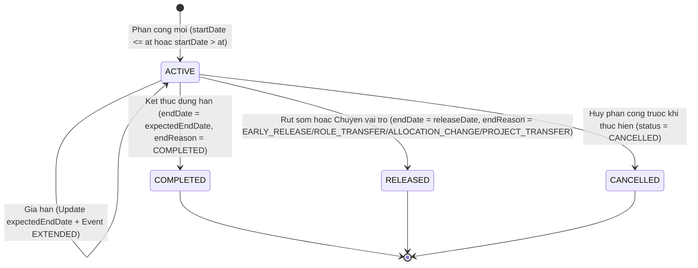

# HR PHASE 4 — MÔ HÌNH MIỀN VÀ NGUYÊN TẮC THIẾT KẾ DỮ LIỆU (DOMAIN MODEL)

- **Phiên bản:** 1.0.3
- **Trạng thái:** APPROVED — FROZEN FOR PHASE 4.1
- **Mã nguồn khảo sát (Surveyed Source SHA):** `8c1e1c89084a27eccacc3bc5fdf12aa3af160925`
- **Người phê duyệt:** Chủ dự án

---

## I. MÔ HÌNH THỰC THỂ MIỀN (DOMAIN ENTITY RELATIONSHIPS)

```mermaid
erDiagram
    Employee ||--o{ EmployeeProjectAssignment : "dieu_dong_lao_dong"
    Project ||--o{ EmployeeProjectAssignment : "tiep_nhan_lao_dong"
    ProjectPersonnelRole ||--o{ EmployeeProjectAssignment : "dinh_danh_vai_tro"
    User ||--o? Employee : "lien_ket_tai_khoan"
    Project ||--o{ ProjectMember : "cap_quyen_he_thong"
    User ||--o{ ProjectMember : "duoc_cap_quyen"

    Employee {
        string id PK
        string code UK
        string fullName
        EmployeeStatus status
    }

    Project {
        string id PK
        string code UK
        string name
        ProjectStatus status
    }

    ProjectPersonnelRole {
        string id PK
        string code UK
        string name
    }

    EmployeeProjectAssignment {
        string id PK
        string employeeId FK
        string projectId FK
        string projectPersonnelRoleId FK
        DateTime startDate
        DateTime expectedEndDate
        DateTime endDate
        int allocationPercentage
        EmployeeProjectAssignmentStatus status
        EmployeeProjectAssignmentEndReason endReason
        string overrideReason
    }

    User {
        string id PK
        string email UK
        UserRole role
    }

    ProjectMember {
        string id PK
        string projectId FK
        string userId FK
        ProjectRole role
    }
```

---

## II. NGUYÊN TẮC RANH GIỚI BẮT BUỘC (DOMAIN BOUNDARY RULES)

### Rule 1: Tách biệt Hồ sơ Nhân sự (`Employee`) và Tài khoản Truy cập (`User`)
1. Một `Employee` có thể không có `User` (ví dụ: công nhân thời vụ, cán bộ công trường không thao tác ERP).
2. Khi tài khoản `User` bị khóa (`isActive = false`), hồ sơ `Employee` vẫn ở trạng thái hoạt động (`ACTIVE`) và giữ nguyên quá trình điều động lao động tại công trường.
3. Khi nhân viên nghỉ việc (`status = RESIGNED`), quy trình Offboarding kiểm tra các phân công đang hiệu lực. Hoàn tất nghỉ việc bắt buộc xử lý đóng các phân công liên quan trước hoặc trong cùng một giao dịch (DEC-09). Không thực hiện tự động đóng ngầm phân công.

### Rule 2: Tách biệt Điều động Lao động (`EmployeeProjectAssignment`) và Phân quyền Dự án (`ProjectMember`)
1. `EmployeeProjectAssignment` ghi nhận thực tế lao động tại công trường: Làm gì, ở đâu, từ ngày nào đến ngày nào, chiếm bao nhiêu % thời gian.
2. `ProjectMember` ghi nhận quyền thao tác trên phần mềm ERP: Có được xem báo cáo nhật ký công trình, duyệt vật tư hay tải tài liệu dự án hay không.
3. **Tuyệt đối không tự động chèn bản ghi `ProjectMember` khi thực hiện phân công `EmployeeProjectAssignment`** và ngược lại.

---

## III. MA TRẬN TRẠNG THÁI VÀ BẢO TOÀN LỊCH SỬ (ASSIGNMENT STATE MACHINE)

Enum CSDL chính thức bao gồm 4 trạng thái: `ACTIVE`, `COMPLETED`, `RELEASED`, `CANCELLED`.



### Quy tắc phân tách Ngày hiệu lực và Tỷ lệ Phân bổ (DEC-01):
1. **Phân công đã bắt đầu:** `allocationEffectiveEnd = endDate ?? Infinity (9999-12-31)`.
   Trường `expectedEndDate` của phân công đã bắt đầu chỉ dùng cho cảnh báo sắp/quá hạn gia hạn. Không tự động giải phóng tỷ lệ phân bổ, không tự động kết thúc hiệu lực lao động và không tự động làm nhân sự biến mất khỏi KPI công trường.
2. **Phân công chưa bắt đầu:** `allocationEffectiveEnd = endDate ?? expectedEndDate ?? Infinity (9999-12-31)`.
3. **Gia hạn thời gian (`PROJECT_ASSIGNMENT_EXTENDED`):** Cập nhật `expectedEndDate`, trạng thái giữ nguyên `ACTIVE`, ghi Audit Event gia hạn.
