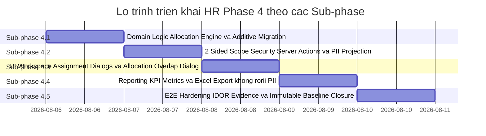

# HR PHASE 4 — LỘ TRÌNH TRIỂN KHAI THEO CÁC SUB-PHASE 4.1 ĐẾN 4.5 (IMPLEMENTATION ROADMAP)

- **Phiên bản:** 1.0.3
- **Trạng thái:** APPROVED — FROZEN FOR PHASE 4.1
- **Mã nguồn khảo sát (Surveyed Source SHA):** `8c1e1c89084a27eccacc3bc5fdf12aa3af160925`
- **Người phê duyệt:** Chủ dự án

---

## I. TỔNG QUAN TIẾN TRÌNH THỰC HIỆN SUB-PHASE 4.1 – 4.5

---

## II. ĐẶC TẢ CHI TIẾT CÁC SUB-PHASE

### Sub-phase 4.1 — Domain Logic, Allocation Engine & Additive Migration
- **Mục tiêu:** Nâng cấp `src/lib/hr/project-assignment-service.ts` với Thuật toán Sweep-Line, PostgreSQL Concurrency Locking (`lock_timeout = '5s'`), phân tách công thức ngày `allocationEffectiveEnd` (DEC-01), helper ngày Việt Nam `parseVietnamDateOnly` (DEC-03) và thực thi Additive Migration bổ sung enum `EmployeeProjectAssignmentEndReason` (DEC-06) cùng composite indexes `@@index([employeeId, status, startDate])`, `@@index([projectId, status, startDate])` (DEC-07).
- **Entry Gate:** Phê duyệt đặc tả Phase 4.0.3 và commit Git SHA đặc tả.
- **Exit Gate:** 100% Unit test cho Service & Allocation Engine chạy PASS trên Vitest.

### Sub-phase 4.2 — Security Guard, 2-Sided Scope & Server Action Contracts
- **Mục tiêu:** Xây dựng các Server Action (`assignEmployeeToProjectAction`, `transferProjectRoleOrAllocationAction`, `extendProjectAssignmentAction`, `releaseEmployeeFromProjectAction`) với 2-Sided Target Scope Guard (`EmployeeTargetScope` + `ProjectStaffingScope` - DEC-04) và PII Payload Isolation (DEC-08).
- **Entry Gate:** Sub-phase 4.1 Exit Gate được mở.
- **Exit Gate:** 100% IDOR denial integration tests PASS.

### Sub-phase 4.3 — UI Workspace, Forms & Allocation Overlap Dialog
- **Mục tiêu:** Xây dựng giao diện `/hr/project-assignments` bằng `HrWorkspaceShell` hoàn chỉnh, trang danh sách điều động đơn lẻ, hộp thoại tạo mới/chuyển vai trò và `AllocationOverlapDialog`.
- **Entry Gate:** Sub-phase 4.2 Exit Gate được mở.
- **Exit Gate:** Giao diện đáp ứng tiêu chuẩn Accessibility, Light Theme high contrast, không có hydration errors.

### Sub-phase 4.4 — Reporting KPI Metrics & Excel Export
- **Mục tiêu:** Xây dựng KPI Dashboard metrics (đúng điều kiện ngày) và Xuất Báo cáo Danh sách Nhân sự Công trình ra Excel (.xlsx) không chứa PII.
- **Entry Gate:** Sub-phase 4.3 Exit Gate được mở.
- **Exit Gate:** File Excel xuất ra khớp dữ liệu CSDL và không rò rỉ thông tin nhạy cảm PII.

### Sub-phase 4.5 — E2E Hardening, IDOR Evidence & Immutable Baseline Closure
- **Mục tiêu:** Chạy lại toàn bộ các Playwright E2E Test Suites trên QA isolated database. Kiểm tra rò rỉ PII. Chốt một Git Commit SHA duy nhất và đưa ra quyết định GO Phase 4 Final Closure.
- **Entry Gate:** Sub-phase 4.4 Exit Gate được mở.
- **Exit Gate:** `GO — HR PHASE 4 RELEASED`.
