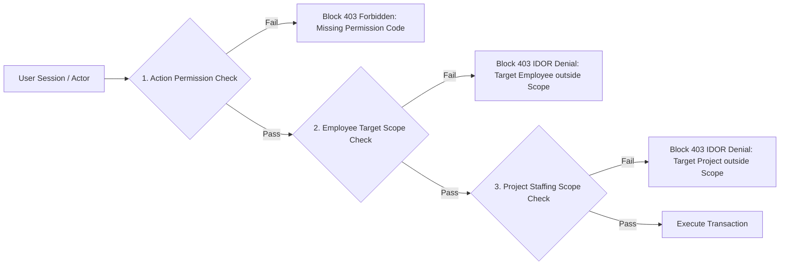

# HR PHASE 4 — MA TRẬN PHÂN QUYỀN VÀ KIỂM SOÁT PHẠM VI DỮ LIỆU 2 CHIỀU (PERMISSION & SCOPE MATRIX)

- **Phiên bản:** 1.0.3
- **Trạng thái:** APPROVED — FROZEN FOR PHASE 4.1
- **Mã nguồn khảo sát (Surveyed Source SHA):** `8c1e1c89084a27eccacc3bc5fdf12aa3af160925`
- **Người phê duyệt:** Chủ dự án

---

## I. CHÍNH SÁCH XÁC THỰC PHẠM VI ĐIỀU ĐỘNG 2 CHIỀU (DEC-04 & DEC-05)

Để ngăn chặn lỗ hổng IDOR khi người dùng cố tình điều động một nhân viên thuộc đơn vị khác hoặc vào một dự án ngoài phạm vi quản lý, mọi Server Action điều động bắt buộc phải thực thi **Xác thực 2 Chiều độc lập**:

### Chi tiết 2 Chiều Kiểm tra Target Scope:
1. **Chiều 1 — Phạm vi Nhân viên (`EmployeeTargetScope`):**
   Xác minh `targetEmployeeId` thuộc phạm vi đơn vị do người dùng quản lý (`OWN_ORGANIZATION_UNIT`), chính mình (`SELF_ONLY`) hoặc toàn công ty (`ALL_EMPLOYEES`).
2. **Chiều 2 — Phạm vi Nhân lực Dự án (`ProjectStaffingScope` - DEC-04):**
   - Phân tách hoàn toàn `ProjectReadScope` và `ProjectStaffingScope`. Quyền xem dự án hoặc quyền `ALL_EMPLOYEES` thuộc HR không được dùng để suy ra quyền điều động dự án.
   - Các vai trò `ADMIN`, `DIRECTOR`, `DEPUTY_DIRECTOR` có `ProjectStaffingScope` trên toàn bộ các công trình hợp lệ.
   - Người dùng có các quyền `hr:project_assignment:create`, `hr:project_assignment:update`, `hr:project_assignment:release` được phép thao tác theo `EmployeeTargetScope` của chính quyền đó và trên công trình tiếp nhận hợp lệ (`ACTIVE` hoặc `PLANNING`).
   - Quyền điều động nhân sự chỉ cấp quyền quản lý nhân lực. Không tự động cấp quyền xem báo cáo dự án, không tự động tạo `ProjectMember`, không cấp quyền tài liệu, vật tư hay nhật ký công trình.

---

## II. MA TRẬN PHÂN QUYỀN VAI TRÒ HỆ THỐNG THỰC TẾ (VERIFIED USER ROLE MATRIX - DEC-05)

Bảng ma trận dựa trên các Enum `UserRole` thực tế trong `prisma/schema.prisma:11-21`:

| Vai trò Hệ thống (`UserRole`) | `assignment:read` | `assignment:create` | `assignment:update` | `assignment:release` | `allocation:override` | `role:manage` |
| :--- | :---: | :---: | :---: | :---: | :---: | :---: |
| **`ADMIN`** | **ALLOW** | **ALLOW** | **ALLOW** | **ALLOW** | **ALLOW** | **ALLOW** |
| **`DIRECTOR`** | **ALLOW** | **ALLOW** | **ALLOW** | **ALLOW** | **ALLOW** | **ALLOW** |
| **`DEPUTY_DIRECTOR`** | **ALLOW** | **ALLOW** | **ALLOW** | **ALLOW** | DENY | DENY |
| **`MANAGER`** | **OWN_ORG** | **OWN_ORG** | **OWN_ORG** | **OWN_ORG** | DENY | DENY |
| **`CHIEF_COMMANDER`** | **OWN_PROJ** | DENY | DENY | **DENY (DEC-05)** | DENY | DENY |
| **`SUPERVISION_HEAD`** | **OWN_PROJ** | DENY | DENY | DENY | DENY | DENY |
| **`CONSTRUCTION_SUPERVISOR`** | **OWN_PROJ** | DENY | DENY | DENY | DENY | DENY |
| **`ENGINEER` / `STAFF`** | **SELF_ONLY** | DENY | DENY | DENY | DENY | DENY |

*Lưu ý DEC-05:* Vai trò `CHIEF_COMMANDER` (Chỉ huy trưởng) không trực tiếp thực hiện mutation rút nhân sự (`release = DENY`), chỉ có quyền xem danh sách nhân lực thuộc công trình quản lý và gửi yêu cầu qua quy trình ngoài hệ thống trong Phase 4.

---

## III. THỐNG NHẤT MÃ QUYỀN ĐIỀU ĐỘNG (HR PERMISSION DEFINITIONS)

| Permission Code | Tên quyền nghiệp vụ | Scope mặc định | Mối liên hệ Permission Policy |
| :--- | :--- | :---: | :--- |
| `hr:project_assignment:read` | Xem danh sách điều động dự án | `OWN_PROJECTS` / `OWN_ORG` | Cho phép đọc dữ liệu điều động nhân sự dự án |
| `hr:project_assignment:create` | Tạo mới điều động nhân sự | `OWN_ORGANIZATION_UNIT` | Khởi tạo bản ghi phân công nhân sự mới đến công trình |
| `hr:project_assignment:update` | Chỉnh sửa/Gia hạn phân công | `OWN_ORGANIZATION_UNIT` | Gia hạn expectedEndDate hoặc sửa hành chính |
| `hr:project_assignment:release` | Rút nhân sự / Kết thúc điều động | `OWN_ORGANIZATION_UNIT` | Chấm dứt phân công công trình trước thời hạn |
| `hr:project_allocation:override` | Phê duyệt vượt phân bổ 100% | `ALL_EMPLOYEES` | Phê duyệt ngoại lệ phân bổ nhân lực cao điểm |
| `hr:project_role:manage` | Quản lý danh mục vai trò công trường | `ALL_EMPLOYEES` | Quản trị bảng danh mục `ProjectPersonnelRole` |
