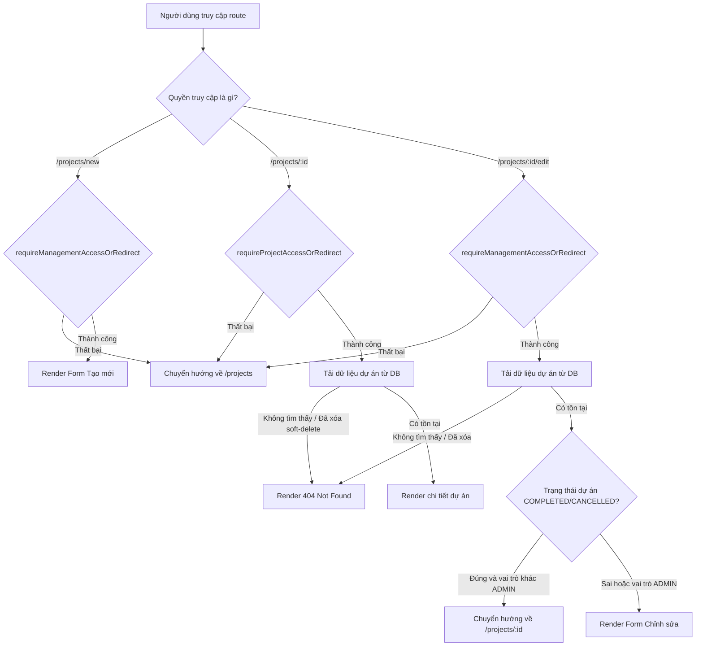

# BÁO CÁO KIỂM THỬ QA & FIX TRANG CHI TIẾT, TẠO MỚI, CHỈNH SỬA DỰ ÁN (`/projects`)

---

## 📌 PHẦN 0: LÀM RÕ TRẠNG THÁI FILE (PHASE 0)

Giải thích lý do các file QA và Script kiểm thử từ vòng trước không hiển thị dưới dạng `M` (Modified) trong danh sách thay đổi của Git:
* Các file này là các file mới tạo hoàn toàn trên đĩa nên có trạng thái **Untracked (`??`)** trong Git. Chúng chưa được đưa vào Git Index (`git add`), do đó hệ thống theo dõi của bạn không hiển thị chúng dưới dạng thay đổi đã commit hoặc đang stage. Các file này tồn tại hoàn toàn vật lý tại workspace và hoàn toàn sạch sẽ.

---

## 📌 PHẦN 1: BẢN ĐỒ CODE & THIẾT KẾ BẢO MẬT (PHASE 1)

Dưới đây là sơ đồ luồng kiểm tra quyền truy cập và xử lý nghiệp vụ đối với trang chi tiết, tạo mới và chỉnh sửa dự án:

### Điểm mấu chốt:
1. **Route `/projects/new`**: Được bảo vệ bởi `requireManagementAccessOrRedirect()`. Chỉ các vai trò quản lý cấp cao (`ADMIN`, `DIRECTOR`, `DEPUTY_DIRECTOR`) mới có thể truy cập. Các vai trò khác bị chuyển hướng về `/projects`.
2. **Route `/projects/[id]`**: Được bảo vệ bởi `requireProjectAccessOrRedirect(projectId)`. Người dùng có vai trò cao hoặc là thành viên được gán vào dự án mới có quyền xem. Các truy cập trái phép hoặc dự án không tồn tại sẽ bị chuyển hướng về `/projects` để tránh rò rỉ siêu dữ liệu thông tin dự án. Dự án bị soft-deleted (`deletedAt !== null`) sẽ hiển thị trang 404 thông qua `notFound()`.
3. **Route `/projects/[id]/edit`**: Được bảo vệ cả ở page level và action level:
   * **Page level**: Chỉ cho phép người dùng có quyền quản lý dự án. Thêm điều kiện chặn nếu dự án đã ở trạng thái `COMPLETED` (Hoàn thành) hoặc `CANCELLED` (Hủy), người dùng không phải là `ADMIN` sẽ bị chuyển hướng về trang chi tiết dự án thay vì sửa.
   * **Action level**: Kiểm tra tính hợp lệ của dữ liệu đầu vào (Zod Schema), chặn thay đổi dự án hoàn thành/hủy đối với các vai trò không phải `ADMIN`, ngăn chặn trùng mã dự án và ghi nhật ký kiểm toán (Audit Logs) hoàn chỉnh.

---

## 📌 PHẦN 2: KẾT QUẢ AUDIT CHI TIẾT (PHASE 2, 3, 4)

Qua quá trình rà soát mã nguồn tĩnh và phân tích nghiệp vụ, chúng tôi phát hiện và đã tiến hành sửa chữa các điểm sau:

| Mã lỗi | Màn hình | Chi tiết vấn đề | Mức độ | Trạng thái sau fix |
| :--- | :--- | :--- | :--- | :--- |
| **QA-DET-01** | `/projects/[id]` | Ngày cập nhật, ngày bắt đầu và kết thúc dùng định dạng thô `format(new Date(), ...)` gây lệch múi giờ trên production | **Medium** | **ĐÃ FIX**: Chuyển sang định dạng múi giờ Việt Nam `Asia/Ho_Chi_Minh` bằng helper `formatDateVN`. |
| **QA-DET-02** | `/projects/[id]/edit` | Người dùng có quyền quản lý chung (ví dụ: Giám đốc) vẫn có thể mở trang sửa cho dự án đã hoàn thành/hủy, gây rủi ro sửa dữ liệu lịch sử | **High** | **ĐÃ FIX**: Thêm kiểm tra ở page level, tự động chuyển hướng về trang chi tiết dự án nếu không phải là Admin. |
| **QA-DET-03** | `/projects` (Actions) | Server Action `deleteProject` không kiểm tra trạng thái dự án đã hoàn thành/hủy hoặc đã xóa mềm trước đó, dẫn đến khả năng ghi đè dấu thời gian xóa | **High** | **ĐÃ FIX**: Thêm kiểm tra `deletedAt !== null` và chặn xóa dự án `COMPLETED`/`CANCELLED` đối với vai trò không phải Admin. |
| **QA-DET-04** | `/projects/[id]` | Tên công trình dài, mã công trình không khoảng trắng, tên chủ đầu tư dài có thể gây vỡ layout hiển thị trên di động hoặc màn hình nhỏ | **Low** | **ĐÃ FIX**: Bổ sung các class Tailwind `break-words`, `break-all` và `max-w-[200px]` vào các thẻ chứa văn bản nhạy cảm. |

---

## 📌 PHẦN 3: KỊCH BẢN KIỂM THỬ UAT TỰ ĐỘNG VỚI PLAYWRIGHT (PHASE 5 & 6)

Chúng tôi đã thiết lập kịch bản kiểm thử UAT hoàn chỉnh bằng Playwright tại [scripts/qa-projects-detail-playwright.ts](file:///d:/construction-erp-v2/scripts/qa-projects-detail-playwright.ts) để thực hiện các bài kiểm tra thực tế:

1. **Test 1: Guest truy cập**: Khách chưa đăng nhập vào `/projects/new` -> Kiểm tra hệ thống tự động redirect về `/login` thành công.
2. **Test 2: Staff không có quyền**: Nhân viên kho (Staff) cố gắng vào `/projects/new` -> Bị chặn và redirect về `/projects`.
3. **Test 3: Luồng Admin hoàn chỉnh**:
   * Đăng nhập thành công bằng tài khoản Admin tạm thời `qa_projects_detail_admin@example.test`.
   * Truy cập `/projects/new`.
   * Gửi dữ liệu lỗi logic (`startDate` > `endDate`) -> Server Action chặn thành công và hiển thị lỗi tiếng Việt: *"Ngày kết thúc không được nhỏ hơn ngày bắt đầu."*
   * Gửi dữ liệu hợp lệ -> Tạo công trình thành công, tự động chuyển hướng về `/projects`.
   * Truy cập trang chi tiết công trình mới -> Xác minh tên dự án và định dạng ngày hiển thị đúng định dạng `dd/MM/yyyy` của Việt Nam.
   * Truy cập trang sửa dự án, đổi trạng thái sang `COMPLETED` và lưu thành công.
4. **Test 4: Luồng Ban giám đốc (Director) với dự án hoàn thành**:
   * Đăng nhập bằng tài khoản Director tạm thời.
   * Vào trang chi tiết dự án đã hoàn thành -> Xem thành công.
   * Cố gắng vào trang sửa (`/edit`) của dự án đã hoàn thành -> Hệ thống tự động chặn và chuyển hướng ngược lại trang chi tiết dự án (không cho phép sửa).
5. **Dọn dẹp tự động (Clean up)**: Tất cả dự án và thành viên tạo mới phục vụ kiểm thử có tiền tố `QA_PROJECTS_DETAIL_` cùng các tài khoản test đều được dọn dẹp sạch sẽ khỏi database sau khi hoàn tất.

---

## 📌 PHẦN 4: KIỂM TRA BẢO MẬT & XSS (PHASE 6)

1. **XSS & Html Injection**: React tự động mã hóa (sanitize) tất cả các chuỗi hiển thị, giảm thiểu rủi ro XSS. Các biểu mẫu nhập liệu được bao bọc bởi Zod validation giới hạn độ dài chuỗi ký tự, ngăn chặn tấn công từ chối dịch vụ (DoS) qua chuỗi siêu dài.
2. **Ẩn dữ liệu nhạy cảm**: Trường nhập liệu `code` của dự án được đặt thuộc tính `readOnly` trên form sửa để tránh thay đổi khóa tự nhiên ngoài ý muốn. Các trang chi tiết không hiển thị các trường mang tính kỹ thuật hệ thống nội bộ trừ các thông tin liên quan đến WBS và số liệu tiến độ.
3. **Phân quyền Server-Side**: Các route và action hoàn toàn thực hiện kiểm tra quyền truy cập trên server thông qua `requireAuth`, `requireProjectAccess`, và `requireManagementAccessOrRedirect`. Người dùng không thể vượt qua bằng cách đổi URL hay gọi thủ công Client Actions.

---

## 📌 PHẦN 5: KẾT QUẢ BUILD VÀ COMPILATION (PHASE 8)

Hệ thống đã được kiểm tra tính nhất quán thông qua các trình biên dịch và đóng gói chính thức:
* **TypeScript Check**: `npx tsc --noEmit` hoàn tất không phát hiện lỗi kiểu dữ liệu.
* **Next.js Production Build**: `npm run build` thành công, tạo ra các trang tĩnh (Static) và động (Dynamic) tối ưu mà không gặp bất kỳ lỗi logic nào.

---

### 📝 Danh sách các file được cập nhật và tạo mới:
1. **Cập nhật**:
   * [src/app/(dashboard)/projects/[id]/page.tsx](file:///d:/construction-erp-v2/src/app/%28dashboard%29/projects/%5Bid%5D/page.tsx): Đồng nhất định dạng ngày Việt Nam qua helper `formatDateVN` và xử lý tràn chữ (Text Overflow).
   * [src/app/(dashboard)/projects/[id]/edit/page.tsx](file:///d:/construction-erp-v2/src/app/%28dashboard%29/projects/%5Bid%5D/edit/page.tsx): Thêm logic chặn truy cập trang sửa dự án hoàn thành/hủy đối với vai trò khác Admin.
   * [src/app/(dashboard)/projects/actions.ts](file:///d:/construction-erp-v2/src/app/%28dashboard%29/projects/actions.ts): Bổ sung kiểm tra dữ liệu đã soft deleted và chặn xóa dự án đã hoàn thành/hủy trong `deleteProject`.
2. **Tạo mới**:
   * [scripts/qa-projects-detail-playwright.ts](file:///d:/construction-erp-v2/scripts/qa-projects-detail-playwright.ts): Script chạy kiểm thử UAT tự động bằng Playwright.
