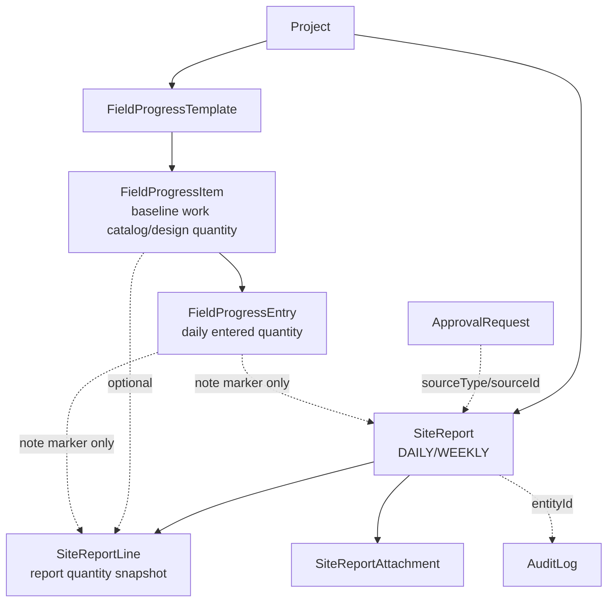

# REPORTS AND FIELD PROGRESS FULL AUDIT - 2026-07-09

Audit scope: Reports / Bao cao hien truong, Daily Report, Weekly Report, Work Picker popup, export/print, approvals/permissions, and synchronization with Field Progress / Khoi luong cong trinh.

Important constraint: this audit did not change application code or business data. The only file created is this QA report.

## 0. File / Module Audit Map

### Project instructions and docs read

- `AGENTS.md`
- `CLAUDE.md`
- `.agents/skills/design-taste-frontend/SKILL.md`
- `.agents/skills/speckit-*.md`
- `docs/design/UI_UX_STYLE_GUIDE.md`
- `docs/superpowers/plans/2026-07-04-site-report-field-progress-sync.md`
- Related `docs/qa/*REPORT*`, `*FIELD_PROGRESS*`, `*WEEKLY*`, `*PRINT*`, `*SYNC*` reports dated 2026-07-03 and 2026-07-04

### Database / schema

- `prisma/schema.prisma`
- Runtime DB queried read-only via `src/lib/prisma.ts`

### Reports backend

- `src/app/(dashboard)/reports/actions.ts`
- `src/lib/reports/report-create-service.ts`
- `src/lib/reports/report-transition-service.ts`
- `src/lib/reports/report-progress-sync.ts`
- `src/lib/reports/report-workflow-policy.ts`
- `src/lib/reports/report-stats.ts`
- `src/lib/reports/report-timezone.ts`
- `src/lib/reports/weekly-report-utils.ts`
- `src/lib/reports/report-serializers.ts`

### Field Progress backend

- `src/lib/field-progress/volume-balance.ts`
- `src/lib/field-progress/volume-guard.ts`
- `src/lib/field-progress/rollup.ts`
- `src/lib/field-progress/entry-workflow-policy.ts`
- `src/app/(dashboard)/projects/[id]/field-progress/actions.ts`
- `src/app/(dashboard)/projects/[id]/field-progress/daily/actions.ts`

### Reports UI

- `src/app/(dashboard)/reports/page.tsx`
- `src/app/(dashboard)/reports/loading.tsx`
- `src/app/(dashboard)/reports/error.tsx`
- `src/components/reports/types.ts`
- `src/components/reports/reports-workspace.tsx`
- `src/components/reports/reports-toolbar.tsx`
- `src/components/reports/reports-table.tsx`
- `src/components/reports/reports-stats.tsx`
- `src/components/reports/reports-mobile-cards.tsx`
- `src/components/reports/create-report-dialog.tsx`
- `src/components/reports/create-dialog/work-picker.tsx`
- `src/components/reports/create-dialog/selected-work-card.tsx`
- `src/components/reports/create-dialog/weekly-report-form.tsx`
- `src/components/reports/create-dialog/general-info-card.tsx`
- `src/components/reports/create-dialog/resources-and-quality.tsx`
- `src/components/reports/create-dialog/attachments-card.tsx`
- `src/components/reports/report-detail-drawer.tsx`
- `src/components/reports/report-print-template.tsx`
- `src/components/reports/report-print-preview-dialog.tsx`
- `src/components/reports/print-report-toolbar.tsx`
- `src/components/reports/site-report-gallery-dialog.tsx`
- `src/components/reports/photo-preview-stack.tsx`

### Field Progress UI

- `src/app/(dashboard)/projects/[id]/field-progress/page.tsx`
- `src/app/(dashboard)/projects/[id]/field-progress/daily/page.tsx`
- `src/app/(dashboard)/projects/[id]/field-progress/summary/page.tsx`
- `src/components/field-progress/master-table.tsx`
- `src/components/field-progress/daily-entry-table.tsx`
- `src/components/field-progress/daily-status-calendar.tsx`
- `src/components/field-progress/summary-desktop-view.tsx`
- `src/components/field-progress/summary-mobile-view.tsx`
- `src/components/field-progress/table-styles.ts`
- `src/components/project/project-module-tabs.tsx`

### Reports API / print / attachment

- `src/app/api/reports/[reportId]/attachments/route.ts`
- `src/app/api/reports/attachments/[attachmentId]/route.ts`
- `src/app/api/reports/[reportId]/history/route.ts`
- `src/app/print/reports/[reportId]/page.tsx`
- `src/lib/storage/local-storage-provider.ts`

### QA scripts inspected

- `scripts/reports-final-audit-phase1-to-5.ts` - read-only, executed.
- `scripts/audit/reports-final-audit-phase1-to-5.ts` - read-only intent, not executable because import path is broken.
- `scripts/qa-popup-volume-balance.ts` - not executed, mutates DB inside a rollback transaction.
- `scripts/qa-daily-report-volume-balance.ts` - not executed, mutates DB inside a rollback transaction.
- `scripts/qa-report-progress-sync.ts` - not executed, upserts/updates persistent QA data.
- `scripts/qa-weekly-report-ui-submit-print.ts` and `scripts/qa-weekly-report-full-flow.ts` - not executed in this audit because they are not wired as package tests and may create UI/business data.

## 1. Executive Summary

Overall result: FAIL.

Go-live recommendation: NO.

Reason: the specific balance service behind the Reports work picker can currently return the expected `design=180`, `cumulative=44`, `today=44`, `remaining=136` for the verified sample item/date, but the whole Reports <-> Field Progress subsystem is not safe enough for go-live. Critical gaps remain in reject/delete rollback semantics, DB constraints, source provenance, weekly report structure, UI data mapping, attachment integrity, and real E2E coverage.

Most important findings:

- Work picker backend now passes the suspected sample balance if it receives the correct `projectId` and `reportDate`: DB read-only check for project `CT-TAYHO-2026-001`, item `FP-CB-001`, date `2026-07-04` returned `planned=180`, `totalActive=44`, `sameDate=44`, `remaining=136`.
- Work picker can still load wrong/blank context because `ReportsWorkspace` renders `CreateReportDialog` without passing `currentProjectId` from the global project context (`reports-workspace.tsx:690-700`).
- Reject does not rollback quantities: `rejectSiteReportTransition` syncs mode `REJECT`, `report-progress-sync.ts` converts entries to `REVISION_REQUESTED`, and `volume-balance.ts:26-31` still counts `REVISION_REQUESTED` in cumulative.
- Soft delete does not rollback quantities: `softDeleteSiteReport` only sets `SiteReport.deletedAt` and writes an audit log (`actions.ts:1316-1338`); it does not call sync mode `CANCEL`.
- Weekly reports are not go-live ready: one submitted weekly report has 0 lines; another weekly report has 3 lines but all 3 miss `fieldProgressItemId` and `designQuantity`.
- Detail drawer and print template drop the most important quantity snapshots: `page.tsx:102-112` maps only `quantityToday`, not design/before/cumulative/progress; print table only shows `quantityToday` (`report-print-template.tsx:233-250`).
- DB has no unique constraint for report number, weekly project/week, or active field-progress entry source, so app-level duplicate checks are race-prone.

## 2. Current Data Diagram

Current storage responsibility:

- Baseline/original quantity: `FieldProgressItem.designQuantity`.
- Daily entered quantity: `FieldProgressEntry.quantity`.
- Quantity inside field report: `SiteReportLine.quantityToday`, with snapshots `designQuantity`, `quantityBefore`, `quantityCumulative`, `progressPercent`.
- Daily and weekly reports: same `SiteReport` table, separated by `SiteReport.type` (`DAILY` / `WEEKLY`).
- Attachments: Reports use `SiteReportAttachment`; normal Documents use `Document`. Report attachments are not stored in `Document`.
- Approval center: generic `ApprovalRequest` with `type=REPORT`, `sourceType=SITE_REPORT`, `sourceId=<SiteReport.id>`; no dedicated `Approval` model.
- History: no `ReportHistory` model; history is `AuditLog`.

Key architectural problem: `FieldProgressEntry` does not have `sourceType`, `sourceId`, or `sourceLineId` columns. Source provenance is embedded in `note` as markers such as `[SOURCE:SITE_REPORT:<reportId>] [SOURCE_LINE:<lineId>]`. This is fragile, hard to constrain, and easy to overwrite.

## 3. Audit Database

### Related models found

- `User`
- `Project`
- `ProjectMember`
- `Document`
- `SiteReport`
- `SiteReportPhoto`
- `SiteReportAttachment`
- `SiteReportLine`
- `ApprovalRequest`
- `AuditLog`
- `FieldProgressTemplate`
- `FieldProgressItem`
- `FieldProgressEntry`

Models requested but not present under those names:

- No `Report` model.
- No `ReportLine` model.
- No `ReportAttachment` model.
- No `ReportHistory` model.
- No generic `Approval` model; actual model is `ApprovalRequest`.

### Status and soft delete

Schema evidence:

- `SiteReportStatus`: `DRAFT`, `SUBMITTED`, `APPROVED`, `REJECTED`, `REVISION_REQUESTED`, `LOCKED`, `CANCELLED` (`schema.prisma:109-117`).
- `FieldProgressEntryStatus`: `DRAFT`, `SUBMITTED`, `APPROVED`, `REVISION_REQUESTED`, `CANCELLED` (`schema.prisma:181-187`).
- `SiteReport.deletedAt`, `SiteReportLine.deletedAt`, `FieldProgressItem.deletedAt`, and `FieldProgressEntry.deletedAt` exist.

Balance status currently counted:

- `volume-balance.ts:26-31` counts `DRAFT`, `SUBMITTED`, `APPROVED`, `REVISION_REQUESTED`.
- `CANCELLED` is not counted.
- There is no `REJECTED` status for `FieldProgressEntry`.

Implication: rejected report quantities remain counted if the sync service sets entries to `REVISION_REQUESTED`. This conflicts with the requested rollback behavior for reject/cancel/delete.

### Constraints and indexes

Present:

- `SiteReport.reportNo` has an ordinary index only (`schema.prisma:506`; read-only audit also confirmed `reportNoHasUniqueIndex=false`).
- `SiteReport` has indexes for project, creator, report date, report number.
- `FieldProgressItem` and `FieldProgressEntry` have ordinary indexes.

Missing:

- No unique constraint for `SiteReport.reportNo`.
- No unique constraint for one weekly report per `(projectId, type, weekStartDate, weekEndDate, deletedAt=null)`.
- No unique constraint for one active report-sourced `FieldProgressEntry` per `(sourceType, sourceId, sourceLineId)` because source columns do not exist.
- No partial unique index for one active manual entry per `(projectId, templateId, itemId, entryDate, sourceType='MANUAL')`.

Race condition risk: app-level duplicate checks exist for weekly creation (`actions.ts:1074-1088`) and sync source lookup (`report-progress-sync.ts:242-264`), but without DB-level constraints two concurrent requests can still double-create.

### Read-only DB evidence

Project audited: `CT-TAYHO-2026-001`.

Snapshot from direct DB query:

- Field progress items: 28 total, 20 work items.
- Active `FieldProgressEntry`: 3.
- Site reports: 20 total in the broader audit; project query saw 15 active/non-active records depending filter.
- Report statuses in read-only script: `APPROVED=5`, `SUBMITTED=8`, `DRAFT=2`, `REJECTED=2`, `CANCELLED=3`.
- Weekly reports: 2.
- Weekly without lines: 1.
- Report attachments: 6 photo records, 0 file records.
- Missing files on disk for report attachments: 6.
- Disk files without DB record under `storage/site-reports`: 2.
- Duplicate report numbers: none currently, but no unique index prevents future duplicates.

Sample item:

- `FP-CB-001`
- Design quantity: 180
- Current balance at `2026-07-04`: design 180, cumulative active 44, today active 44, remaining 136.

Data mismatch:

- Historical `SiteReportLine` rows exist for `FP-CB-001` with `quantityToday=80` and `quantityToday=0` while current active `FieldProgressEntry` for the sample item/date is 44. This shows `SiteReportLine` is not a reliable balance source by itself; balance must read `FieldProgressEntry`.

## 4. Audit Backend

### Work picker data path

UI:

- `CreateReportDialog` loads work items when `form.projectId` or `form.date` changes (`create-report-dialog.tsx:104-122`).
- It calls `getProjectWorkItems(form.projectId, form.date)` (`create-report-dialog.tsx:113`).

Server:

- `getProjectWorkItems(projectId, reportDate?)` validates session and project access (`actions.ts:205-213`).
- It loads `FieldProgressItem` work rows (`actions.ts:215-228`).
- It calls `getBulkWorkQuantityBalance(prisma, projectId, itemIds, { targetDate: reportDate })` (`actions.ts:234-238`).
- It returns design, cumulative active, today active, remaining, progress percent (`actions.ts:240-250` and following lines).

Assessment:

- PASS for passing `targetDate` into balance service.
- PASS for backend returning the suspected sample values when called with correct project/date.
- FAIL in naming: returned field is called `approvedCumulative` but value is `totalActiveEnteredQuantity`, not approved-only (`actions.ts:250`).
- FAIL in UI context wiring: `ReportsWorkspace` does not pass `currentProjectId` to `CreateReportDialog` (`reports-workspace.tsx:690-700`), so multi-project users can see blank/wrong initial project even when Reports list is scoped by global context.

### Balance service

`getBulkWorkQuantityBalance`:

- Reads baseline from `FieldProgressItem.designQuantity` (`volume-balance.ts:45-59`).
- Reads active entries from `FieldProgressEntry` (`volume-balance.ts:61-75`).
- Uses `targetDate` to calculate same-day quantity (`volume-balance.ts:81-111`).
- Supports `excludeSourceMarker` for editing a report (`volume-balance.ts:93-96`).
- Calculates remaining as `design - totalActiveEnteredQuantity` (`volume-balance.ts:115-128`).

Critical semantic issue:

- It counts `DRAFT`, `SUBMITTED`, `APPROVED`, and `REVISION_REQUESTED`.
- Field Progress master/summary usually treats approved quantity as canonical. Reports popup treats all active entered quantity as cumulative.
- The UI does not clearly separate approved, pending, draft, submitted, and revision quantities.

### Report create/update/sync

Create:

- `createSiteReport` builds daily lines through `buildDailyReportLines`.
- `createSiteReportWithAudit` syncs daily reports into `FieldProgressEntry`.
- Draft daily reports with positive quantity create `DRAFT` entries, and these are counted by WorkPicker because `DRAFT` is active.

Submit/approve/reject:

- `submitSiteReportTransition` calls sync mode `SUBMIT` (`report-transition-service.ts:72-75`).
- `approveSiteReportTransition` calls sync mode `APPROVE` (`report-transition-service.ts:122-125`).
- `rejectSiteReportTransition` calls sync mode `REJECT` (`report-transition-service.ts:177-180`).

Sync service:

- Skips weekly reports (`report-progress-sync.ts:177-187`).
- CANCEL mode exists (`report-progress-sync.ts:189-191`).
- REJECT mode sets progress entries to `REVISION_REQUESTED` (`report-progress-sync.ts:193-195`).
- Existing own entries are found by note marker, not by structured source columns (`report-progress-sync.ts:242-264`).
- It updates report line snapshots before writing progress entry (`report-progress-sync.ts:316-328`).
- It updates existing entries or creates new ones (`report-progress-sync.ts:352-365`).

Critical issues:

- Reject is not rollback: entries become `REVISION_REQUESTED`, and `REVISION_REQUESTED` is counted by balance.
- Soft delete is not rollback: `softDeleteSiteReport` does not invoke sync `CANCEL`.
- Source marker in `note` can be lost or overwritten by manual daily entry.
- No DB uniqueness means two concurrent syncs can create duplicate active entries.

### Field Progress daily write path

`batchSaveDailyEntries`:

- Requires project access only (`daily/actions.ts:15-16` and `rbac.ts:180-186`).
- Sets status based on role and `_submit` (`daily/actions.ts:20-21`).
- Fetches existing entries by template/date, not by source type (`daily/actions.ts:25-35`).
- Explicitly removed `assertFieldProgressEntryWritable` (`daily/actions.ts:90`).
- Updates existing entries directly (`daily/actions.ts:136-150`).
- Creates manual entries without source type (`daily/actions.ts:165-180`).

Critical issue: report-sourced entries can be overwritten/deleted by the daily manual screen/action because server-side source protection was removed. UI disables report-sourced rows for non-admin/director (`daily-entry-table.tsx:456-479`), but this is not a server-side guard and admins/directors can overwrite by design without a structured adjustment flow.

Another logic issue:

- The comment says "cumulative before today", but query includes `{ entryDate: { gte: end } }`, meaning future approved entries are included (`daily/actions.ts:52-63`). This can distort validation and remaining quantity.

### Weekly backend

`getWeeklyReportSummary`:

- Loads daily reports in date range (`actions.ts:916-928`).
- Can include submitted/draft for preview counters (`actions.ts:912-914`).
- Aggregation uses only `approvedReports` (`actions.ts:948-1000`).
- Returns only weekly quantity and dates; it does not compute before-week cumulative, cumulative-to-end-week, remaining, or percent.

`createWeeklyReportFromApprovedDailyReports`:

- Re-runs preview (`actions.ts:1065-1066`).
- Checks duplicate weekly report inside transaction (`actions.ts:1074-1088`) but no DB unique constraint backs it.
- Creates weekly `SiteReportLine` rows from preview groups (`actions.ts:1109-1120`).
- Weekly created lines do not store `fieldProgressItemId`, `designQuantity`, `quantityBefore`, `quantityCumulative`, or `progressPercent`.

Result: weekly report is currently a summary copy of approved daily quantities, not a proper weekly progress report.

## 5. Audit Frontend UI/UX

### Reports list

Strengths:

- Reports page scopes list by global project context.
- List/table/mobile cards exist.
- `router.refresh()` is called after create/submit/approve/reject/delete (`reports-workspace.tsx:371`, `381`, `390`, `435`, `462`).

Issues:

- Create dialog is not given the current global project ID (`reports-workspace.tsx:690-700`).
- Report type TS union omits schema statuses `LOCKED` and `CANCELLED` (`types.ts:6`).
- Source text has Vietnamese mojibake in many files, raising maintainability and UI copy risk.

### Create dialog

Strengths:

- Has Daily/Weekly tabs.
- Shows summary cards.
- Has loading state for work items.
- Uses modal animation classes.

Issues:

- Backdrop does not close the modal. That may be intentional for unsaved form safety, but there is no visible explanation.
- Save/submit flow creates a draft first to upload attachments, then submits. If upload succeeds but submit fails, the report remains draft with active draft progress entries counted in balance (`reports-workspace.tsx:345-386`).
- UI allows draft over-limit in some cases, while server sync can reject it. This creates confusing "save draft" behavior.
- Double-click protection relies on `isSubmitting`; no local idempotency key or server idempotency token exists.

### Work picker popup

Strengths:

- Calls backend with project/date through parent dialog.
- Shows design, cumulative, today, remaining, status columns (`work-picker.tsx:183-195`).
- Shows project code/name if provided (`work-picker.tsx:113-117`).
- Has search, category grouping, filters, row selection, selected count.

Issues:

- The outer overlay has no `onClick={onClose}` (`work-picker.tsx:110-111`), so click outside does not close.
- Table `min-w-[800px]` inside modal can be awkward on mobile (`work-picker.tsx:183`).
- "Luy ke" displays `approvedCumulative`, but the value is active cumulative including draft/submitted/revision (`work-picker.tsx:249`).
- UI does not split approved, pending, draft, submitted, and revision quantities.
- Status column only shows remaining/done, not approval status.

### Detail drawer

Strengths:

- Drawer has overlay click close and Escape handling.
- It fetches history.
- It aggregates weekly-looking lines for display.

Issues:

- It displays only today's/weekly quantity, not design, cumulative before, cumulative after, remaining, percent.
- Attachment display depends on files existing; current read-only audit found all 6 report attachment DB records missing files on disk.

### Print / export

Strengths:

- Dedicated print route exists: `/print/reports/[reportId]`.
- Print route checks project access and print policy (`page.tsx:69-70`).
- Print template handles photos/files if present.

Issues:

- Print table only has STT, work, unit, quantity, note (`report-print-template.tsx:233-250`).
- Daily print lacks design, cumulative before date, cumulative after date, remaining, and progress percent.
- Weekly print lacks before-week, in-week, end-week, remaining, percent, and source day list as first-class columns.
- `npm run build` warning: Turbopack traced whole project risk via `src/lib/storage/local-storage-provider.ts` imported by report attachment download route.

## 6. Audit Sync: Reports <-> Field Progress

### Flow 1 - Field Progress -> Reports

Expected: input 44/180 in Field Progress daily, open Reports same project/date, WorkPicker shows 180 / 44 / 44 / 136.

Result: PARTIAL PASS.

Evidence:

- Current balance service returns the expected sample values for `FP-CB-001` on `2026-07-04`.
- `getProjectWorkItems` passes `targetDate` into the balance service.

Remaining fail/risk:

- If the create dialog is opened from a globally selected project, it may not default to that project because `currentProjectId` is not passed.
- Semantics are active cumulative, not approved cumulative.
- No real Playwright E2E test was available/run for the full browser flow in this audit.

### Flow 2 - Reports -> Field Progress

Expected: daily report quantity appears in daily input and summary.

Result: PARTIAL PASS / HIGH RISK.

Evidence:

- Daily report create/submit/approve sync writes `FieldProgressEntry`.
- DB sample has source-marked entries from site reports.

Risk:

- Daily Field Progress screen can overwrite report-sourced entries via server action.
- Summary/master usually count approved only, while WorkPicker counts active statuses. Users can see different totals across screens.

### Flow 3 - Edit report 44 -> 60

Expected: update to 60, no 44+60 double count.

Result: PARTIAL PASS.

Evidence:

- Update rebuilds daily lines and syncs the same report using `excludeSourceMarker` in balance service.
- Existing entries are found by report marker and updated, not blindly re-created.

Risk:

- Because source marker is stored in `note`, a manual edit that overwrites note can break idempotency.
- No DB unique constraint prevents race-condition duplicates.

### Flow 4 - Delete / cancel / reject report

Expected: rollback cumulative and remaining.

Result: FAIL.

Evidence:

- `softDeleteSiteReport` does not call sync `CANCEL`.
- Reject sets entries to `REVISION_REQUESTED`; balance counts `REVISION_REQUESTED`.

Impact:

- Deleted or rejected report quantities can remain in active cumulative, depending path/status.

### Flow 5 - Multiple reports same day

Expected: same-day sum 44+20=64.

Result: LOGIC PASS / CONSTRAINT RISK.

Evidence:

- Balance service sums all active entries for same target date.

Risk:

- No uniqueness/idempotency prevents accidental duplicate report entries in concurrent submits.

### Flow 6 - Multiple days

Expected: cumulative through target date and same-day quantity split correctly.

Result: LOGIC PASS / SEMANTIC RISK.

Evidence:

- Balance service totals all active entries and separately counts same target date.

Risk:

- It totals future active entries too when opening an earlier target date, because total is not date-bounded. If WorkPicker means "luy ke den ngay bao cao", this is wrong. It currently means "total active entered in project all dates".

### Flow 7 - Over design quantity

Expected: server reject and UI warning.

Result: PARTIAL PASS.

Evidence:

- `evaluateVolumeGuard` is called in report sync (`report-progress-sync.ts:298-312`).
- UI validates selected lines against remaining before submit.

Risk:

- Draft/save behavior is inconsistent: UI may allow draft over-limit while server sync still rejects.
- Error message says enter a reason for over-limit, but `evaluateVolumeGuard` currently blocks over-limit instead of allowing with reason.

## 7. Audit Daily Report

Current daily report has:

- Project link through `projectId`.
- Report date/time.
- Weather condition and temperature.
- Reporter name.
- GPS fields in schema and form.
- Work lines.
- Attachments/photos through `SiteReportAttachment`.
- Materials, labor, quality, issues, recommendations.
- Status and approval fields.
- Audit logs.
- Print route/template.

Missing or weak:

- UI/detail/print do not surface the full quantity snapshots already present in DB.
- No first-class signature model.
- No explicit source/audit link from report line to progress entry except note marker.
- No robust edit/delete rollback.
- Attachments have DB records but missing disk files in current data, so image/document display is not reliable.
- Daily report can be a foundation for weekly only after quantity snapshots and source linkage are made first-class and print/detail screens show them.

Recommended Daily Report line structure:

- `fieldProgressItemId`
- `workCode`
- `categoryName`
- `workContent`
- `unit`
- `designQuantity`
- `approvedCumulativeBeforeDate`
- `pendingCumulativeBeforeDate`
- `quantityToday`
- `approvedCumulativeAfterDate`
- `activeCumulativeAfterDate`
- `remainingAfterDate`
- `progressPercent`
- `sourceEntryId`
- `note`
- `issueNote`
- `proposalNote`

## 8. Audit Weekly Report

Current status: FAIL for go-live.

What works:

- UI can choose a date and derives Monday-Sunday (`weekly-report-form.tsx:13`, `50-53`).
- Week start/end are displayed and read-only after date selection.
- Preview calls `getWeeklyReportSummary`.
- Weekly creation can aggregate approved daily reports.
- Weekly print exists via the shared print template.

What is missing:

- No explicit "current week / previous week / next week" quick controls.
- No custom week-start configuration.
- Aggregation only sums approved daily line quantities.
- Weekly lines do not preserve `fieldProgressItemId` and design/cumulative snapshots.
- No before-week cumulative.
- No in-week vs end-week vs remaining vs percent.
- No structured source day/report linkage in DB.
- No duplicate protection at DB level.
- Existing DB has one submitted weekly report with 0 lines.
- Existing DB has one weekly report with 3 lines, but all 3 miss `fieldProgressItemId` and `designQuantity`.

Proposed weekly report structure:

- Project code/name/location.
- Week range, week number, standard Monday-Sunday flag or custom range.
- Overall weekly progress summary.
- Work table grouped by category/work item:
  - `fieldProgressItemId`
  - code/name/unit
  - design quantity
  - approved cumulative before week
  - quantity in week
  - approved cumulative to end week
  - active pending quantity
  - remaining after week
  - percent complete
  - days with quantity
  - source daily report IDs
- Highlight photos/documents from daily reports.
- Outstanding issues/risks/recommendations.
- Next-week plan.
- Creator/reviewer/status/signature.

## 9. Audit 3 Field Progress Tabs

Current placement under Project is partly reasonable:

- Baseline quantity table belongs under Project because it is project setup/master data.
- Summary belongs under Project because it is project-level monitoring.
- Daily input is the conflicting part because Reports daily already captures the same "field daily quantity" plus richer context.

Recommended product direction:

- Keep `Bảng khối lượng gốc` in Project.
- Keep `Tổng hợp khối lượng` in Project.
- Keep `Nhập khối lượng theo ngày` only as an engineering/admin adjustment screen, not the primary field-user flow.
- Make Reports Daily the primary field-user entry surface.

If keeping both Reports and Daily Entry:

- Define source types: `SITE_REPORT`, `MANUAL_ADJUSTMENT`, `IMPORT`, possibly `MIGRATION`.
- Report-sourced entries should not be overwritten by manual daily entry.
- Manual adjustment must require role, reason, audit log, and preferably a separate adjustment line.
- Summary should have clear filters: approved only, pending included, draft included.

If moving daily entry into Reports:

- Field users have one workflow and less double entry.
- Engineering/admin still needs a correction interface.
- Requires migration/backfill and stronger source model.

Do not remove Daily Entry immediately. First fix source provenance and rollback; then demote the tab to "Điều chỉnh kỹ thuật" if the business agrees.

## 10. Audit Animation / UI Polish

Good:

- Create modal and WorkPicker use `animate-in`, fade/zoom transitions.
- Drawer has overlay and Escape close.
- Buttons have hover/transition classes.
- Tables have hover/selected states.
- Empty states exist in Reports list and WorkPicker.

Needs work:

- WorkPicker outside click does not close.
- Create modal outside click does not close; if intentional, add dirty-form-aware behavior and visible safe close pattern.
- WorkPicker table min-width can overflow on mobile.
- Loading skeletons are inconsistent across Reports, WorkPicker, and drawer.
- Validation/error messages are present but not always close to the problematic field.
- UI uses "Luy ke" without explaining active vs approved.
- There is no clear visual separation of approved/pending/draft quantities.
- Some source text is mojibake, making Vietnamese UI copy hard to maintain.

## 11. Defect List

### CRITICAL

1. Reject does not rollback quantity. `REJECT` sets entries to `REVISION_REQUESTED`, and balance counts `REVISION_REQUESTED`.
2. Soft delete does not rollback quantity. `softDeleteSiteReport` does not call sync `CANCEL`.
3. Report-sourced `FieldProgressEntry` can be overwritten by Daily Entry server action because source write guard was removed.
4. No structured source columns on `FieldProgressEntry`; provenance relies on `note` markers.
5. No DB-level unique constraints for active progress source, report number, or weekly project/week.
6. Weekly reports are structurally incomplete and existing data includes a submitted weekly report with 0 lines.

### HIGH

1. WorkPicker may open with blank/wrong project because `currentProjectId` is not passed into create dialog.
2. "Luy ke" label is misleading: value includes draft/submitted/revision, not approved-only.
3. Detail drawer and print do not show design/cumulative/remaining/percent.
4. `batchSaveDailyEntries` "cumulative before today" query includes future approved entries.
5. Attachment integrity is broken in current data: 6 report attachment DB rows have missing files.
6. Weekly lines miss `fieldProgressItemId`, `designQuantity`, and cumulative snapshots.
7. App-level duplicate weekly check is race-prone without DB unique constraint.

### MEDIUM

1. Save draft/submit with attachments has partial-failure state that can leave active draft quantities.
2. WorkPicker outside click does not close.
3. Mobile WorkPicker table may overflow.
4. Report status TS type omits `LOCKED` and `CANCELLED`.
5. Read-only audit script under `scripts/audit` has a broken import path.
6. Print/build route triggers Turbopack NFT warning through local storage provider.

### LOW

1. Several unused imports/variables in Reports and Field Progress files.
2. Source contains mojibake Vietnamese text.
3. `getProjectWorkItems` has unreachable fallback logic after early return.
4. Dead/unused system-admin variables remain in some report actions.

### UX POLISH

1. Split quantity badges into approved/pending/draft.
2. Add dirty-form close confirmation for modal/backdrop.
3. Improve mobile WorkPicker layout.
4. Add consistent loading skeletons.
5. Improve print template hierarchy and spacing for weekly report.

## 12. Fix Plan By Phase

### Phase 1 - Data correctness / critical fixes

1. Add structured source columns to `FieldProgressEntry`: `sourceType`, `sourceId`, `sourceLineId`.
2. Backfill source columns from existing note markers.
3. Add unique/index strategy:
   - unique report source line entry
   - unique active manual entry per project/item/date/manual source
   - unique active weekly report per project/week
   - unique `SiteReport.reportNo`
4. Fix reject/delete/cancel semantics:
   - decide whether reject should rollback or remain pending revision; prompt expects rollback.
   - `softDeleteSiteReport` must call sync `CANCEL` in same transaction.
5. Restore server-side guard preventing manual Daily Entry from overwriting report-sourced entries.
6. Fix date-bounded balance: WorkPicker for report date should calculate cumulative through target date, not all future entries.

### Phase 2 - Standardize Daily Report

1. Return and map all quantity snapshots into UI types.
2. Show design, before date, today, after date, remaining, percent in detail drawer and print.
3. Clarify active vs approved quantities in WorkPicker.
4. Add robust over-limit server and client messages.
5. Add idempotency/double-submit protection for report create/submit.

### Phase 3 - Rebuild Weekly Report

1. Rework weekly aggregation around work item IDs and daily source report IDs.
2. Add before-week, in-week, end-week, remaining, percent.
3. Include days with quantity and source daily reports.
4. Add previous/current/next week quick controls and optional custom range.
5. Backfill or mark invalid existing weekly reports with zero/missing lines.

### Phase 4 - UI/UX / animation

1. Fix create dialog project context.
2. Improve WorkPicker mobile layout.
3. Add consistent modal close/dirty-confirm pattern.
4. Normalize loading/empty/error states.
5. Clean mojibake source strings and align with design guide.

### Phase 5 - Tests / E2E / export

1. Unit/integration tests for `getBulkWorkQuantityBalance`:
   - same day
   - multiple days
   - future date exclusion
   - draft/submitted/approved/rejected/cancelled semantics
2. Integration tests for report sync:
   - create
   - submit
   - approve
   - reject rollback
   - delete rollback
   - edit no double count
   - concurrent duplicate prevention
3. Playwright tests for:
   - Field Progress -> Reports popup
   - Reports -> Field Progress daily and summary
   - Daily Report -> Weekly Report
   - WorkPicker project/date context
   - print route and attachment rendering
4. Attachment integrity tests: upload, download, delete, missing-file display.

## 13. Commands Run And Results

### Required commands

- `npx prisma validate`
  - First run failed in sandbox because Prisma attempted to access `https://binaries.prisma.sh/.../schema-engine.exe.gz.sha256` and network was blocked.
  - Re-run with approval outside sandbox: exit 0. Schema loaded from `prisma/schema.prisma`.

- `npx prisma generate`
  - Run with approval outside sandbox.
  - Exit 0. Schema loaded from `prisma/schema.prisma`.

- `npx tsc --noEmit`
  - Exit 0.

- `npm run build`
  - Exit 0.
  - Next.js 16.2.7 / Turbopack compiled successfully.
  - Warning: "Encountered unexpected file in NFT list" traced through `src/lib/storage/local-storage-provider.ts` and report attachment download route.

### Additional checks

- `npm run lint`
  - Exit 1.
  - 221 problems: 37 errors, 184 warnings.
  - Report/field-progress relevant examples:
    - `src/lib/reports/report-progress-sync.ts:269` prefer-const error.
    - `src/lib/storage/local-storage-provider.ts:65` no-require-imports error.
    - Many unused warnings in Reports and Field Progress components.
  - Many blocking lint errors are also in `scratch/*.js` and `patch.js`.

- `npx tsx -r dotenv/config scripts/reports-final-audit-phase1-to-5.ts`
  - Exit 0.
  - Read-only.
  - Found 20 reports, 2 weekly reports, 1 weekly without lines, 6 missing report attachment files, 2 disk files without DB record, no reportNo unique index.

- `npx tsx -r dotenv/config scripts/audit/reports-final-audit-phase1-to-5.ts`
  - First run blocked by sandbox EPERM for `tsx/esbuild` spawn.
  - Re-run with approval: failed because script imports `../src/lib/prisma` from `scripts/audit`, which resolves incorrectly.

### Tests not run

- No package-level `test` script exists.
- Existing report/field-progress QA scripts include DB mutations/upserts or browser flows that create data, so they were not run under this no-code/no-data-change prompt.
- Playwright config exists, but `testDir` is `./scripts/qa` and currently contains document tests, not Reports/Field Progress E2E tests.

## 14. Final Conclusion

Do not mark this module PASS yet.

The narrow suspected balance case appears fixed at service level when the correct project/date are supplied: the current balance for `FP-CB-001` on `2026-07-04` is `180 / 44 / 44 / 136`. However, the Reports module as a whole is not safely synchronized with Field Progress because reject/delete rollback, source protection, unique constraints, weekly reporting, and UI/print quantity presentation are still incomplete.

The next implementation prompt should start with Phase 1 only: source provenance, rollback semantics, DB constraints, date-bounded balance, and server-side protection against overwriting report-sourced progress. Weekly redesign and UI polish should wait until the data contract is trustworthy.
