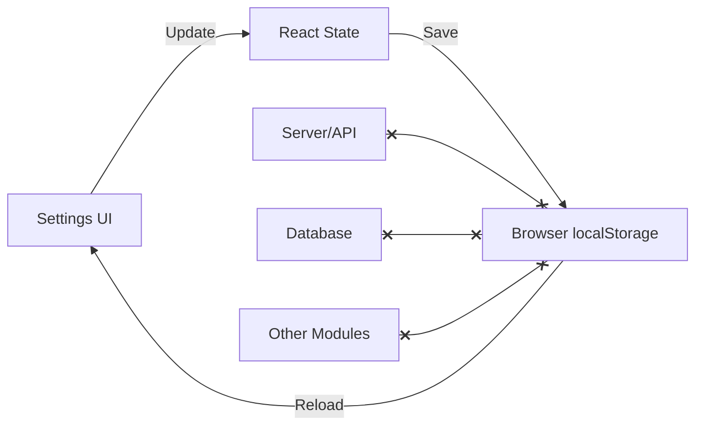

# BÁO CÁO AUDIT: PHÂN HỆ CÀI ĐẶT HỆ THỐNG (SETTINGS)

## 1. Tổng quan kết luận
**Đánh giá:** **UI-ONLY (Hoàn toàn giả lập)**
Phân hệ Settings hiện tại hoàn toàn là một giao diện giả lập (UI-only mockup) được lưu dưới dạng `localStorage` trên trình duyệt. Không có bất kỳ liên kết nào với Database, không có API backend, không có server validation, và **không có bất kỳ tính năng nào đang hoạt động thật** (không có enforcement).

## 2. Danh sách file đã kiểm tra
- `src/app/(dashboard)/settings/page.tsx`: Route chính của trang Settings.
- `src/components/settings/settings-workspace.tsx`: Component giao diện và logic quản lý state của Settings.
- `src/lib/settings/settings-profile.ts`: Nơi định nghĩa interface, hằng số và các helper giả lập.
- `prisma/schema.prisma`: Schema database của toàn hệ thống.

## 3. Sơ đồ luồng dữ liệu (Hiện tại)

*Luồng dữ liệu hoàn toàn bị cô lập tại Client, không đi qua Server/API/Database, cũng không ảnh hưởng đến bất kỳ Module nào khác.*

## 4. Bảng đánh giá từng Setting
| Setting | Đang lưu DB? | UI đọc? | Server enforce? | API liên quan | Kết luận |
|---|---|---|---|---|---|
| **Doanh nghiệp** (Tên, MST, Hotline, Múi giờ, Tiền tệ...) | Không | Lấy từ `localStorage` | Không | Không có | **UI-only**. Dữ liệu hardcode / local. |
| **Bảo mật** (2FA, Đổi mật khẩu, Timeout, Audit log...) | Không | Lấy từ `localStorage` | Không | Không có | **UI-only**. 2FA hay Audit chưa đọc từ setting này. |
| **Quy trình** (Duyệt vật tư, ngưỡng hợp đồng, duyệt 2 bước) | Không | Lấy từ `localStorage` | Không | Không có | **UI-only**. Không tác động tới luồng Approval/Payment/Material hiện tại. |
| **Tài liệu** (Quy tắc tên, dung lượng, versioning) | Không | Lấy từ `localStorage` | Không | Không có | **UI-only**. Không tác động tới logic Upload/Document. |
| **Thông báo** (Gửi email, leo thang, nhắc nhở) | Không | Lấy từ `localStorage` | Không | Không có | **UI-only**. Không có job cron hay queue nào đọc cấu hình này. |
| **Dữ liệu** (Sao lưu, Retention, Export, Maintainance) | Không | Lấy từ `localStorage` | Không | Không có | **UI-only**. Không có logic backup. Tính năng "Sao lưu: Tốt" trên UI chỉ là fake state. |

## 5. Vấn đề UI/UX (Mức Component)
- **Tình trạng:** Khá hoàn thiện về mặt thẩm mỹ và UI states (responsive, sticky sidebar, tabs không reload trang, các trường thông tin dàn layout rõ ràng).
- **Save/Undo:** Hoạt động tốt ở phía Client (dựa vào so sánh snapshot và current profile), nhưng gây hiểu lầm nghiêm trọng vì user tưởng dữ liệu đã được lưu lên hệ thống.
- **Form validation:** Hoàn toàn thiếu. Các component `TextField`, `NumberField` không sử dụng thư viện validate nào (như Zod/React Hook Form), không có min/max rõ ràng (ví dụ số âm, timeout 0 phút).
- **Giả mạo Trạng thái:** Card "Kiểm soát đang bật", "Cảnh báo bảo mật", "Sao lưu Tốt" hoàn toàn tính toán từ client state, không phản ánh hiện trạng thực tế của server.

## 6. Vấn đề Database
- **Không tồn tại Model Settings:** `prisma/schema.prisma` không có bất kỳ bảng nào lưu Settings (như `SystemSetting`, `OrganizationSetting` hay `SystemPolicy`).
- Không có default data trong DB (Seed).
- Không có audit log ghi lại việc thay đổi Setting (bảng `AuditLog` có tồn tại nhưng không được gọi).

## 7. Vấn đề logic/enforcement
- Các tính năng được mô tả ở Settings như "Bắt buộc mã công trình trước khi chi", "Bắt buộc 2FA cho quản trị", "Nhắc báo cáo hiện trường", "Leo thang phê duyệt" hoàn toàn **chưa được lập trình** (không có middleware, không có cron job, không có validation ở server actions).

## 8. Vấn đề bảo mật/RBAC
- **Tích cực:** Màn hình UI có bảo vệ RBAC ở mức layout/route (`if (!canManageUsers(session)) redirect("/projects");`).
- **Tiêu cực:** Không có Server Action/API nên cũng không có bảo mật ở tầng xử lý. Khi làm thật sẽ cần thiết lập RBAC cực kỳ cẩn thận cho API update settings để tránh leo thang đặc quyền.

## 9. Danh sách Issue theo mức độ
- **[CRITICAL] 01 - System Architecture:** Toàn bộ Settings lưu vào LocalStorage (`SETTINGS_STORAGE_KEY`) thay vì Database.
- **[CRITICAL] 02 - Lack of Enforcement:** Tất cả cấu hình bảo mật, quy trình, tài liệu đều là Fake UI, không có tác dụng thực tế ở backend.
- **[HIGH] 03 - Lack of Server Action / API:** Không có API endpoint nào để xử lý việc read/update cấu hình.
- **[HIGH] 04 - Lack of Validation:** Form không có logic kiểm tra dữ liệu đầu vào (không có Zod schema, min/max length/values).
- **[MEDIUM] 05 - Misleading UI:** Các thẻ "Summary Card" ở trên cùng đưa ra thông tin gây hiểu lầm cho Admin (VD: "Sao lưu: Tốt" dù hệ thống chưa hề có backup).

## 10. Đề xuất Fix (Theo thứ tự ưu tiên)
1. **Thiết kế Database:** Bổ sung mô hình `SystemSetting` dạng key-value hoặc một row JSON duy nhất (Singleton pattern) vào `schema.prisma`.
2. **Backend API/Action:** Viết Server Actions để lấy (get) và cập nhật (update) cài đặt. Bắt buộc kết hợp RBAC (`canManageUsers`).
3. **Audit Log:** Gắn `AuditLog` creation vào action cập nhật cấu hình.
4. **Validation:** Thêm Zod schema để validate dữ liệu từ server-side cho từng nhóm (Organization, Security, Workflow, ...).
5. **UI Integration:** Chuyển `settings-workspace.tsx` từ dùng localStorage sang gọi Server Actions (hoặc dùng `useQuery`/`useMutation` nếu có).
6. **Enforcement (Phase 2):** Dần dần áp dụng các Settings này vào các module tương ứng (ví dụ: áp dụng `contractValueThreshold` vào Approval Module). Nếu chưa áp dụng được ngay, cần ẩn đi hoặc ghi rõ "Sắp ra mắt" trên UI.

## 11. Kết quả các lệnh đã chạy
- `git status --short`: Phát hiện file `src/app/(dashboard)/settings/page.tsx`, `src/components/settings/*`, `src/lib/settings/*` (mới thêm hoặc sửa đổi).
- `npx tsc --noEmit`: Code không có lỗi type nào (Exit code: 0).
- Khảo sát mã nguồn (Grep): Biến `SETTINGS_STORAGE_KEY` chỉ được gọi tại màn hình Settings, không có file nào khác đọc cấu hình này.

## 12. Kết luận Go/No-Go
**NO-GO (TUYỆT ĐỐI KHÔNG ĐƯỢC ĐƯA VÀO SỬ DỤNG THẬT)**.
Phân hệ Cài đặt hiện tại chỉ là một bản **Mockup UI**. Đưa màn hình này vào production sẽ lừa dối người dùng (Quản trị viên tưởng đã cấu hình 2FA hoặc Backup nhưng thực tế hệ thống không chạy). Cần phải đập bỏ luồng localStorage và thay bằng DB/Server API thực sự trước khi có thể gọi là hoàn thành.
