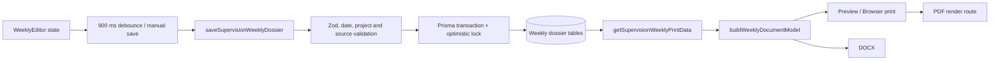

# Supervision Weekly - Full System Audit and Stabilization Report

Date: 2026-07-23  
Conclusion: **NO-GO for a full production claim.** The code-level remediation and static verification below pass, but a safe independent QA database and authenticated browser runtime were not available for the required end-to-end evidence.

## 1. Executive summary

This audit covered the weekly supervision dossier editor, status workflow, canonical print data, Word/PDF export endpoint, document rendering, Excel removal, and supporting unit tests.

The important defects found in source were corrected:

- A concurrent submit could write duplicate state revisions because the update only matched the dossier ID.
- The client did not receive the post-transition lock version and could issue stale follow-up operations.
- An incoming row ID could be reused without proving it belonged to the current dossier.
- The PDF route trusted the request `Host` header when choosing a page to render and forwarded the session cookie to that host.
- PDF browser/context resources were not guaranteed to close after failure.
- The document model invented place, recipient, recipient title, and author values for missing data.
- A category-only legacy row was not recognized as meaningful because the model checked the wrong field name.
- The sole date test used an unresolved Vitest alias.

No Prisma schema change, migration, seed, cleanup, or database mutation was run.

## 2. Scope and inventory

Audited runtime files:

- `src/app/(dashboard)/supervision/weekly/**`
- `src/app/api/supervision/weekly/[id]/export/route.ts`
- `src/app/supervision-export/[id]/page.tsx`
- `src/components/supervision-weekly/**`
- `src/lib/supervision-weekly/**`
- `prisma/schema.prisma` weekly-supervision models
- `tests/supervision-weekly/**`

Relevant Prisma aggregate:

- `SupervisionWeeklyDossier`
- `SupervisionWeeklyEntry` and `SupervisionWeeklyShiftSelection`
- `SupervisionWeeklyTransition`
- `SupervisionWeeklyQuantity`
- `SupervisionWeeklyProgress`
- `SupervisionWeeklyObservation`
- `SupervisionWeeklyRevision`
- `User`, `Project`, and `FieldProgressItem`

The legacy `SupervisionWeeklyPackage` models were observed but not modified.

## 3. Actual data pipeline

The state transition path is separate from autosave: `transitionSupervisionWeeklyDossier` validates the server state, writes the transition and revision in one transaction, then revalidates the dossier/list paths.

## 4. UI, DTO, database, and document mapping

| Field family | Editor/save DTO | Prisma | Print DTO/document output |
| --- | --- | --- | --- |
| Dossier identity/status/version | `id`, `status`, `version`, `lockVersion` | `SupervisionWeeklyDossier` | ID/status used for authorization and document build context |
| General fields | report number, place, recipient name/title | dossier fields | metadata/official header in preview, DOCX, PDF |
| Date ranges | result week and next-week period | dossier date fields | document type selects its own range |
| Schedule | entries + shift selections | entries/shift selections | seven-day grouped schedule, ordered by date/shift/sort order |
| Source selectors | project/category/work/manual snapshots | source fields on all row models | `formatSupervisionSourceLines` |
| Section II | transitions, quantities, units, variance reason | transition/quantity tables | canonical variance calculation and print rows |
| Section IV | planned/actual progress, delay fields | progress table | progress rows with on-time/delayed description |
| Next-week sections II/III | observations by document type/category/order | observation table | fixed follow-up/recommendation sections |
| Revision audit | workflow action/reason/version | revision table | server audit only, not a document field |

All editor source models carry snapshot and manual fallbacks. Renderers use optional/null guards. No live `Project` or `FieldProgressItem` relation is needed to print an already-saved snapshot.

## 5. State machine

| Status | Editable/autosave | Submit | Preview/export | Review action |
| --- | --- | --- | --- | --- |
| `DRAFT` | Yes | Yes | Yes | No |
| `REVISION_REQUIRED` | Yes | Yes | Yes | No |
| `SUBMITTED` | No | No | Yes | Request revision or approve |
| `APPROVED` | No | No | Yes | Lock |
| `LOCKED` | No | No | Yes | No |

Allowed transitions are centralized in `workflow.ts`: `DRAFT|REVISION_REQUIRED → SUBMITTED → APPROVED|REVISION_REQUIRED → LOCKED`.

Each transition now uses `updateMany` constrained by `id`, current `status`, and `lockVersion`. A stale or concurrent request produces a controlled conflict instead of a duplicate revision. The returned status and incremented lock version update client state immediately.

## 6. Autosave analysis

- Autosave waits 900 ms and only runs when state is dirty.
- Manual preview and submit call `flushSave()` before requesting canonical print data or changing workflow state.
- The save action only accepts `DRAFT` or `REVISION_REQUIRED`; a delayed save cannot downgrade a submitted dossier.
- The client has an in-flight transition guard in addition to disabled UI state, preventing double-click submit races.
- Save uses `expectedLockVersion`; conflicts are surfaced as a retryable UI state.

## 7. Export and print analysis

- DOCX and preview read the same `getSupervisionWeeklyPrintData` DTO.
- PDF keeps the browser-print template as its rendering source for parity.
- PDF now requires `SUPERVISION_PDF_RENDER_ORIGIN`, documented in `.env.example`; it never derives an internal render destination from an untrusted request host.
- The route forwards a session cookie only to the configured origin and always closes Playwright context/browser in `finally`.
- Unsupported formats, including `format=xlsx`, return controlled HTTP 400 responses.

## 8. Excel removal

Supervision-specific Excel handling was removed from the export route. The unused `xlsx` package was removed from `package.json` and `package-lock.json` (including its transitive lock entries).

Repository-wide search found Excel references only in other document/report attachment features. Those features still accept Excel files and were intentionally left intact.

## 9. Files changed

| File | Change |
| --- | --- |
| `src/app/(dashboard)/supervision/weekly/actions.ts` | optimistic transition lock, server workflow helper, safe row-ID reuse, blank default place on create |
| `src/components/supervision-weekly/weekly-editor.tsx` | double-submit guard and lock-version synchronization |
| `src/app/(dashboard)/supervision/weekly/[id]/edit/page.tsx` | null-safe author rendering |
| `src/app/api/supervision/weekly/[id]/export/route.ts` | validated document/format, configured PDF origin, cookie confinement, browser cleanup |
| `src/lib/supervision-weekly/document-model.ts` | correct category field and no invented metadata fallbacks |
| `src/lib/supervision-weekly/workflow.ts` | new pure state-machine definition |
| `src/lib/supervision-weekly/workflow.test.ts` | state-machine tests |
| `src/lib/supervision-weekly/document-model.test.ts` | blank metadata and legacy category-only tests |
| `tests/supervision-weekly/date.test.ts` | working relative import for Vitest |
| `package.json`, `package-lock.json` | removed unused `xlsx` dependency |
| `.env.example` | documented trusted PDF render origin |

## 10. Database and migration impact

Schema impact: none.  
Migration: none.  
Data cleanup: none.  
Seed/fixture mutation: none.

`DATABASE_URL` and `QA_DATABASE_URL` were both present but resolved to the same host, port, and database (`construction_erp_v2_qa`). This violates the required independent-QA rule, so no database query, dossier creation, status mutation, or cleanup was attempted.

## 11. Verification results

| Check | Result | Evidence |
| --- | --- | --- |
| Prisma schema validation | PASS | `npx prisma validate` |
| Prisma client generation | PASS | `npx prisma generate` |
| TypeScript | PASS | `npx tsc --noEmit` |
| Scoped lint | PASS | ESLint on all changed supervision files/tests |
| Unit tests | PASS | 7 files, 17 tests via Vitest |
| Production build | PASS | `npm run build` outside sandbox |
| Full-app regression compile | PASS | Next build emitted all listed routes |
| Database save/submit/reload | BLOCKED | QA URL is not independent |
| Browser editor/preview runtime | BLOCKED | no safe authenticated QA runtime/session evidence |
| Word open/render | BLOCKED | requires QA dossier/download artifact |
| PDF open/render | BLOCKED | requires QA dossier/configured render origin |
| Browser print 3-5 pages | BLOCKED | requires QA browser runtime/data |
| Responsive screenshots | BLOCKED | no safe authenticated runtime |
| Cross-project/IDOR runtime | BLOCKED | requires two QA principals/projects |

The build completed with one existing Turbopack warning in the unrelated reports attachment route (`next.config.ts` tracing). It did not fail compilation and was not altered in this audit.

## 12. Data parity matrix

| Dimension | Editor/static mapping | Database runtime | Preview/Word/PDF runtime |
| --- | --- | --- | --- |
| Row counts/order | PASS by code review and sort tests | BLOCKED | BLOCKED |
| Project/category/work/manual source | PASS by formatter/model tests | BLOCKED | BLOCKED |
| Dates/shifts | PASS by date tests/model | BLOCKED | BLOCKED |
| Quantities, units, variance | PASS by quantity tests/model | BLOCKED | BLOCKED |
| Progress/delay | PASS by canonical model review | BLOCKED | BLOCKED |
| Report number and common metadata | PASS by model tests | BLOCKED | BLOCKED |
| Next-week observations | PASS by document model tests | BLOCKED | BLOCKED |
| Submitted status/version | PASS by pure state-machine tests and server review | BLOCKED | BLOCKED |

This is not a claim of end-to-end parity. Runtime outputs remain unverified until independent QA data and authenticated browser evidence are available.

## 13. Security, accessibility, performance, and responsive review

- Server actions enforce session, role, dossier ownership/review privilege, project scope, and source project/category/work relationships.
- Export obtains canonical data through the same permission-checked server action.
- PDF host-header cookie forwarding was eliminated; configured PDF origin is explicit and validated.
- Selectors, row action menus, labels, keyboard behavior, table horizontal overflow, and mobile wrapping were reviewed statically. No authenticated runtime evidence was captured.
- Save/transition operations use transactions and optimistic lock versions. PDF resource cleanup is now deterministic.

## 14. Screenshot evidence

No screenshots were captured. Existing QA artifacts were not reused as evidence because they predate this diff. New screenshots require a safe independent QA database and an authenticated browser session.

## 15. Remaining risks and required next gate

1. Provision `QA_DATABASE_URL` pointing to a different host/port/database than `DATABASE_URL`.
2. Configure `SUPERVISION_PDF_RENDER_ORIGIN` to a trusted application origin reachable from the server.
3. Create a clearly marked QA dossier and perform save, submit, reload, preview, DOCX, PDF, browser print, conflict, RBAC, and cross-project tests.
4. Capture new desktop/mobile/editor/preview/PDF/Word/print screenshots and attach them to this report.
5. Re-run the listed regression smoke routes with an authenticated QA user.

Until those gates are complete, this audit remains **NO-GO for full release certification**, despite passing static, unit, type, lint, Prisma, and build verification.
